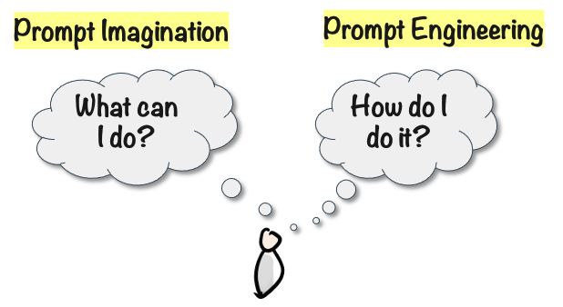

# Einstein in Your Basement

So here’s a silly mental model for this: You have Einstein in your basement. In fact everyone does. And by “Einstein”, I really mean the combination of every smart person who ever lived.

You can talk to Einstein whenever you want. He has instant access to the sum of all human knowledge, and will answer anything you want within seconds, never running out of patience.

Just for fun, I asked ChatGPT "What are you? Explain in 1 sentence to a 10 year old". It answered:

> I'm like a super smart robot that can answer lots of questions and help with all sorts of things, kind of like a really helpful genie in a computer!

He can also take on any role you want - a comedian, poet, doctor, coach – and will be an expert within that field.

He has some human-like limitations. He can make mistakes, jump to conclusions, or misunderstand you. But the biggest limitation is your imagination, and your ability to communicate effectively with him. This skill is known as Prompt Engineering and in the age of AI this is as essential as reading and writing.

Most people vastly underestimate what this Einstein in your basement can do. It’s like going to the real Einstein, and asking him to proof-read a high school report. Or hiring a world class 5 star chef and having him chop onions. The more you interact with Einstein, the more you will discover surprising and powerful ways for him to help you or your company.
