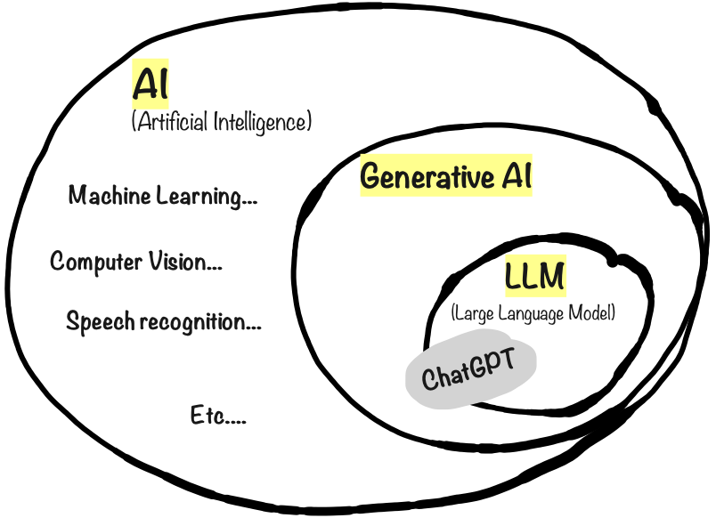

# Terminology

OK enough fluffy metaphors, let’s clarify some terms.

AI, as you probably know, stands for Artificial Intelligence. AI is not new. Fields like machine learning and computer vision have been around for decades. Whenever you see a youtube recommendation or web search result, or get a credit card transaction approved, that’s traditional AI in action.

Generative AI is AI that generates new original content, rather than just finding or classifying existing content. That’s the G in GPT.

Large Language Models or LLMs are a type of Generative AI that can communicate using normal human language.

ChatGPT is a product by the company OpenAI. It started as an LLM, essentially an advanced chatbot, but using a new architecture called the Transformer architecture. That’s the T in GPT. It is so fluent at human language that anyone can use it, you don’t need to be an AI expert or programmer. And that’s what kind of triggered the whole revolution.
