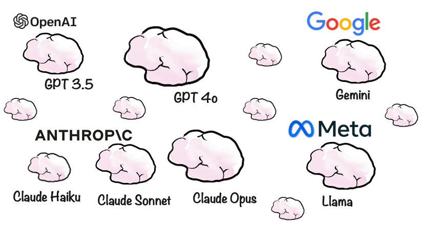
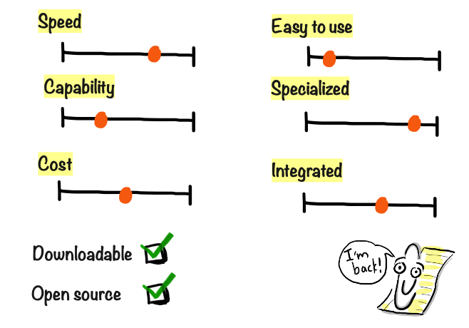

# Models, models everywhere

Now, although ChatGPT kinda got the ball rolling, GPT isn’t the only model out there. In fact, new models are sprouting like mushrooms. Above are some of the most popular models at the time of writing (which may be completely out of date by the time you read this).

They vary a lot in terms speed, capability, and cost. Some can be downloaded and run locally, others are only online. Some are free or open source, others are commercial products. Some are super easy to use, while others require complicated technical setup. Some are specialized for certain use cases, others are more general and can be used for almost anything. Some are built into products in the form of copilots or chat windows.

Remember Clippy, that annoying bouncy paperclip character trying to assist you in Microsoft Office in the mid-90's? It's like he is back, but actually works (more or less). It’s the wild west.

Just keep in mind that you generally get what you pay for. With a free model you may just be getting a smart highschool student in your basement, rather than Einstein.

