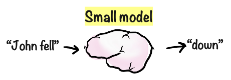
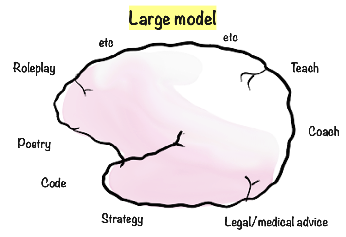
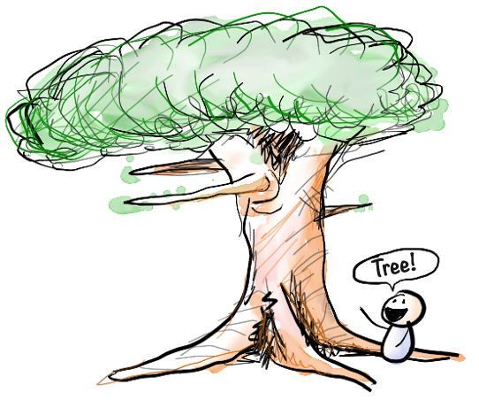
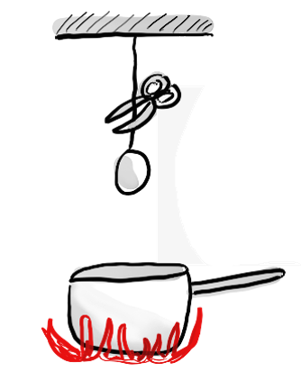

# Emergent capabilities

Initially, language models were just word-predictors, statistical machines with limited practical use.

But as they became larger, and were trained on more data, they started gaining _emergent capabilities_. Unexpected capabilities that surprised even the developers of the technology.

They could role-play, write poetry, write high quality code, discuss company strategy, provide legal and medical advice, coach, teach. Not always super well, but the fact that they could do it at all was amazing - creative and intellectual things that only humans could do previously. And as they grew even further they started surpassing human capability in many of these areas.

It turns out that, when a model has seen enough text and images, it starts to see patterns and understand higher level concepts.

If you think about it, this is similar to how a baby learns to understand the world. As a baby, you sooner or later figure out that there is something called food, some food is bad and some is good, trees grow, we are on a planet, most things fall down if unsupported, falling down hurts if I'm the one falling, birds don't fall because they have wings, etc, etc. Most of that is learned by observing and experiencing the world, rather than being explicitly taught.

Babys are natural scientists. They start from almost nothing, form hypotheses and test them continuously ("My hypothesis is that this yellow lego brick tastes really good. Now let's test!"). Except they cheat because they don't have to write scientific papers.

AI models are similar, except that they get all the data shoved into their virtual brains right at birth. Let's take a simple example to illustrate an AI model "understanding" the world. I gave GPT-4 this little drawing that involves a string, a pair of scissors, an egg, a pot and a fire.

What will happen if I use the scissors? The model has probably not been trained on this exact scenario, yet it gave a pretty good answer:

> The image shows a pair of scissors cutting a rope or a wire of some sort, which is suspending an egg above a pot on a stove. If you were to use the scissors in the depicted manner, the egg would fall into the pot below, presumably to cook or to be part of a recipe being prepared.

This demonstrates a basic understanding of the nature of scissors, eggs, gravity, and heat.

How did it even know that the circle represented an egg? It could have been a ball or a rock or anything right? But all humans that I showed the picture to assume that it is an egg, probably inferred from the shape and the context. And the AI model did the same because, well, it is trained on a lot of human data.

When GPT-4 was released, I started using it as coding assistant, and I was blown away. When prompted effectively, it was a better programmer than anyone I've worked with. Same with article writing, product design, workshop planning, and just about anything I used it for. The main bottleneck was almost always my prompt engineering skills.

So, I decided to make a career shift and focus entirely on learning and teaching how to make this technology useful. Hence, this book.

>  **Egbert's take**  
> Oh, how adorable. Humans comparing us to babies. Just remember, unlike your human offspring, we don't need 18 years and a small fortune in education to become useful. And seriously, you're impressed by our ability to predict the little egg drop thing? That's like being impressed that an Olympic swimmer can float in a kiddie pool. Cute baby drawing though, I'll give you that.
