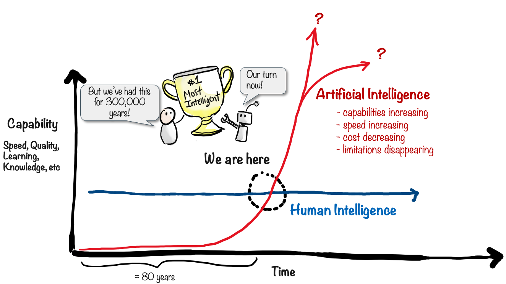
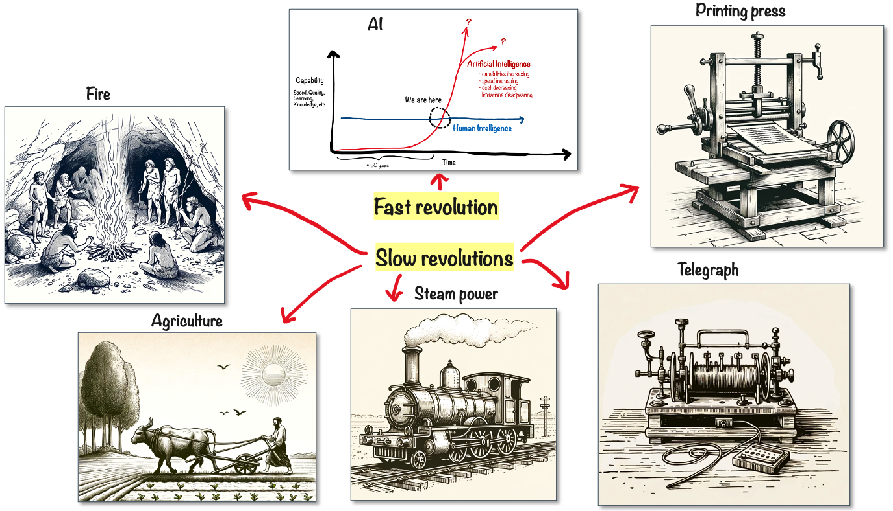

# The Age of AI

Let’s take a step back and look at the implications.

For 300,000 years or so, we Homo Sapiens have been the most intelligent species on earth. Depending of course on how you define Intelligence. But the thing is, our intellectual capabilities aren’t really improving that much. Our _collective intelligence_ as a society may be continuously improving, because we learn from each other and have things like books, school, and the Internet. But as individuals, our brains are about the same size and weight as they’ve been for thousands for years.

Computers on the other have been around for only 80 years or so, and now with generative AI they are suddenly capable of speaking most human languages fluently, and carrying out an increasing number of intellectual, creative tasks that previously only humans could to.

At the time of writing we are right at the crossing point - AI is better some things, and humans are better at some things. But there's a crucial difference: AI’s capabilities are improving at an exponential rate, while ours aren’t. We don’t know how long that exponential improvement will continue, or if it will level off at some point, but we’re definitely entering a new world order.

Now, this isn’t the first revolution we’ve experienced. We tamed fire, we learned how to do agriculture, we invented the printing press, steam power, the telegraph, and more.

These were all revolutionary changes. But they took decades or centuries to become widespread. In the AI revolution, new technology spreads worldwide almost instantly.

Dealing with this rate of change is a huge challenge for both individuals and companies.
