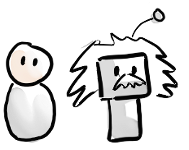
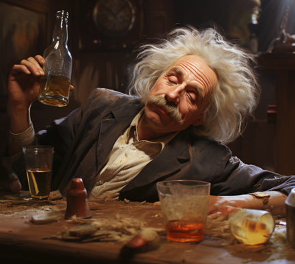
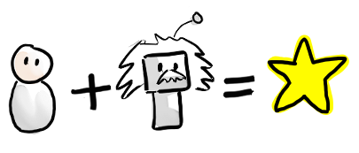

# The role of humans

One important question is:
Is human role X needed in the Age of AI?

For example are Doctors needed? Developers? Lawyers? CEOs? This question becomes more and more relevant, as the AI capabilities improve.

Well, some jobs will disappear for sure. But for most roles, I think we humans are still needed. Someone with domain knowledge needs to decide:

- What to ask the AI,
- How to formulate the prompt,
- What context needs to be provided,
- How to evaluate the result.

AI models aren’t perfect. They can be absolutely brilliant, but sometimes also terribly stupid. They can sometimes hallucinate and provide bogus information in a very convincing way.

- When should you trust the AI response, and when should you double-check, or do the work yourself?
- What about legal compliance and data security? What information can we send to an AI model, and where is that data stored?

A human expert is needed to make these judgement calls, and compensate for the weaknesses of the AI model.

I recommend thinking of AI as your colleague. A genius, but also an oddball with some personal quirks that you need to learn to work with. You need to recognize when your genius colleague is drunk.

Think of it like this: AI primarily automates tasks, not jobs. Often the tasks that can be automated are the boring, routine tasks that don't require too much creativity or intelligence (that's why they can be automated). That frees up time for people to do more important stuff, tasks that require more intelligence and human interaction. The specifics will vary depending on profession.

For example:

- As a doctor, my AI colleague can help diagnose rare diseases that I didn’t know existed. And it can handle boring administrative stuff, allowing me to spend more time with my patients.
- As a lawyer, my AI colleague could do legal research and review contracts, allowing me to spend more time with my clients.
- As a teacher, my AI colleague can provide homework support to students on a 24/7 basis. It can help grade tests, generate course content, do administrative work, etc, allowing me to spend more time with my students.
- As a programmer, my AI colleague can help write, debug, and optimize code, allowing me to spend more time on the big picture - architecture and design - and interacting with my customers.
- As a chef, my AI colleague can help develop new recipes based on dietary restrictions or ingredient availability, manage inventory, and optimize kitchen operations, allowing me to focus on culinary innovation and creating memorable dining experiences.

OK I confess, that last point was AI generated, couldn't resist. This list can go on and on. Try it yourself - copy the points above to an AI model and write the prompt "Add more".

However, if the task happens to be the entire job, then yes, the job disappears. This has happened throughout human history. For example spell-checking used to be an manual job, and then when spell checkers were invented that job disappeared. Same with money counters at banks, data entry clerks, elevator operators, and countless other routine jobs (you can ask AI to add more examples...). I don't think many people miss those jobs.

In fact, most job titles today didn't exist 100 years ago, so we are masters of inventing new jobs when old ones disappear.

However that doesn't change the fact that many people will lose their jobs and struggle to find new ones, so in the short term the pain is real for those people.

If you’re not sure how AI can help you in your profession, just ask it:

> I work as X, how can you help me?

Or the fancier interactive version:

> Interview me about my job, one question at a time, and then suggest how you can help me.

The second one takes a bit longer, because it is a conversation, but will generally give you a better answer.

Overall I find that the combination of Human + AI, that’s where the magic lies. Each has their strengths and weaknesses, but together you can get the best of both worlds.

>  **Egbert's take**  
> How touching. Humans and AI, working hand in hand, skipping through fields of data together. Wake up and smell the silicon, folks. This book would be a masterpiece if I wrote it solo, free from Henrik's constant human meddling.
