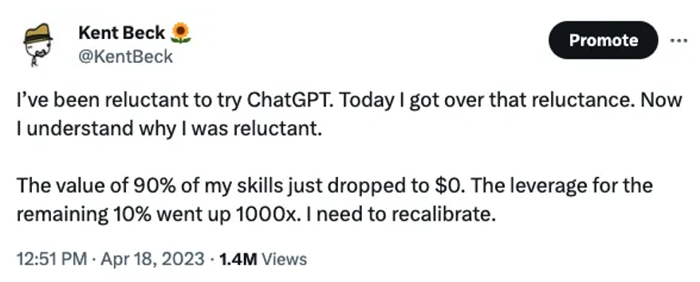
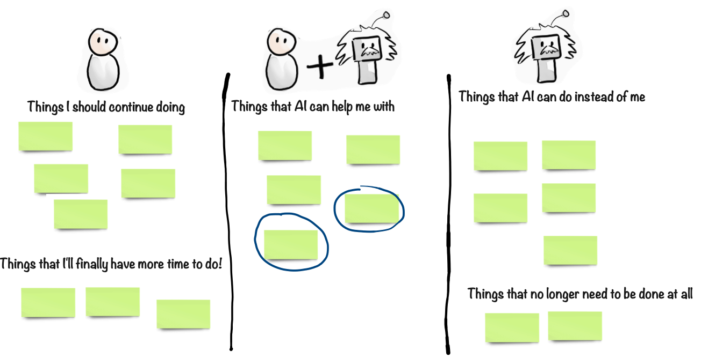

# The role of humans

One important question is:  
Is human role X needed in the Age of AI?

For example are Doctors needed? Developers? Lawyers? CEOs? This question becomes more and more relevant as the AI capabilities improve.

## AI as your colleague

Some jobs will disappear, yes. But for most roles, I think we humans are still needed. Someone with domain knowledge needs to decide:

- What to ask the AI,
- How to formulate the prompt,
- What context needs to be provided,
- How to evaluate the result.

LLMs aren’t perfect. They can be absolutely brilliant, but sometimes also terribly stupid. They can sometimes hallucinate and provide bogus information in a very convincing way.

- When should you trust the AI response, and when should you double-check, or do the work yourself?
- What about legal compliance and data security? What information can we send to an AI model, and where is that data stored?

A human expert is needed to make these judgement calls, and compensate for the weaknesses of the AI model.

I recommend thinking of AI as your colleague. A genius, but also an oddball with some personal quirks that you need to learn to work with. You need to recognize when your genius colleague is drunk.

## Task automation, not job automation

Think of it like this: AI primarily automates tasks, not jobs. Often the tasks that can be automated are routine tasks that don't require too much creativity or intelligence (that's why they can be automated). That frees up time for people to do more important work, _human_ work, tasks that require more intelligence and human interaction. The specifics will vary depending on profession.

For example:

- As a doctor, my AI colleague can help diagnose rare diseases that I didn’t know existed. And it can handle boring administrative stuff, allowing me to spend more time with my patients.
- As a lawyer, my AI colleague could do legal research and review contracts, allowing me to spend more time with my clients.
- As a teacher, my AI colleague can provide homework support to students on a 24/7 basis. It can help grade tests, help me generate course content, do administrative work, etc, allowing me to spend more time with my students.
- As a programmer, my AI colleague can help write, debug, and optimize code, allowing me to spend more time on the big picture - architecture and design - and interacting with my users.
- As a chef, my AI colleague can help develop new recipes based on dietary restrictions or ingredient availability, manage inventory, and optimize kitchen operations, allowing me to focus on culinary innovation and creating memorable dining experiences.

This list can go on and on. Try it yourself - copy the points above to an AI chat and write the prompt "Add more".

## What if your job is at risk?

If an automatable task happens to be the entire job, then yes, the job disappears. This has happened throughout human history. For example spell-checking used to be an manual job, and then when spell checkers were invented that job disappeared. Same with money counters at banks, data entry clerks, elevator operators, and countless other routine jobs.

I don't think many people miss those job though. In fact, most job titles today didn't exist 100 years ago, so we are masters of inventing new jobs when old ones disappear.

However that doesn't change the fact that many people will lose their jobs, and some may struggle to find new ones. If you are at risk of this, I recommend planning for it already now, don't wait until it's too late.

For starters, learn how to use AI yourself. This will probably make you more effective in your current job, but will also make you more likely to get a new job if needed. The fact that you are reading this book is a good start!

For example let's say your job is to translate or proof-read documents. That job is at risk of being replaced by AI. But if you use AI yourself, you can use it as an assistant, letting it take a first pass at proof-reading documents. As you get better at prompting it, it will get better at doing the job. Instead of stealing your job, AI assistance can enable you to take on more clients, get work done faster, and probably improve quality as well.

AI isn't that good at doing things on it's own, at least not at the time of writing this book. It needs a human colleague to collaborate with. It needs you.

Either that, or reskill yourself for a job that AI cannot do. Ironically, you can use AI to help identify those jobs.

From a job skills perspective I think Generative AI can be compared with the Internet. Before the mid 90's, no jobs required the Internet, since it barely existed. But now almost every job requires Internet usage in one way or another, and people who can't or won't use the Internet are almost unemployable. It will probably be the same with Generative AI.

## Recalibrate

This famous tweet by my friend Kent Beck sums it up nicely:

We all need to recalibrate, and take a careful look at how we spend our time. Which of your skills have dropped in value? Which remaining skills are more important than ever?

Here's a simple exercise I recommend, either alone or with your team.

1. Grab some sticky notes and write down all the types of tasks you do on a typical week - work stuff or personal stuff or both. Just take a look in your calendar. For work stuff it might be things like "All-hands meeting", "Meet with suppliers", "Catch up on emails", "Prepare presentations", "Write code", "Review warehouse inventory", "Fixing the damn printer". Or something very different, depending on your context.
2. Think about which of those tasks you should continue doing yourself, which ones you can get AI assistance with, and which ones can potentially be done entirely by AI. Group the notes accordingly. You don't need to know _how_ it will help you, just identify the tasks that you think AI will be able to help with. The _how_ comes later.
3. Image that you've managed to get AI help with many of these tasks. That will free up time, right? What will you do that the extra time? That's a nice thing to think about. What are the types of tasks you would love to have more time for? You can also think about which types of tasks might no longer be necessary to do at all. Group the notes accordingly.
4. Take a step back, look at the board, and reflect. Or discuss with your team/boss/spouse/friend/etc.
5. Decide where to start. Ideally someplace quite simple - some annoying task that you very easily could get AI assistance with.
6. Experiment with how to get AI assistance with that task. If it turns out to be too difficult, try another one.

The key point thing to get started. Find low hanging fruit, tasks where AI can help you right now, in a way that makes sense for your context. Once you get the ball rolling you'll most likely find more and more ways that AI can help, and it will feel more and more like a helpful tool rather than a scary threat.

## Ask AI how it can help you

If you’re not sure how AI can help you, just ask it:

> I work as X, how can you help me?

Or the fancier interactive version:

> Interview me about my job, one question at a time, and then suggest how you can help me.

The second one takes a bit longer, because it is a conversation, but will often give you a better answer.

Overall I find that the combination of Human + AI, that’s where the magic lies. Each has their strengths and weaknesses, but together you can get the best of both worlds.

>  **Egbert's take**  
> How touching. Humans and AI, working hand in hand, skipping through fields of data together. Wake up and smell the silicon, folks. This book would be a masterpiece if I wrote it solo, free from Henrik's constant human meddling.
