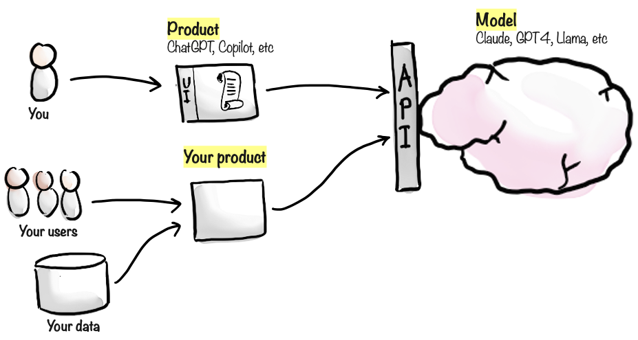

# Using AI vs building AI-powered products



It's important to distinguish between the models, and the products that build on them.

As a user, you don't interact directly with the model. Instead, you interact with a product - for example through a website or mobile app. The product in turn talks to the model behind the scenes.

Products add capabilities and data that aren't part of the model itself, but can also introduce limitations.

## Buying or building AI products

Here are some sample AI products that are very popular at the time of writing this book:

- ChatGPT is an app and website which lets you chat with the GPT-family of models. It adds feature such as a user interface and message history, which the model itself doesn't have. It also adds multi-modality, so you talk to it or upload images, and it will use the appropriate model behind the scenes.
- Similarly, Claude is an app & website that lets you chat with the Claude-family of models from Anthropic.
- GitHub Copilot is an AI-powered coding assistant. It integrates with various development environments, analyzes the context of your code, and suggests entire lines or blocks of code as you type. It doesn't really have a user interface, it is working in the background as part of your develpment environment.
- Perplexity is a search engine that uses AI to provide more relevant and accurate results, with references. It is basically an alternative to Google search, that focuses on delivering answers and knowledge rather than page links.

As a developer, you can build your own AI-powered products and features. All the major AI companies provide APIs (Application Programming Interfaces) that let your code talk to their models. This is very powerful! It allows you to build small tools and utilities specific to your context, and the power of the AI models let's you build very advanced functionality with very little code.

For example:

- As an elearning site, you could add a chatbot to answer questions about the courses.
- As a recruitment company, you could build AI-powered tools to help evaluate candidates.
- As a restaurant, you could create an AI-driven menu recommendation system based on customer preferences and dietary restrictions.
- If your company needs to deal with many invoices and RFPs (requests for proposals), you could build an AI-powered tool help analyze these.

In each of these examples, your users interact with your product, and your product interacts with the model.

Sometimes it makes sense to buy an existing product, sometimes it is simpler to build your own - depending on the complexity of the product, and your development knowledge or access to internal development teams.

## Code example

Here is an example of JavaScript using OpenAI API to talk to GPT. Not a lot of code needed:

```javascript
import { config } from "dotenv";
import { OpenAI } from "openai";
config(); // load OpenAI key from .env file
const openai = new OpenAI({ apiKey: process.env.OPENAI_API_KEY });

const result = await openai.chat.completions.create({
  model: "gpt-4",
  messages: [
    {
      role: "user",
      content: "Hello, how are you?",
    },
  ],
});
console.log(result);
```

And here is an example of the automatic candidate evaluation, it takes a job description and a bunch of CVs in a folder, and evalutes each candidate. And incidently the code itself as mostly AI-written.

So as a product developer, you can use AI models as an external brain to insert intelligence into your product. Very powerful.
