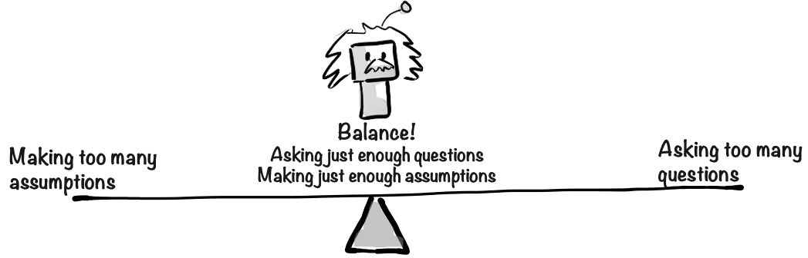

# Prompt engineering

In order to use Generative AI effectively, you need to get good at Prompt Engineering.

Prompt Engineering is the art of crafting effective prompts that produce useful results from an AI model. I think Prompt Design would be a better term, but Prompt Engineering seems to have stuck so we'll go with that.

This skill is crucially important, whether you are using an AI product like ChatGPT or building your own AI product.

# Example - from bad to good prompt

Here's an example of some basic prompt engineering techniques. Let's say you want help planning a workshop.

> **Prompt 1**  
> Give me an agenda for a workshop

This prompt is unlikely to give useful results. No matter how smart the AI model is, if it doesn't know the context of your workshop, it can't produce a useful result. It will often give you one of the following:

- A vague, generic high level agenda that is unlikely to be useful in practice. Maybe if you've never done a workshop before it could serve as a high level template for workshops in general, but that's about
- A detailed, specific agenda for a made-up workshop context, with timestamps and concrete agenda items. This can be quite funny, but also pretty useless since it is has nothing to do with your actual context.

Let's improve the prompt.

> **Prompt 2**  
> Give me an agenda for a workshop.  
> I'm meeting a leadership team at an aerospace consulting firm. The goal of the workshop is to figure out how they can use AI. They are new to this. We have 8 people for 4 hours.

This second prompt is much better. Now we provided a bit of context - what the workshop is about, who will be there, what the goal is, etc. With this information, the AI model will give us a much more useful result. Even a tiny bit of context makes a huge difference.

This is usually done iteratively - you don't need to provide a perfectly complete context from the beginning.

1. Write a prompt with the most important part the context, and look at the result.
2. Add a followup prompt to provide more information, or edit the original prompt.
3. Rinse and repeat until you get a good result.

Here's another approach.

> **Prompt 3**  
> Give me an agenda for a workshop.  
> Feel free to ask me any clarifying questions first.

Instead of giving it a bunch of context upfront, I asked it to interview me to get the context it needs, and then propose a workshop agenda after. So the AI will drive the conversation instead of me.

This sometimes gives more interesting and useful results, but can take a bit longer.

I often combine these techniques. I provide a clear question, add a bit of context, and then tell it to ask me if it needs any more info.

## The biggest limitation is you

The biggest limitation is not the AI model, but the quality of your prompts. I keep seeing this. Whenever I get a bad or mediocre result from an AI, it almost always turns out to be because of a badly phrased prompt, unclear goal, or lack of context. When I fix the prompt and do a few rounds of iteration, the results improve dramatically.

I've experienced situations where I'm sitting next to a colleague, both of us working on similar things and using AI assistance, and he keeps getting mediocre results while I keep getting really good results. At first glance you'd think that I was using a better model, but in fact I was just more experienced with prompt engineering, and better at giving the AI model the info it needs to do a good job.

## How to learn Prompt Engineering

There are plenty of courses, books, videos, and articles to help you learn this.

This book also contains a chapter called [Prompt Engineering Techniques](../4-extra/460-prompt-engineering-techniques.md), with more specific tips and examples.

But the most important thing is to practice, and learn by doing. Try using AI for all kinds of things, even silly things, or things that AI isn't good at. By toying around and testing the limits you will build your skills.

A nice side effect is that you will become better at communicating in general, since Prompt Engineering is really all about clarity and effective communication.

## Will prompt engineering become obsolete as models improve?

This is a very relevant question. Let's take my first prompt as an example again:

> **Prompt**  
> Give me an agenda for a workshop.

In early 2024, even the best AI models would give a pretty useless response to that, because of the lack of context.

However now, in late 2024, some of the models have started asking followup questions even without being told to. They are smart enough to realize when they lack important context, and instead of making assumptions they ask for the information they need. This is a balancing act, because part of what makes AI models useful is that they don't require a 100% complete context, they can often make correct assumptions about the missing information and still provide useful results.

This is what human experts do too, right? If you consult a lawyer about a legal issue, they'll ask for details about your situation before offering advice. You normally don't need to tell a human expert "Feel free to ask followup questions". But they will also make some assumptions based on their experience.

So the prompt engineering technique of adding "Feel free to ask followup questions" is already becoming obsolete. However it doesn't hurt to add it anyway sometimes, especially if you are using a cheaper model that doesn't always do it automatically.

Another example is the "Let's think step by step" technique. This used to be crucial for math or problem-solving prompts. Without it, AI jumped to (often incorrect) conclusions. Adding this phrase prompted the AI to reason through the problem, to think out loud before giving an answer. This measurably improved the accuracy of the responses, and also give you better insight into how the AI came up with the answer.

However now almost every decent model does that automatically, so that phrase doesn't make much difference anymore.

Web search engines liked Google evolved in a similar way. In the late 90s it was really important to use specific techniques such as boolean operators, quotes for exact phrases, etc. Writing good search queries was a skill, and people taught courses on it. But now search engines understand natural language and user intent, making these magic incantations largely obsolete. You can now type a vague, messy, misspelled question and often get exactly what you're looking for.

So back to the original question: **Do prompt engineering skills still matter when models improve?**

My take:

- **High level prompting techniques stay important.** Things like providing a clear goal and context, iterating on the results, applying critical thinking, asking the model to take on a a specific role, etc. This gives the AI model a better understanding of what you want, and will improve the results almost no matter how smart the model is.
- **Low level prompting techniques become less important** Specific phrases and tricks like "Think step by step", or "Ask followup questions". The trend is that these kinds of things get built into the models, making them less and less important.

So when find prompt engineering guides and templates and checklists online. Some of what you read will be obsolete, especially the low level techniques. But it doesn't hurt to try them out and compare the results. For example try adding "Let's think step by step" to your next prompt, and see if it makes any difference.

Adding these kinds of phrases _might_ give you better results, and will probably not give you worse results, so when in doubt you can just add them anyway.
