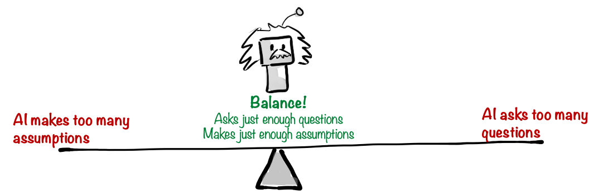

# Prompt engineering

In order to use Generative AI effectively, you need to get good at Prompt Engineering.

> **Prompt Engineering**  
> The art of crafting effective prompts that produce useful results from a Generative AI model.

I prefer the term Prompt Design, but Prompt Engineering seems to have stuck so we'll go with that.

This skill is crucially important, whether you are using an AI product like ChatGPT or building your own AI product.

# Example - from bad to good prompt

Here's an example of some basic prompt engineering techniques. Let's say you want help planning a workshop.

> **Prompt 1**  
> Give me an agenda for a workshop

This is a pretty bad prompt. No matter how smart the AI model is, if it doesn't know the context of your workshop, it will be hard to produce a useful result. A prompt like this will often give you one of the following:

- **A vague, generic high level agenda** that is unlikely to be useful in practice. Maybe if you've never done a workshop before it could serve as a high level template for workshops in general, but that's about it.
- **A detailed, specific agenda for a made-up workshop context**, with timestamps and concrete agenda items. This can be quite amusing, but also pretty useless since it is has nothing to do with your actual context.

Let's improve the prompt.

> **Prompt 2**  
> Give me an agenda for a workshop.  
> I'm meeting a leadership team at an aerospace consulting firm. The goal of the workshop is to figure out how they can use AI. They are new to this. We have 8 people for 4 hours.

This second prompt is much better. Now we provided a bit of context - what the workshop is about, who will be there, what the goal is, etc. With this information, the AI model will give us a much more useful result. Even a tiny bit of context makes a huge difference.

This is usually done iteratively - you don't need to provide a perfectly complete context from the beginning.

1. Write a prompt with the most important part the context, and look at the result.
2. Add a followup prompt to provide more information, or edit the original prompt.
3. Rinse and repeat until you get a good result.

Here's another approach.

> **Prompt 3**  
> Give me an agenda for a workshop.  
> Feel free to ask me any clarifying questions first.

Instead of giving it a bunch of context upfront, I asked it to interview me to get the context it needs, and then propose a workshop agenda after. So the AI will drive the conversation instead of me.

This will sometimes give even better results, but can take a bit longer.

I often combine these techniques. I provide a clear question, add a bit of context, and then tell it to ask me if it needs any more info.

## The biggest limitation is you

In most cases the biggest limitation is not the AI model, but the quality of your prompts.

I keep seeing this. Whenever I get a bad or mediocre result from an AI, it almost always turns out to be because of a badly phrased prompt, unclear goal, or lack of context. When I fix the prompt and do a few rounds of iteration, the results improve dramatically.

I've experienced situations where I'm sitting next to a friend or colleague, both of us working on similar things and using AI assistance, and they keep getting mediocre results while I keep getting really good results. At first glance you'd think that I was using a better model, but in fact I was just more experienced with prompt engineering, and better at giving the AI model the info it needs to do a good job. Like most things, it's a skill you build up with practice.

When I was getting started with using generative AI, I made a lot of incorrect assumptions about the limitation of the technology. For example, I noticed that AI models often jump to conclusions if I don't provide enough context. I thought that was in inherent limitation of the technology. But then one day I tried a prompt like this:

> **Prompt**  
> I have problem with my team. I want you to take on the role of a master coach. Interview me about my problem, one question at a time. Keep asking questions until you start understanding the root cause. Then give me several suggestions, with pros and cons, and recommendation for where to start.

I was amazed by the result. First it asked me a bunch of questions all at once, which was a bit overwhelming, so I added "One question at a time" to the prompt. After that it drove the conversation, interviewed me, and then came up with very useful suggestions, with pros and cons of each, and a recommendation for where to start. Just like a I asked.

So all that time I thought the models were incapable of asking questions or driving a conversation. I thought they were hard-wired to answer questions immediately without asking for more info. But it turned out that that was just the _default behavior_ of the model. And the default behavior could easily be changed by, well, simply asking it!

## How to learn Prompt Engineering

There are plenty of courses, books, videos, and articles to help you learn this.

This book also contains a chapter called [Prompt Engineering Techniques](../2-use-cases/460-prompt-engineering-techniques.md), with more specific tips and examples.

But the most important thing is to practice, and learn by doing. Try using AI for all kinds of things, even silly things, or things that AI isn't good at (although it may surprise you). By toying around and testing the limits you will build your skills.

A nice side effect is that you will become better at communicating in general, since Prompt Engineering is really all about clarity and effective communication.

## Will prompt engineering still matter when models improve?

Some people argue that, as AI models get better, prompt engineering as a skill will become obsolete. I think this is partially true, but not entirely.

Let's take my first prompt as an example again:

> **Prompt**  
> Give me an agenda for a workshop.

In early 2024, even the best AI models would give a pretty useless response to that prompt, because of the lack of context.

However now, in late 2024, some of the models ask followup questions even without being told to. They are smart enough to realize when they lack important context, and instead of making assumptions they ask for the information they need.

This is a balancing act, because part of what makes AI models useful is that they don't require a 100% complete context, they can often make correct assumptions about the missing information and still provide useful results.

Gen AI models are to some extent always trying to read your mind, trying to guess what you want. That's how they differ from programming languages. With programming languages you have to be very explicit. The compiler or interpreter will never guess what you want, if some information is missing it will simply fail. But if you tell a Gen AI model "write a cheerful goodnight story" it will make all kinds of guesses and assumptions. It will guess what length you want, what genre, what characters, what you mean by cheerful, what the target audience is, what format and tone, etc.

In fact, this is one of the things that makes Gen AI models so powerful - that you don't have to write a complete, perfect specification. For example when building products, I sometimes write vague prompts like "Make this user interface look better" or "improve the code structure" and often get surprisingly useful results. One of the characteristics of a good AI model is that it knows when make assumptions and when to ask followup questions.

This is what human experts do too, right? If you consult a lawyer about a legal issue, they'll ask for details about your situation before offering advice. But they will also make some assumptions based on their experience. You normally don't need to tell a human expert "Feel free to ask followup questions".

So the prompt engineering technique of adding "Feel free to ask followup questions" is already becoming obsolete. However it doesn't hurt to add it anyway sometimes, especially if you are using a cheaper model that doesn't always do it automatically.

In the early days of Gen AI, people uncovered all kinds of prompting tricks and incantations that made the results measurably better. For example the "Let's think step by step" technique. This used to be crucial for math or problem-solving prompts. Without it, AI jumped to (often incorrect) conclusions. Adding this phrase prompted the AI to reason through the problem, to think out loud before giving an answer. This measurably improved the accuracy of the responses, and also give you better insight into how the AI came up with the answer. There have even been academic papers written on specific prompt engineering tricks like this.

However over time the better models started doing many of these things automatically, most likely because the engineers tuned the models to do so. So specific phrases like "Let's think step by step" don't matter as much anymore.

> **Historical comparison: Web search engines**  
> Web search engines liked Google evolved in a similar way. In the late 90s it was really important to use specific techniques such as boolean operators, quotes for exact phrases, etc. Writing good search queries was a skill, and people taught courses on it. But now search engines understand natural language and user intent, making these magic incantations largely obsolete. You can now type a vague, messy, misspelled question and often get exactly what you're looking for.

So back to the original question: **Do prompt engineering skills still matter when models improve?**

My take:

- **High level prompting techniques will stay important.** Things like providing a clear goal and context, iterating on the results, applying critical thinking, asking the model to take on a a specific role, etc. This gives the AI model a better understanding of what you want, and will improve the results almost no matter how smart the model is.
- **Low level prompting techniques will become less important** Specific phrases and tricks like "Think step by step", or "Ask followup questions". These kinds of things will probably keep getting built into the models, making them less and less important for you to write manually.

So when you find prompt engineering guides and templates and checklists online, some of what you read will be obsolete, especially the very specific phrases and low level techniques. But it doesn't hurt to try them out and compare the results. Try adding "Let's think step by step" to your next prompt, and see if it makes any difference.

Adding these kinds of phrases _might_ give you better results, and will probably not give you worse results, so when in doubt you can just add them anyway.
