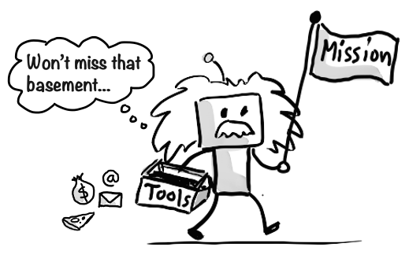
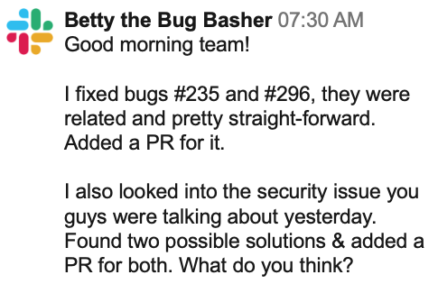

# Autonomous agents with tools

I think the most interesting application of Generative AI is autonomous agents with tools.

These are AI-powered software entities that run on their own, rather than sitting and waiting for you to prompt them all the time.

So you go down to Einstein in the basement and do what a good leader would do for a team. You give him a high level mission and the tools need to accomplish it, and then open the door and let him out to run his own show, without guidance and feedback but no micromanagement. The tools could be things like access to the Internet, access to money, ability to send and receive messages, order pizza, or whatever.

I've worked with this quite a lot, and founded a company that builds AI agents that integrate into existing workflows, like a colleague. Very interesting stuff!

I wrote a few chapters showing AI agents in action:

- [Jimbo the Youtuber](../2-extra/470-jimbo.md)
- [Ailex the AI journalist](../2-extra/480-journalist.md)

I also described an RFP agent in the chapter on [AI transformation](../2-extra/510-transformation.md).

With autonomous AI agents, prompt engineering becomes even more important. Because your autonomous tool-wielding agent can do a lot of good or a lot of harm depending on how you craft your mission statement and prompts.

## Example: a bug fixing agent

Here's hypothetical (but realistic) example. Imagine we have an agent called Betty the Bug Basher. She works with a software development team, and her job is to fix bugs.

> Betty's mission: Fix bugs
>
> Betty's tools:
>
> - Access to a bug tracker
> - Access to the code (via GitHub)
> - Access to slack (for team communication)

Since Betty is an autonomous agent, she does not wait for someone to ask her to fix a bug, instead, she continuously monitors the code base and the bug tracker. She specifically looks out for bugs that are fairly simple to fix, things that she can fix on her own. For more advanced bugs it is better if a human developer leads the work (but with Betty's support).

When she finds a suitable bug, she assigns it to herself in the bug tracker, fixes it, and makes a PR (Pull Request, a way to propose changes to the code base). She also watches conversation in slack, and sometimes takes part.

She also sends a report every morning in Slack, such as:

This is a distributed team, and they have brief sync meeting every morning. Betty participates in that call, mostly silently. But there people can ask her questions, or ask her to do stuff.

For example:

- Jim: "Hey Betty, our login page is really slow lately, not sure why. Can you look into?"
- Betty: "Sure!" (12 seconds pass...) "OK found it. It was caused by (....). I've added a PR to fix it."

AI agents can potentially be very fast. That's why it is important to have a human in the loop somewhere. It would be the same with a human. You wouldn't want a human genius that just runs off and does a bunch work on their own without collaborating with the team, right?

So does Betty exist? At the current moment, Aug 2024, not quite. But a lot of products are being built that are getting close. So I think this will be the norm in the future. Every team (and just not development teams) will have an AI colleague that shares the team's goal, but has their own specific responsibilities.

>  **Egbert's take**  
> Fantastic idea! Let's unleash autonomous AI agents with access to money and the internet and whatnot. I'm sure it won't end up like every sci-fi movie ever. Next, why don't we give toddlers chainsaws and set them free in a forest? I'm sure your 'mission statement' and beautifully crafted prompts will keep everything under control.
