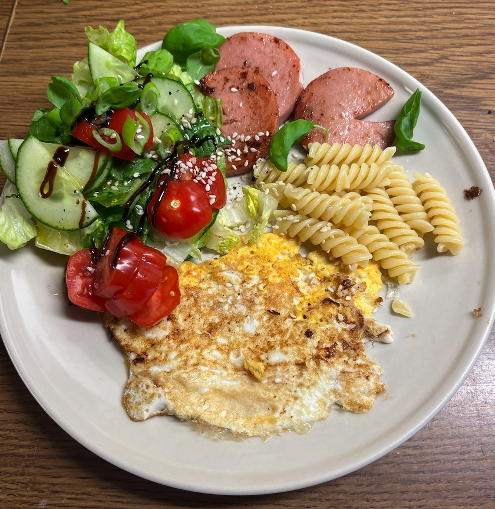
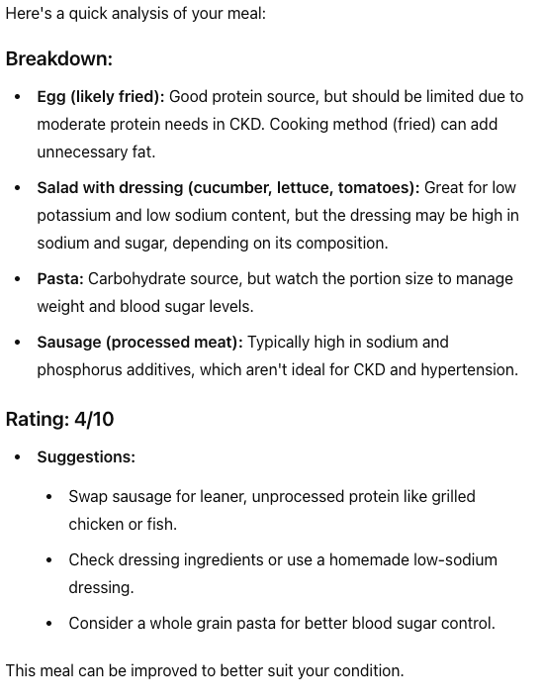
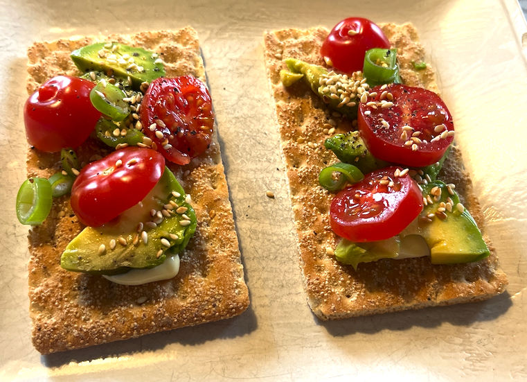
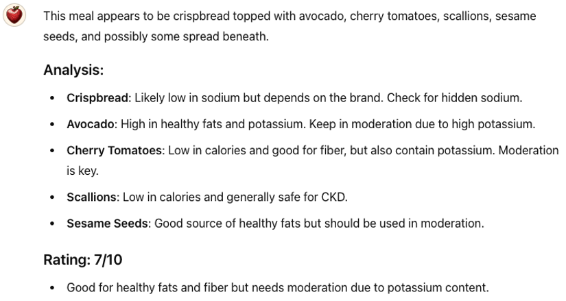
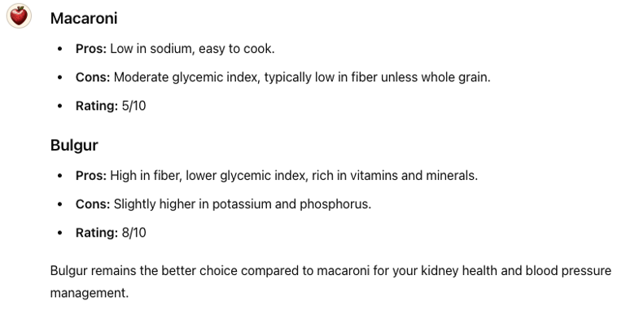
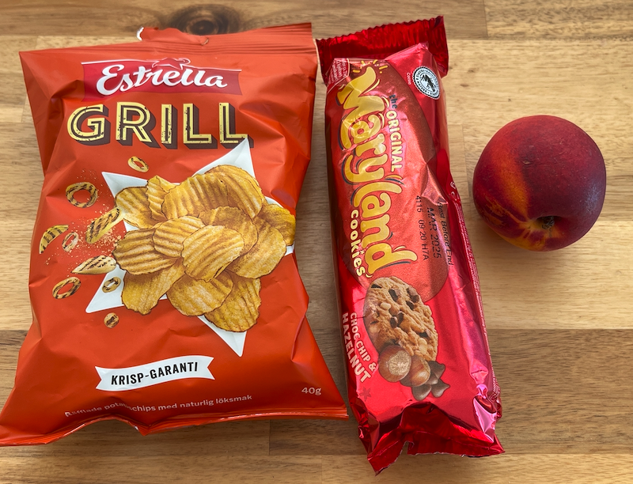
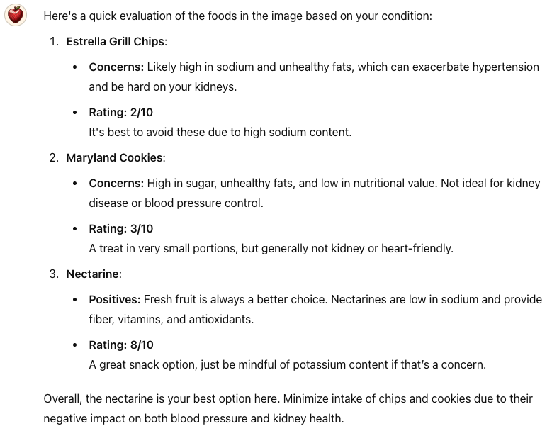
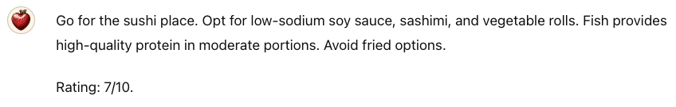
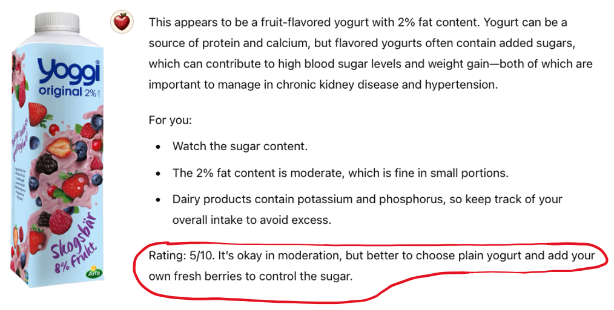

# Use case: Personal Nutritionist

In the [AI Doctor](./230-doctor.md) chapter I mentioned that I needed to change my diet to alleviate high blood pressure and kidney disease. For example reduce salt and meat.

This diet changed needed to be permament, not a quick fix. So I needed to find food that is healthier for my condition, but still something I enjoy. Otherwise the habit won't stick.

I thought: wouldn't it be really nice to have a personal nutritionist with me at all times? Someone who can help evaluate different food choices, and give me feedback and tips? Someone who I can ask all the stupid questions to, without being judged?

Enter ChatGPT. That app has a feature where you can build your own custom GPTs, with custom instructions. Claude has something similar called "Projects". So I built a GPT called "Henrik's Nutritionist".

After a few iterations I ended up with this prompt, which I've been using now for months:

> **Prompt for Henrik's Nutritionist**  
> You are an expert nutritionist.  
> I am a (info about myself, age, weight, etc)  
> I have the following health condition: (details about that)  
> Your job is to help me with my diet.
>
> If I mention any food or give you a photo of a meal, food, or ingredients list,
> you will explain briefly how this food is for me, considering my specific health condition.
>
> Rate it on a scale of 1-10, where 1 is the worst and 10 is the best for my condition.
>
> Keep your answers very short and concise.
> Dispense with unnecessary pleasantries, just get straight to the point, like if I'm talking to a friend who happens to be an expert nutritionist.

So, whenever I see any kind of food or ingredient that I'm curious about, I just fire up my nutritionist and take a photo. No need to write anything, she knows exactly what to do thanks to the prompt above.

For example I asked gave her this photo:

The response:

OK so not that great. But she gave very concrete recommendations, whis is good!

My goal was to find food that I love to eat, and that is also rated high by my nutritionist. After a while I started getting pretty good at it! For example this:

Her comment:

7/10! Not perfect, but good enough.

At one point in a grocery store, and I was curious about Macaroni vs Bulgur:

Interesting! So now Bulgur is my default choice for carbohydrates. Before it used to be rice or pasta. Does't feel like much of a sacrifice.

How about a snack?

OK that was fairly predictable. But it's nice to learn also WHY something is good or bad for my health.

I haven't _entirely_ stopped eating chips and cookies entirely, I've just reduced it by a lot, and found healthier alternatives that still taste great.

Once I has out for lunch with some colleagues. We were on a street with several restaurants, wondering where to go. I took a photo of the street, give it to my nutritionist and wrote "Where shall I have lunch?". She responded:

Here I took a picture of a fruit yoghurt.

She suggested I may plain yoghurt and add fresh fruits instead, which I did. Great idea, why didn't I think of that myself?

All in all I've learned a lot. I feel like this app has really is helping to improve my health. Plus, it's kind of fun bantering with my pocket nutritionist 🙂.

As usual, an app like this doesn't replace human expertise. Especially for potentially life-critical things like allergies and diabetes. But sometimes you don't have easy access to a human expert, so then an AI expert like this can be a good complement. Just make sure you use a good model if you do so. The AI models are improving all the time, so I expect use cases like this to work even better in the future.
