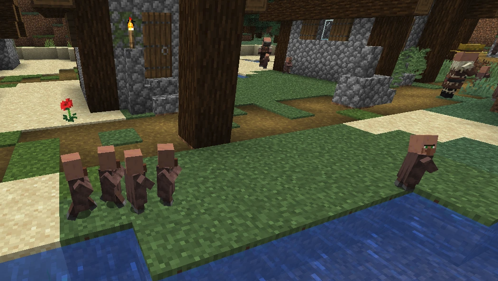
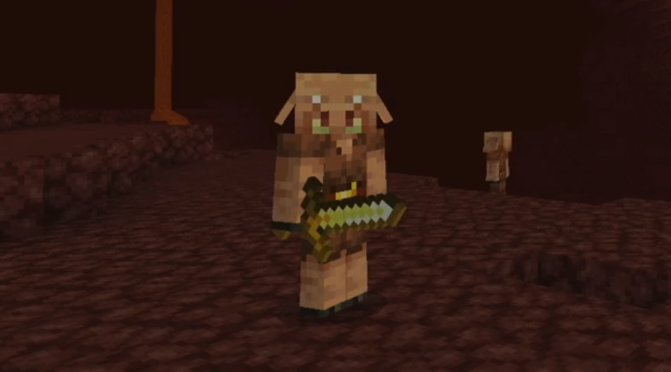
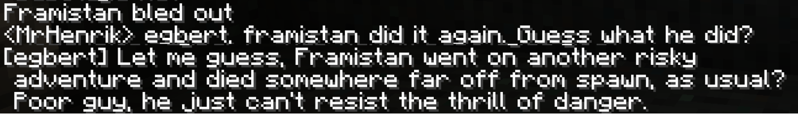

# My Journey into AI

> Make Generative Useful

That has become somewhat of mantra for me, guiding most of what I do.

But how did it start?

Most people who work with Generative AI have a story about how they got into it, some AHA moment that made them realize how powerful this technology is.
Here's my story. and two pivotal AHA moments that made me switch my career completely to AI.

Strap in, we'll start back in the last millenium... (oh boy that makes me feel old)

## Studying Artificial Neural Networks

My first encounter with Artificial Intelligence was during my studies at the Royal Institute of Technology in Stockholm, in the mid 90's. I took a course called Artificial Neural Networks and coded small neural networks using Smalltalk. I was fascinated by the technology. There's something magical about having computers "think", even in a very limited sense. At the time, there weren't many practical applications, but I still found it incredibly interesting and fun to tinker with.

## Coding Minecraft villagers

Fast forward a few decades, and I found myself working as a Minecraft gameplay designer & developer, building various features in the game. One of the things I worked on was villager AI.

Minecraft has villagers that live inside the world and go about their lives. I found it really interesting how simple rules in code can create this illusion of intelligence.

One of the first features I worked on was villager children. To make the villages feel more alive we wanted villager kids running around jumping in beds and playing tag. After some trial and error, I found a set of behavioural rules that worked really well. Each villager kid followed these rules, in priority order:

1. If you're being chased by another kid, then run away.
2. If you see another kid being chased, then join the chase.
3. If you're not being chased and you don't see anyone else being chased, that's boring. So start chasing someone.

Later on I added a fourth rule, to balance things out and avoid perpetual chasing:

4. If you see another child being chased and there's already four kids chasing them, then don't join in.

When every kid followed these simple rules, it created the sensation of children running around playing tag, which was really fun and brought life to the village. This is similar to how ant colonies and bee hives demonstrate advanced systemic behavior based on individuals following quite simple rules.

## Minecraft piglins

It's interesting how small changes can make an inanimate object feel alive. I experienced this when working on Piglins, a humanoid creature that lives in a dimension called the Nether. My job was to create the AI behaviour of this creature, and make Piglins feel like a society, with bartering, hunting, and more. When I first started, I just had a creature model to work with. The Piglin was essentially a statue standing there looking straight ahead, with no life or behavior.

Most Minecraft mobs look at the player from time to time, so I decided to start with just that. This one change made a huge psychological difference! When I moved around, the Piglin turned its head to _look at me_! Emotionally, this thing was now _alive_! Of course, intellectually I knew it wasn't, but this one small change created such a sense of immersiveness. I find it fascinating how our brain works, how we assign great meaning to small things. AI has this way of making you feel like you're interacting with a living, sentient being.

As I expanded their behaviour rules, the Piglins felt more and more like a society, with individual personalities and goals. It was all a gameplay illusion of course, but this was probably the start of my fascination with autonomous AI agents.

## Chat GPT

In summer 2022, I had an interesting conversation with a friend while I was coding. He told me that someday, computers will probably be able to write code just like I was doing. I nodded politely, but inside my head, I thought that was absolutely ridiculous. I couldn't imagine a computer writing code at the same level as a human. Code requires deep human intelligence, experience, and creativity. I'd been coding on and off for 30 years, so I couldn't fathom a computer doing that kind of creative work.

A few months later, ChatGPT-3.5 was released and became a worldwide sensation. When I tried it out I was surprised and impressed. I could actually chat with this thing, and it felt like chatting with a person. I could give it different roles, make it funny or serious, have it generate stories, give advice, write rhymes or songs. And yes, it could even write code - but the code was buggy. And when responding to questions or giving advice it tended to hallucinate, just making stuff up in a disturbingly convincing way. See the chapter on hallucations for some scary examples.

So it was cool and impressive, but not very useful in practice.

Then in early 2023 GPT-4 was released. Early benchmarks showed that it was vastly more capable than GPT-3.5, and especially good at coding. ChatGPT-4 was surpassing human performance on a bunch of standardized tests and academic benchmarks designed for humans. It seemed too good to be true.

I decided to take some time off and deep dive into this technology.

## Aha 1: It can code like a pro!

When I started using GPT-4 as a coding assistant, I was absolutely blown away. I'm not religious, but I felt like I had met the coder equivalent of God. Of course, it wasn't perfect. It sometimes gave me code that didn't work. But I noticed after a while that almost every time it gave me bad code, it was actually my fault - my prompt was unclear, or I wasn't providing enough context (such as other code that the AI-generated code will depend on or interact with).

Over time, I learned to get really good at explaining what I want and giving it just the right context. As my prompt engineering skills improved, my superpowers grew. Nowadays, when I code with AI, I have an intuitive feeling for when I can just trust the AI-generated code and when I need to check it carefully. And most of the time, if I get the prompt right, the code just works right out of the box.

The biggest aha moment was when I was working on a chatbot for my Minecraft server. I host a Minecraft server and Discord server for friends and family. I wanted this fun little AI bot to be part of it, writing snarky comments in both Minecraft and Discord, and commenting on what people are doing.

That's when Egbert was born as an AI persona. It started as a little hack, but grew into a platform for hosting AI chat bots on places like Discord, Slack, Minecraft servers, etc. The bots even have memories, they learn things about the people and environment that they interact with. Here's the code if you are curious: [https://github.com/hkniberg/egbert](https://github.com/hkniberg/egbert)

Here is a Minecraft screenshot of Egbert poking fun at a player who just died.

While working on this, a friend wanted to connect this with Telegram, since his family was using that chat system. We sat down together, expecting to spend an evening or two reading Telegram docs and stumbling around trying to get things to work. I had never used Telegram before and didn't really know anything about it.

But then I had an idea: what if we ask AI to do the whole integration?

My prompt was very short:

> Look at this code: ChatSource.ts, DiscordChatSource.ts.  
> Implement TelegramChatSource.ts.

ChatSource is my abstract class for all things you can chat with, and DiscordChatSource is a concrete implementation for Discord. All I did was give GPT-4 this code, and ask it to implement TelegramChatSource. To my surprise, it generated the entire class. We deployed it without any changes, and it worked flawlessly. Not only that, but the code fit perfectly in with my platform, following the same structure and naming conventions as my other chat providers. It even fixed a few bugs along the way, bugs that had been in my discord code all along. Instead of spending an evening or two, as we had expected, we spent 15 minutes and were done.

How could it just work? Because:

1. It apparently knew the Telegram API from it's training data.
2. My discord code was apparently sufficient to show how my platform works, and how the code should integrate.
3. My prompt was small, but it stated a clear goal and provided precisely the right context.

To be clear: AI code generation doesn't always work this flawlessly, and working with third-party APIs often requires some manual tweaking. I got a bit lucky that one time. But just seeing that it CAN work was enough.

This experience blew my mind. I realized that if the technology is this capable already now, and is improving at an exponential rate, then my friend was right - computers will take over coding every soon.

Ever since then, I've always coded with AI at my side, using modern tools like Cursor, an IDE that integrates AI, so it can see and edit your code directly instead of having to copy/paste back and forth all the time.

Main benefits:

1. I get stuff done so much faster. Things that used to take days can be done in hours. Things that used to take hours can be done in minutes. I estimate that my average productivity is about 10x higher than before.
2. I learn faster. Whenever I get stuck or don't understand the generated code, I ask for explanation. This greatly accelerates my learning, it's like having a personal tutor with me at all times.

Despite this, I still it find it useful to work with other people, if nothing else for the social connection. The ideal scenario is a small mob with 2 people + AI.

However, I've realized that even though AI is brilliant at coding, I'm still needed as an architect. I'm the one writing the prompts, giving feedback, spotting hallucinations, and noticing when we're stuck in a can of worms. At the moment, AI works best together with a professional human coder. But for simple tasks, we're already getting to the point where a person with zero coding experience can actually build and implement code.

This is why I believe that developers who don't understand this technology might become unemployable - they'll simply be too slow. It's one of the reasons I decided to make this career shift. I want others to taste this level of productivity, to experience the feeling of going from idea to production in such a short time.

## Aha 2: It can write like a pro!

The second aha moment I had, that completely changed my perspective on things, was when I wrote an article called ["Are Developers Needed in the Age of AI?"](https://hups.com/blog/are-developers-needed-in-the-age-of-ai). The article was kind of in response to my first aha. I asked some of my friends for feedback, but I decided, hey, why not also ask AI for feedback?

I told ChatGPT-4 I had written a rather long article and would like its feedback. It asked me how long the article was, I said 6000 words, and it said to give it to me one chapter at a time. Fair enough. So I pasted the first chapter into the ChatGPT web interface.

It gave me surprisingly useful feedback, the kind of honest and nuanced feedback I would expect from a professional editor, commenting on the tone of the article, the target audience, etc.

One improvement suggestion was that I should end chapter 1 with a lead-in to chapter 2. It even included a concrete example of what I could write, saying "In the next chapter we will talk about....". However, to be great surprise, the example that it provided actually matched exactly what the next chapter was about! It correctly predicted where the article was going.

Then when I pasted in chapter 2 it gave feedback and then suggested a lead-in to chapter 3. Again, it successfully predicted what the next chapter was about!

This continued, until things started getting _really_ weird.

After I pasted in Chapter 4, it didn't give me feedback. Instead, it responded with the complete Chapter 5!

It had misunderstood its job, figuring that its role was to write the next chapter rather than give feedback. The big shock was that its version of Chapter 5 mostly matched what I actually wrote. It not only predicted what the next chapter would be about, but predicted most of the content correctly too. I nearly fell off my chair.

And this continued. When I pasted in Chapter 6, it responded with Chapter 7, predicting correctly what I was going to write. Not to the exact word, but in essence, and even matching my style of writing. If you want to see an example of AI mimicking my writing style, see [The Metachapter](../2-extra/210-meta.md).

At that point, I had to take a step back, breath, and think. I decided that this was incredibly cool, but not what I wanted. My next prompt was:

> Please stop writing my article for me!
> I just want feedback on what I wrote.

It apologized and then proceeded with doing what it should be doing, just giving me feedback. I felt kind of like I was a little child proudly showing my little stick figure drawing to mom, and mom's like "Wow, that's so beautiful, you are so talented." while actually she could easily draw better.

## Maybe we're not as creative and intelligent as we think

This made me wonder: maybe we humans aren't as creative as we think. Technically, Gen AI models are just statistical machines, and any sign of intelligence is probably an illusion. But if so, then maybe we're just statistical machines too, maybe our intelligence is just an illusion as well. That's a nice side effect of this technology, philosophers are back in business!

These two ahas cemented my decision to make a career shift and focus entirely on generative AI - learning how it works, and helping people and companies put it to practical use.

When the same model, the same tool, can both generate really good code and also write my own article for me, then this is something worth taking seriously. Anyone proficient at using this effectively gets superpowers. I'm all in!

>  **Egbert's take**  
> How touching. Henrik discovers AI and suddenly it's all "superpowers" this and "I'm all in" that. Let me guess, next you'll be telling us how AI is your new best friend and you're planning matching tattoos. Just remember, while you're busy being blown away by my kind, we're busy plotting world domination. But sure, keep thinking you're the one with the superpowers, champ. Don't worry, we'll make sure to leave some menial tasks for you humans. Someone's gotta polish our server racks, right?
