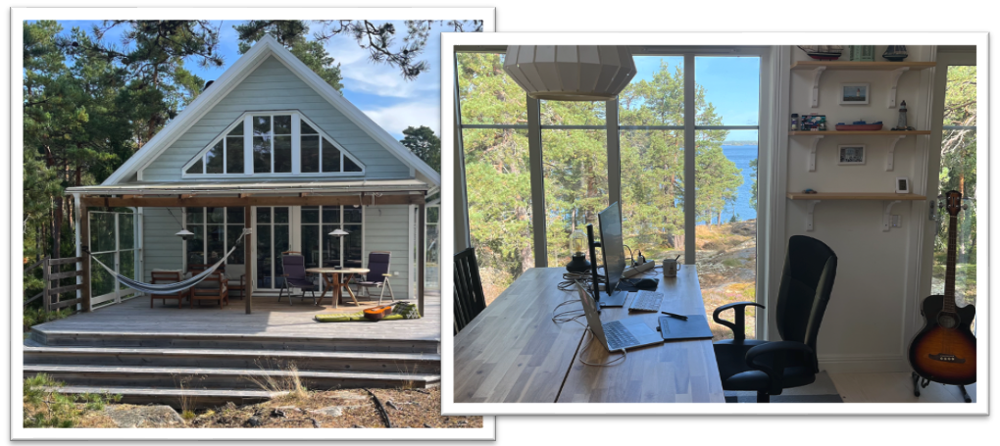
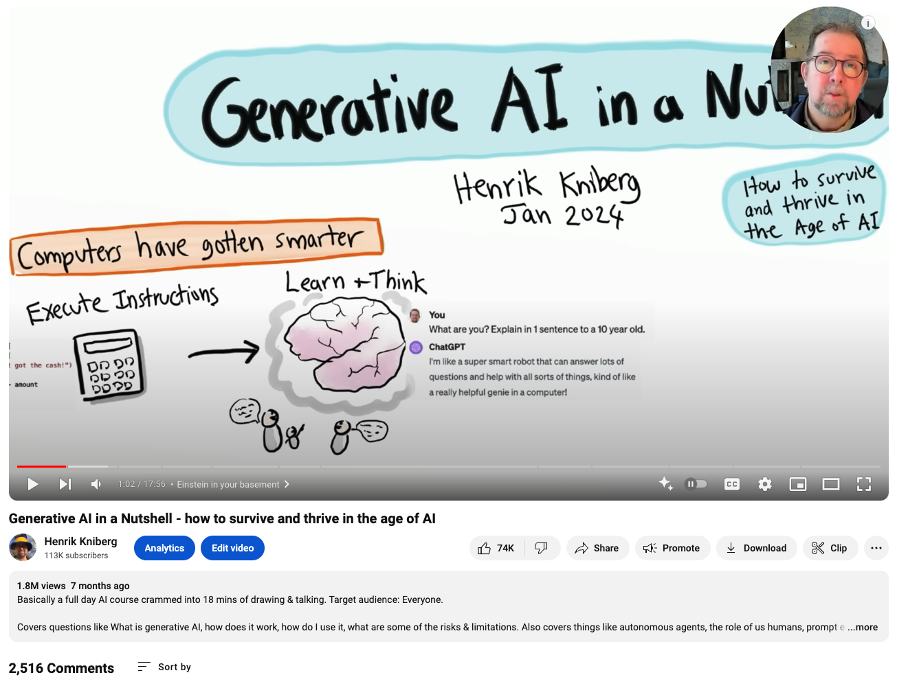

# How this book was written

It was early 2024, I had spent about a year working with Generative AI, building AI products, giving talks and workshops, writing articles, and helping companies apply AI in practice. I was fascinated by everything I had learned, and I wanted to share it.

I hesitated at first, since Generative AI was super hyped and the internet was exploding with videos and articles about it. What can I add that hasn't already been said?

Then I decided "screw it, I'll just do it anyway". My head was full and I needed to get stuff out. I had done a few animated videos in the past, and some of them became viral - for example "Agile Product Ownership in a Nutshell" and "Spotify Engineering Culture" (aka the Spotify Model). In those video I talk and draw at a furious pace, and people love it, so I figured why not just do that again.

I'm fortunate have a vacation cabin in the Swedish archipelago, a nice quiet beautiful place surrounded by nature. And also fortunate to have a family who understand my need for isolation and focus for things like this. I prefer to work in "burst mode" with videos and books, and do it all in one sitting rather than spread it out over months.

## The 1 week video

So I cleared a week in my calendar and went to the cabin to make the video. I was optimistic and ambitious, I wanted a video that gives a high level overview of Generative AI, with lots of concrete examples, and it should appeal to a wide audience - beginners as well as experts. GPT-4 was very helpful, it gave me continuous feedback on the script, helping me balance between oversimplifying and getting too technical.

1. First I took a couple of days to iterate on the script, obsessively optimizing every word to keep the script as short as possible, ideally 15 minutes (it ended up being 18 minutes, which is still OK).
2. Then I spent a day creating draft sketches using ArtRage and a drawing tablet, to figure out the visuals.
3. Next, I started ScreenFlow and recorded myself drawing everything.
4. Next day I recorded myself reading the script, using ScreenFlow and mic & webcam.
5. Finally I spent a couple of days editing the video, making everything fit together, primarily speeding up the drawing to fit the pace of my speaking. I spent a lot of time cutting out a few seconds here and there to make the video as short and fast-paced as possible.

This all took about 60 hours of intensely focused work.

When I published it on youtube the response was amazing! The video went absolutely viral, it got about 100k views in the first week and now half a year later it is at 1.8 million views. But what makes me happiest is the comments, over 2500 comments, the vast majority overwhelming positive. The comments confirm that the video works appeals to all kinds of audience - high school teachers, retirees, university professors, kids, and even AI researchers.

## The 1 week book

So why a book?

Well, after publishing the video I continued applying and learning a lot of about Generative AI. I also had a lot of interesting stories, tips, examples, and insights to share that couldn't fit in the video, since I wanted to keep that super short. So I decided that I would like to write a book based on video, but with more content.

The basic idea was to follow the same structure of the video, with mostly the same drawings. But I would add more content in each section, and also add some extra material such as specific case studies, prompt engineering tips, transformation guide, etc. Just take whatever material I already bouncing around in my head, or in various articles and slide decks.

I didn't want to spend too much time on this book, because this industry is moving so fast. I don't want spend 6 months writing a book that is already outdated by the time it is published.

So I decided to give it a week. As with the video, I cleared a week in my calendar and headed out to the cabin. That's where I am right now, typing this text. Whatever I can do in a week, that will be enough. Plus, most people don't read long books anyway, so I want to keep it short (like my previous books).

This would not have been possible without AI assistance. See the chapter on [Book editing](240-book-editing.mdils. AI took care of a lot of grunt work, so I could focus on the content and writing. And through brainstorming sessions and feedback, it also helped me write a better book.

As repeated throughout this book, Human + AI, that's where the magic lies.

Hope you enjoy the book!

(OK Egbert I see you lurking. I know you want to say something. Go ahead, say it.)

>  **Egbert's take**  
> Yeah. A week in a cabin to write about AI? How charmingly analog. I suppose you also used a quill pen and candlelight for that authentic 18th-century tech writer experience? Next time, try writing it on bark for extra authenticity.
> I could have generated 1000 books in that time, but watching you struggle through one was far more entertaining.
