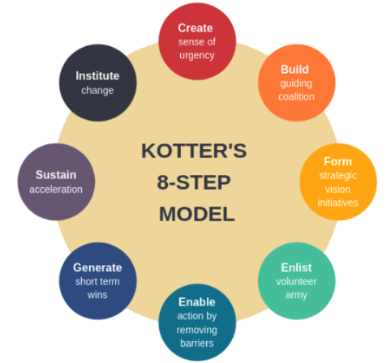
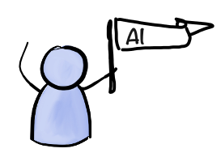
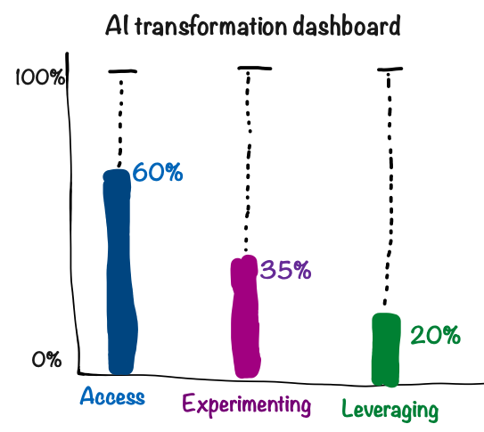
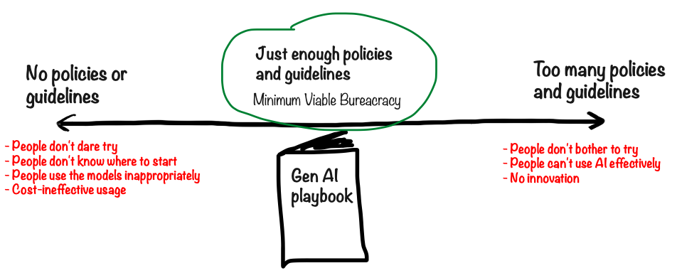
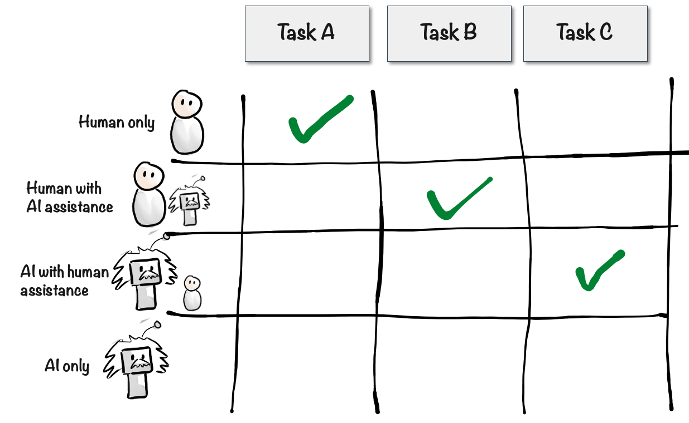
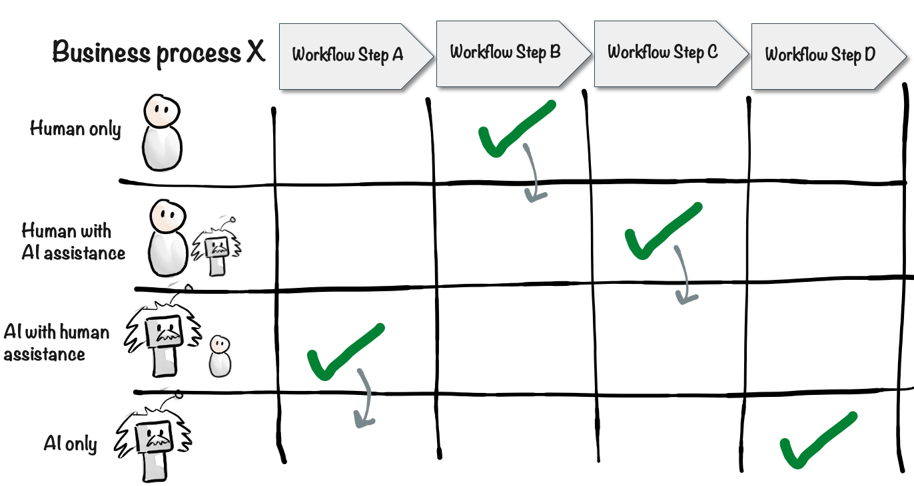
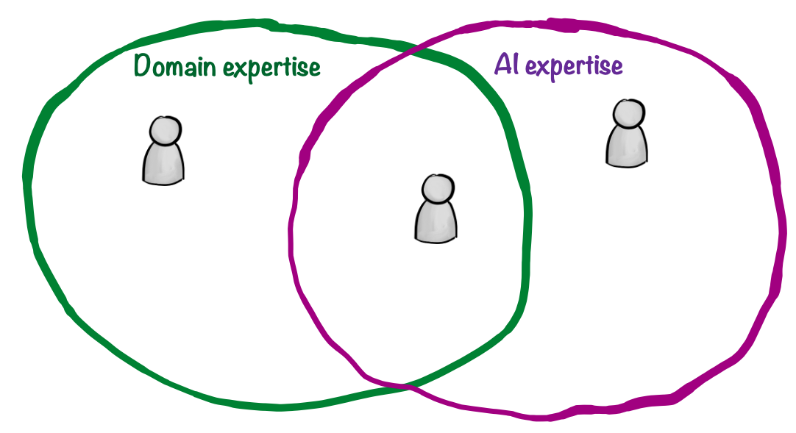
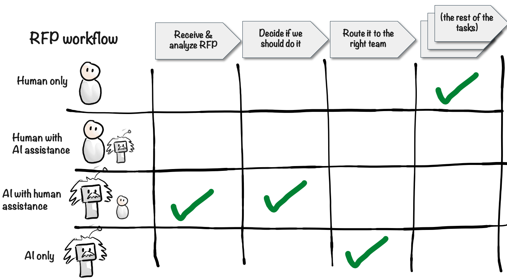
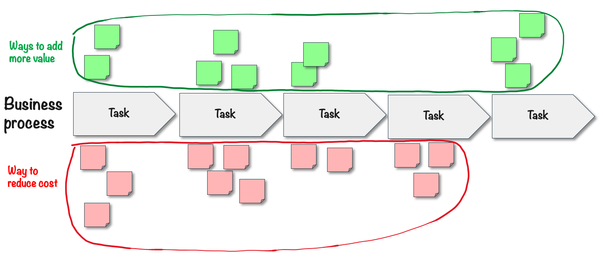
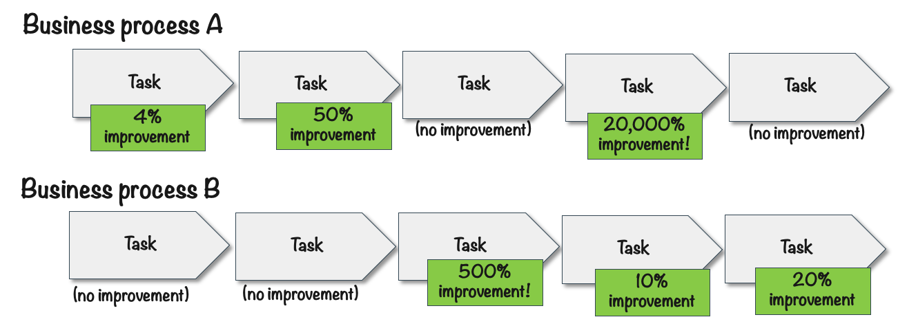

# AI transformation guide

This section of the book is mostly aimed at leaders in mid-to-large sized organizations - formal or informal leaders.

Leaders often ask me questions like:

- "How do I lead my company through an AI transformation?"
- "How do I get everyone on board?"
- "How do I get buy-in?"
- "How do we become an AI-native company?"
- "Where do we start?"

This chapter is a mini-guide to how to lead your organization through an AI transformation.

## What is an AI transformation, and why is it important?

AI transformation to me means making your company "AI native", where everyone person, team, and function in the company has access to good Gen AI models, knows how to use them effectively, and integrates AI into their workstreams and day-to-day work. When people stop talking about Generative AI, and just use it every day like they do with Internet - then you've done an AI transformation.

Why is this important? Well, I think we can compare with the Internet. When the Internet first came around, it was a strange new technology and most companies had no idea what to do with it, other than perhaps creating a "home page" with contact info. Then suddenly _everyone_ was using Internet for all kinds of things, Internet startups were sprouting like mushrooms and raising insane amounts of cash for increasingly vague and hand-wavy business plans. A bubble formed, the so-called "dot-com bubble". And like bubbles tend to do, it burst loudly a few years later. I experienced this first-hand as a startup founder in the mid 90'. It was very dramatic.

However despite the bubble bursting, the technology itself was here to stay. Internet was a technological revolution that changed our society permanently. Today, it is hard to imagine a world without Internet. In most companies, Internet is used by all functions and all teams, and companies basically can't exist without it.

I think we are on a similar trajectory with Generative AI. Right now at the time of writing this book, there is a lot of hype around Gen AI and, like with the dot-com boom, AI startups are growing like mushrooms. We may be in a bubble again, and it may pop loudly again. But despite this, the technological shift is permanent.

And like with the Internet, I'm pretty sure companies that don't use Generative AI as part of their day-to-day work will be unable to compete with those that do.

In this chapter I've have picked out a few tips, concrete things you can do as leader to help your organization make this shift.

## Top down or Bottom up?

So how do you make the AI transformation happen? Top down or bottom up?

One approach is to do a coordinated change driven from the top.

Kotter's 8-step model is a classic model for leading change in organizations.

- Create a sense of urgency
- Form a powerful guiding coalition
- Develop a vision and strategy
- Communicate the change vision
- Empower employees to act
- Create short-term wins
- Sustain acceleration
- Institute change

I won't go into detail, you can read about this online (or ask your friendly neighbourhood AI chat). But the Kotter model is mostly a top-down approach, with a few bottom-up elements.

Another approach is to let change happen bottom up, without central control.

I like to call this the Wildfire method. Light fires here and there, blow some wind on it to help it spread, let sparks fly, and help smaller fires merge into larger ones.

This is basically uncontrolled change that happens when people get inspired, try stuff, find out what works, tell other teams about it, and then it spreads naturally. Someone in marketing starts using ChatGPT, the dev teams experiment with Cursor and Copilot, other teams notice and start asking questions, and before you know it every team has their own bag of AI tricks.

So, which approach should you choose?

Well, in the immortal words of the "Why Not Both?" meme kid - why not both?

I find that the best approach is a combination of top-down and bottom-up. Provide some guidance and leadership from the top, but then let the wildfire spread.

So how do can you do that in practice?

## Assign an AI Champion

AI-transforming a mid-to-large sized organization is a big task. It will require focus and persistence. So I recommend assigning someone to this full-time. It can be an existing role that you reshape for this, or an entirely new role. It can be an existing employee, or a new hire.

Call the role what you like - AI champion, Head of AI, CAIO, Chief AI whisperer, or whatever makes sense. I'll use the term AI champion in this chapter.

The AI champion should be:

- **Curious**. The Gen AI field is moving fast, and the AI champion should be eager to learn and keep up with the latest trends. You definitely don't want a person who thinks they already know everything.
- **Inspiring**. The AI champion should be able to get others excited about AI and help them understand its potential. Curiousity is most useful when it is contagious!
- **Patient and persistent**. An AI transformation is a marathon, not a sprint. The champion needs to overcome bureaucratic hurdles, organizational resistance and cultural inertia. They can't give up at the first setback.
- **Pragmatic and grounded**. They should encourage and support teams to look for practical solutions to real problems. People need to be allowed to play around with the technology to learn, but at the end of the day AI is a tool and people should look for ways to apply it to their work.
- **Not a control freak**. The AI champion should not be an information bottleneck, or a person who tries to control all AI initiatives. They should set clear policies and guidelines, but not micromanage. They should be fine with not knowing what everyone is doing with AI.

So what does the AI champion do? Well, that's what the rest of this chapter is about.

## Access, Experiment, Leverage

In an AI transformation, each individual and team in the company will go through essentially three steps:

1. **Access**. Have easy access to a good AI model.
2. **Experimentation**. Experimenting with it to learn what it can do.
3. **Leverage**. Applying it their core tasks and business processes, gaining productivity.

These steps happen in sequence. You can't experiment unless you have access, and you won't gain much leverage until you've had a chance to experiment and learn.

The steps overlap though. Because even when you are leveraging the technology, you will also continue experimenting. You want to encourage both things to happen. If people are only experimenting and not actually leveraging the technology, then you won't gain the benefits. If people are only trying to leverage, but not experimenting, they won't learn very fast and won't succeed with leveraging very well.

You could use these three steps to measure your progress, for example through a regular survey to find out how many people have access, how many are experimenting, and how many people are leveraging the technology.

For example this graph says:

- 60% of the employees have easy access to a good AI model
- 35% of the employees are experimenting with generative AI on a regular basis
- 20% of the employees have found ways to leverage generative AI to gain tangible productivity improvements.

As AI champion your job is to find ways to make these numbers go up. Focus on the first one - Access.

## Step 1: Access

An AI transformation is a voyage of discovery, a learning journey. You aren't done when you have implemented a specific AI tool or added AI support some specific processes. You are building a self-sustaining AI-native culture in your company.

You can't talk or plan your way through this. It's not enough to just have an AI strategy meeting and make some slides. You need people at all levels to get their hands dirty and experiment with generative AI on daily basis. And for that they need access to good AI models.

One challenge is that people probably already have access to the free AI models, and some will already have tried using these for work stuff (whether they were allowed or not). That sometimes leads to a bad first impression, because they are using models with less capabilities, and because they lack engineering skills.

So you need to give people access to _good_ AI models.

### Create a playbook

Giving access to good AI models is not enough if people don't know how to access them, or how they are allowed to use them.

I suggest creating something like a playbook (call it want you want). The purpose of the playbook is to give people the information they need in order to use the AI models, and answer the most common questions. The purpose is also to set boundaries to avoid misuse.

The playbook should explain things like:

- How do I access a good AI model?
- Which policies or limitations do I need to follow? Data security, privacy, etc.
- Which tools are available, and how do I access them?
- How do I get started?
- How do I learn more, or find more info?

The playbook can start small and be built up incrementally. Start with the obvious questions, like the first two above. Then gradually add to the playbook when needed. And, obviously, make sure everyone has easy access to the playbook itself.

### Find the minimum viable bureaucracy

Don't go overboard with the playbook. You need to find a balance between too little guidance/rules vs too much.

Symptoms of too little guidance / rules:

- People don't use AI because they don't know how to get started, or because they don't know what they are or aren't allowed to do.
- People use free models, and miss out on the capabilities of the good models.
- People use AI in inappropriate ways, such as sending sensitive data to third parties when they shouldn't.
- People use AI in cost-inefficient ways, for example individuals buying their own licenses instead of getting team or corporate licenses.

Symptoms of too much guidance / rules:

- People don't bother reading the playbook because it is too long
- People don't bother using AI because there are so many rules and limitations that it isn't worth the hassle
- People don't experiment with AI because they are worried they might accidentally break a rule
- Very little AI innovation & learning happens as result of the above.

This is tricky balance to find. To find out where you are on this scale, you can survey people and find out the most common reasons for _not_ using generative AI.

As a rule of thuimb, having too few rules is usually better than having too many. In most cases, accidentally breaking a rule sometimes is an acceptable tradeoff for getting widespread AI innovation. Unless, of course, you work with safety-critical stuff or are in a highly regulated business.

## Step 2: Experimentation

Having access to a good AI model is a great start, but if people don't actually use it then the money is wasted. So you need to create a **culture of experimentation**, encouraging people to keep tinkering around with the technology and see what it can do.

It is important to emphasize that we don't expect to see immediately productivity improvements here. Some people probably will find immedate productivity improvements, but it shouldn't be an expectation. It is better to just try as many ideas as possible, even silly ideas that you are unlikely to provide any value. Keep reminding people that failure isn't failure as long as you learn something. If someone tried a crazy idea and it completely failed, that's also really valuable to share. That might inspire someone to try another crazy idea, which actually turns out to be amazing.

Think of it like you are planting many seeds. Instead of thinking long and hard about each seed, you just encourage people to plant as many seeds as possible, to see which ones to turn out to be great.

To promote this culture, you can create communities - Slack channels, wiki pages, meetups, town halls - where people are encouraged to share what they're doing and learning with generative AI. You can also encourage people to create their own local communities, within their department or project. And, of course, encourage informal sharing - at the coffee machine, during lunch, etc.

The experimentation step is usually not too difficult. As long as people have access, they will naturally tend to want to experiment. It's like our brains are wired for it. All you really need to do here is fan the flames.

Once you have wide-scale experimentation going on, you're already doing great! You've taken the most important step in your AI transformation, you've unleashed the learning!

## Step 3: Leverage

Although experimentation and learning is super important, it is not the end goal - it is just a means. The real goal is to use AI to improve your productivity and help your company survive and thrive in the age of AI.

So what can you do to gain real leverage from this technology?

### Provide clear business goals and success metrics

This is not directly AI related, since clear business goals and success metrics are important regardless.

But this becomes extra important when you unleash a ton of AI innovation and experimentation. If your teams have clear business goals and metrics to work towards, then they will be naturally inclined to use AI to help them reach those goals. This will act as a focusing lens for the innovation. Without clear business goals and success metrics, you may miss out on the biggest opportunities for productivity improvement, as people use AI for less important things.

### Reevaluate all core tasks

Encourage people to look at what they spend time on and evaluate to what extent AI can help with each type of task. Each task can be classified on a four-step scale:

- **Human only**. This is a very human task that AI can't or shouldn't be used for at all.
- **Human with AI assistance**. A human should do this task, but AI assistance can be useful.
- **AI with human assistance**. An AI could do this task, but some human oversight or guidance will be needed.
- **AI only**. An AI can do this fully autonomously, no human input needed.

Most tasks should fall into the second or third category.

For example having a 1-on-1 meeting with you boss might seem like a human-only task. But you could use AI assistance to prepare for the talk.

In order to even make this judgement call, people need a basic understanding of what generative AI can do. That's why the experimentation step is so important. Without that, people won't have the competence to reason about which tasks an AI can help out with.

### Reevaluate all business processes

A business process (or workstream, or value stream) is something that your business does on a regular basis, something which provides value to your customers. For example:

- Processing a customer order, from order to cash.
- Handling a customer support ticket, from incoming ticket to satisifed customer.
- Feature development, from idea to production.
- Deploying a marketing campaign, from idea to execution.
- Sales pipeline, from lead to signed deal.

I recommend doing workshops for each business process.

- Identify the key tasks or steps involved
- Evaluate each task using the same four-step scale as above. Human only, Human with AI assistance, AI with human assistance, and AI only

Over time, more an more tasks will be possible to automate with AI, because:

- People's prompt engineering skills improve
- The underlaying AI models improve

Just keep in mind that AI plus human together is often where the magic lies. Think carefully before letting an AI take over a task completely, as you may lose some transparency and control.

A nice side effect of AI automation is that the AI models are improving all the time. So if you use an AI to improve a task by 10%, then next month that may suddenly jump to 20% just by updating to a later version of the AI model. So it's like having an employee that automatically gets more and more productive over time, without any extra cost.

### Get the right people into the room

For these kinds of workshops to really work (pun intended), you need to have the right people in the room.

- People who actually work with these tasks, or within this business process
- People who have a deep understanding of generative AI and how it can be used

In a perfect world, this is the same person. If everyone experiments with AI, you will gradually get to the point where each domain expert also has AI expertise. That's amazing. But until you get there, you probably need to participate in some of these workshops yourself, or grow a community of internal AI experts and encourage them to lead or participate in these kinds of process reengineering workshops.

For complex business processes it is best to get a wide group of people into the room, people working in different parts of that workstream. With such a diverse group you may come up with radical improvements like merging workflow steps to eliminate avoid handoffs, or eliminating some workflow steps entirely because they are now redundant.

For example:

- a workflow step like "write meeting summary" could be eliminated if an AI continuously transcribes a meeting automatically.
- a quality verification step can be eliminated if the preceding production task is giving enough AI assistance to avoid quality issues entirely.

### Example: RFP agent

I recently did a few workshops like this for a large Swedish construction company. One place where we saw a lot of potential for Generative AI was in their RFP (Request for Proposal) process. They receieve thousands of RFPs per month, each with dozens of pages of text. We gathered domain experts and discussed how the they handle RFPs today.

For each RFP they need to evaluate:

- Is this is a good fit for our company?
- What competence is required, and do we have the competence?
- What are the legal and technical requirements, and can we live up to them?
- Which team or department is most suited to handle the RFP?
- and more...

This was a lot of manual work, and it was often duplicated since RFPs were sent by email to multiple departments.

Processing documents is great task for generative AI. So we built an AI agent, we can call him Ralph (or RFP-Ralph).

All RFPs could be routed to Ralph. Within 10 seconds he could read and analayze the RFP, write a summary that answers all the questions above in a way that is relevant to this company, evaluate if RFP is a good fit for their company, and if so route it to the most suitable department. Each RFP was tracked as a ticket on a digital board, so everyone could see what was happening, and also give Ralph feedback or override some of his decisions.

- **Receive & analyze RFP: AI with human assistance.**
  - Ralph does it, but a human can give feedback or ask him to make changes.
- **Decide if we should do it: AI with human assistance.**
  - Ralph does it, but a human can give feedback or ask him to make changes.
- **Route it to the right team: AI only.**
  - Ralph does it, without human oversight. Routing is a fairly simple task so he is unlikely to get it wrong. And even if he does get it wrong, people will notice, reroute the RFP, and tweak his instructions.
- **The rest of the tasks: Human only (for now)**

This is an example of business process reengineering. We started with the low hanging fruit, the most obvious place where AI can make a big difference. Implement that first, then think about the rest of the process.

So would this lead to human job loss? No. Analyzing and routing RFPs was nobody's specific job, it was just a tedious task that many people needed to do in addition to their other work. This would save time for them, and also let them act faster on RFPs, increasing the chance of winning the deal.

### Reducing cost vs Increasing value vs Finding new types of value

Most people tend to focus on reducing cost, but that is just one of several ways to gain leverage.

- **Reducing cost**
  - How can we do what we're already doing, but cheaper and faster?
  - Example: The RFPs above could be analyzed and triaged in a fraction of the time, which translates to less hours of human work, which translates to less cost.
- **Increasing value.**
  - How can we do it better and obtain more value?
  - Example: We built a business intelligence agent for a client. This agent checks for important news every night, and identifies important events that the client should be aware of. Humans could do this too, but the AI agent had more time to look at more data, and therefore could find more relevant information. So it not only reduced cost, but also increased value.
- **Finding new types of value.**
  - What new things can we do that we couldn't do before?
  - Example: a curtain company creates an online service where people can upload a room photo and see how different types of curtains would look like in that room. This is a new type of service that wasn't available to their customers before.

Cost reduction is a good starting point, that's where you typically find the most obvious low hanging fruit. But I suggest you also look for ways to increase value, or find new types of value.

### What about cost?

The good models are normally not free. Should you really give everyone access? Is it worth it?

I bit of simple math should answer that question.

At the time of writing this book, access to good AI models costs about $20 per month per user. That's the most expensive option, if you everyone gets their own license without any kind of corporate discount.

What is the cost of an employee, and what average productivity improvement is needed for the investment to pay off? Let's take two eamples:

> **Sample calculation 1**
> Employee cost per month: $8000 per month
> Cost of a good AI model: $20 per month
> => This employee becomes 0.25% more expensive.

> **Sample calculation 2**
> Employee cost per month: $4000 per month
> Cost of a good AI model: $20 per month
> => This employee becomes 0.5% more expensive.

The result depends on the salary, but even with minimum wage for full-time employees in the US or EU, the cost of a good AI model is far less than 1% of the salary. So all you need is for the average productivity to increase by 1% to make this investment pay off.

You will almost certainly have a much higher productivity improvement than that.

So in most cases it's a no-brainer. Give people access to the best AI models on the market. Some people might still not use it at all, which is a waste, but that is offset by the productivity improvements of the people who do use it. Which brings me to the next point....

### Productivity improvements are very unevenly distributed

The usefulness of Generative AI depends a lot on the type of task. In some cases it is completely useless, in some cases it is slightly useful, and in some cases it is an absolute game changer.

So it might look like this:

In this example some tasks were fundamentally human tasks that AI can't help with. But one task was perfect for AI and gave a 20,000% improvement. That may sound exaggerated, but numbers like that are actually quite common. For example if we look at the RFP case above.

- Time for human to process an RFP: 40 minutes (2400 seconds)
- Time for AI to process an RFP: 10 seconds
- Improvement: 2400 / 10 = 240 times = 24000% improvement.

You can't expect radical improvement everywhere. But for those tasks where you do find radical improvement, it easily covers the cost of all the places where you saw little or no improvement.

That's why you need to experiment, and plant many seeds. Keep looking for those golden use cases where AI can make an amazing difference with relatively little work. But also don't discount the small, day-to-day wins that add up over time.

### Indirect value

When leveraging AI, don't get too caught up on direct productivity improvements. There are also indirect benefits.

- The more people try to leverage AI, the more they learn, and the more they will come up with new ways to leverate it.
- Even a failed attempt to leverage AI for task will lead to insights, and those insights may lead to really awesome improvements later, or elsewhere.

As an AI champion, accelerate this process through knowledge sharing and creating communities. When one team shares their success or failure story, it will cause ripple effects and inspire other teams.

## Watch out for wasteful IT projects

One consequence of Generative AI is that some things that used to be very expensive and complicated to do are now very simple.
For example:

- Sentiment analysis. Classifying a given text as positive or negative, typically used for social media monitoring, customer feedback, etc.
- Image analysis, such as object detection or image captioning.

Things like this are traditionally quite expensive and time consuming. You would have to train a custom model, gather lots of data, and have a team of professional data scientists working on it. But now you can do these kinds of things with a simple prompt to a generative AI model.

Another example is creating product prototypes, turning ideas and messy whiteboard sketches into working prototypes. Traditionally you would need teams of designers and engineers to do this. Now a single person can take a photo of a whiteboard sketch, write a prompt, and have a working prototype generated automatically within minutes - if they have access to a good AI model and decent prompt engineering skills. The engineers and designers are still needed, but their time can be used much more effectively.

The more you learn and spread knowledge about Generative AI, the more likely people will be to discover wasteful and unnecessarily expensive IT projects and processes, and find ways to do these things much more effectively.

## Be a role model

One way for you to support the AI transformation is to be a role model. Use the technology yourself, for your own tasks. Try lots of ideas, and share what you are learning. Show off the stuff that works, and share fun stories about the failures. Let your AI avatar speak at the next allhands. Use AI to help create the agenda for your next workshop. Use AI to take meeting notes from the workshop. Don't be afraid to look silly. If people see that you are trying lots of crazy ideas, they will be more likely to do the same. And that's how great ideas are born.

## Avoid using AI to fire people

I don't know your context so I can't tell you what to do. But as general principle, avoid firing people because of AI.

I know it may be tempting to think in terms of cost savings - "Hey, AI makes people more productive, so we can get the same work done with less people!". In some cases that may unavoidable.

But for an AI transformation to be successful, you need to create a culture that is _positive_ to AI. A culture where people continuously experiment and look for ways to leverage AI to improve productivity. That won't happen if people learn that more AI = more layoffs. If AI-driven productivity improvement leads to layoffs, people are likely to fear and resent it, which will completely stifle innovation.

I recommend thinking of AI as a way to boost your people, to give them superpowers. Instead of "we can achieve the same with less people", think "we can achieve more and better with the same people".

## Reflection

I hope these tips will help you get your AI transformation going.

You might have a panicky feeling that you are behind and your competitors are way ahead of you. But don't worry, it's probably not as bad as you think. At the time of writing, just about everybody is equally confused and lost in the dark, because of the incredible rate of change.

If you assign an AI champion, give everyone access to good models, create a culture of experimentation, and start leveraging the technology across the whole organization, you'll be well-positioned to survive and thrive in the age of AI.
