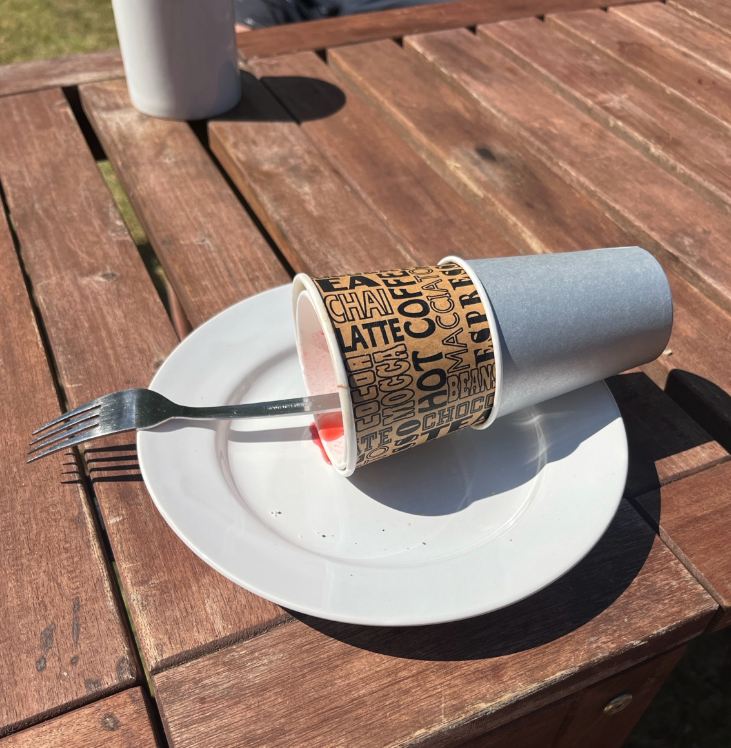
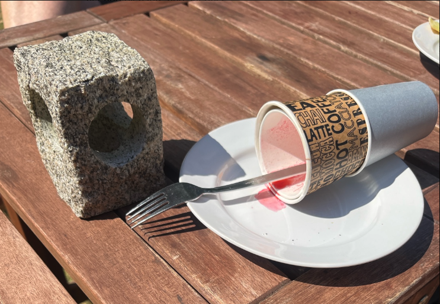
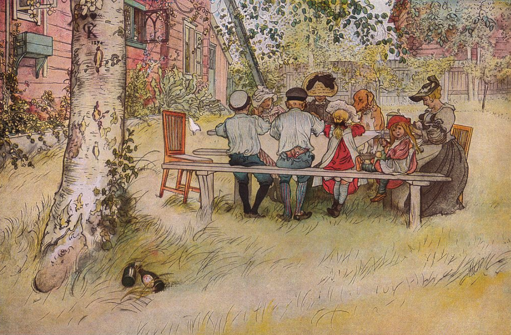

# Use case: the very serious AI art critic

## Disclaimer

This whole chapter is very silly. It also contains a lot of AI generated content.

Believe me, there is nothing useful here.

You still here?

OK then, don't say I didn't warn you.

## The cup - prompt

So anyway I was at a party, we were sitting outside in the garden with my friends, talking about fun and silly ways to use AI.

I took a spontaneous photo of the table in front of me.

... and we wrote this prompt:

> **Prompt**  
> I want you to take on the role of an art critic who takes himself way too seriously, and I want you to make a very detailed analysis of this piece of art. Start by describing what you see, and then write your critique.

... and got the response below, which we made it read out loud for our entertainment. One of my friends had actually studied art, and she thought this was extra funny since she got often these kinds of assignments in art school.

## The cup - AI analysis

In this intriguing composition, we observe a wooden table, a white ceramic plate, a disposable coffee cup with a bold, typographic sleeve, a fork, and a hint of a red substance. Another coffee cup stands in the background, partially obscured.

The wooden table, with its rustic texture, evokes a sense of simplicity and labor, grounding the scene in everyday reality. The white ceramic plate, smooth and pristine, contrasts sharply, symbolizing purity and the blank canvas of daily life. The disposable coffee cup, central to the composition, represents the transient nature of modern existence, its typographic sleeve a chaotic mosaic of consumer culture that captures the frenetic pace of contemporary living.

The fork, boldly inserted through the cup, disrupts the scene's expected order, symbolizing a rebellion against societal norms. The red substance inside the cup, perhaps a remnant of a dessert or a symbol of vitality and sacrifice, adds a visceral element, drawing attention and evoking deeper themes of pleasure and its fleeting nature.

The outdoor setting, bathed in natural light, highlights the interplay between human activity and the natural world, with the sunlight casting gentle shadows that remind us of the passage of time. The second coffee cup in the background, partially visible, hints at an unseen narrative, suggesting a broader context and the presence of another participant in this silent story.

Every element in this piece invites reflection: the precarious balance of the upright cup on the plate, the anthropomorphic qualities of the objects, and the symbolic undertones of everyday items transformed into a profound commentary on the human condition. Through this carefully crafted tableau, the artist challenges us to see beyond the ordinary, revealing the hidden depths and existential inquiries within our daily lives.

## The cup, version 2 - prompt

To spice it up a bit, we added a stone brick thingie to the table and asked it to have another go.

> **Prompt**  
> How does this change the narrative?

## The cup, version 2 - AI analysis

In this updated composition, the addition of a rough-hewn stone block significantly alters the narrative. The stone, with its raw texture and hollowed spaces, introduces an element of permanence and endurance, contrasting sharply with the transient, disposable coffee cup. This juxtaposition deepens the commentary on the fleeting nature of modern conveniences versus the enduring, immutable aspects of nature and existence.

The stone block's ruggedness and the table's rustic wood reinforce themes of stability and natural beauty. In contrast, the white ceramic plate and the disposable coffee cup, still pierced by a fork, emphasize the intersection of human consumption and the ephemeral pleasures of daily life. The red substance inside the cup continues to suggest themes of indulgence and sacrifice.

The outdoor setting, bathed in natural light, remains significant, symbolizing the passage of time and the interplay between human activity and the natural world. The second coffee cup in the background and the presence of human legs add to the narrative's depth, hinting at unseen interactions and a broader context.

Overall, the stone block enriches the piece by adding a layer of timelessness and resilience, challenging the viewer to reflect on the enduring versus the ephemeral in the human experience.

## Carl Larsson painting

We decided to let it analyze a Carl Larsson painting (a famous Swedish painter from the early 1900s).

> **Prompt**  
> Here's another one. Give us an analysis of this one, in the same style.

## Carl Larsson painting - AI analysis

In this evocative tableau, we are presented with a nostalgic scene of domestic tranquility, capturing a moment of idyllic communion amidst the verdant backdrop of a lush garden. The composition is rich with intricate details, each element meticulously chosen to convey a profound narrative about community, innocence, and the passage of time.

The central focus of the image is a group of children and adults gathered around a simple wooden table, engaged in a communal activity. The attire of the figures, reminiscent of a bygone era, evokes a sense of nostalgia and longing for simpler times. The children, adorned in vibrant and varied clothing, symbolize the diversity and vibrancy of youth. The adults, with their more subdued and elegant garments, represent the guardianship and wisdom that accompany age.

The garden setting, with its abundant foliage and dappled sunlight, serves as a metaphor for growth, nurturing, and the cyclical nature of life. The large tree in the foreground, its trunk etched with carvings, stands as a sentinel of time, bearing witness to generations of human interaction. The carvings on the tree suggest a history of personal milestones, love, and memories, grounding the scene in a tangible reality that transcends the ephemeral.

A red chair, striking in its isolation, stands out amidst the otherwise harmonious color palette, perhaps symbolizing a missing presence or an invitation to join the communal experience. The presence of a dog, attentive and integrated into the group, reinforces the themes of loyalty, companionship, and the unspoken bonds that connect all living beings.

In the background, the architecture of the houses, with their quaint and detailed construction, provides a sense of shelter and continuity. They frame the scene, anchoring it in a specific cultural and historical context while suggesting a community bound by shared experiences and mutual support.

The scattered bottles near the tree's base introduce a subtle counterpoint to the idyllic scene, hinting at the presence of human imperfections and the complexities of adult life. They serve as a reminder that beneath the surface of innocence and simplicity lies a more intricate and nuanced reality.

Overall, this artwork masterfully captures the essence of human connection and the timeless beauty of communal life. Each element, from the detailed attire of the figures to the verdant garden setting, is imbued with meaning, inviting the viewer to reflect on the enduring themes of family, memory, and the delicate balance between innocence and experience. Through this composition, the artist offers a poignant commentary on the universal human journey, celebrating both its joys and its challenges.

## Carl Larsson painting - roast prompt

We couldn't resist adding this....

> **Prompt**  
> Now I want you to take on the role of another person. You are a very sarcastic and ironic art critic who thinks that painting is horrible. And I want you to write a rant about that painting. Short, sweet, to the point, no holds barred.

## Carl Larsson painting - AI roast

Oh, where to start with this disaster of a painting? It's like a Hallmark card threw up all over the canvas. We've got this cliché garden scene with everyone looking way too cheerful—clearly no one's had to deal with real life. The kids are dressed like they're auditioning for a period drama, and the adults look like they stepped out of a bad costume party.

The tree with carvings? So original. It's like the artist thought, "Hey, let's throw in some random marks to show time passing!" As if we needed more of that tired trope. The red chair is probably supposed to be symbolic, but it just screams, "Look at me, I'm important!" And the dog—because what's a saccharine family scene without a loyal pet, right?

Those bottles on the ground? Nice try at adding depth, but they just make the whole thing look like a failed attempt at juxtaposing innocence with, I don't know, debauchery? It's a mess. The whole thing is a ham-fisted attempt at nostalgia that ends up feeling like a cheesy, overdone farce.

## Reflection

If anyone thinks AI can't be creative, just point them to this chapter...

Also, if you are bored and want quick entertainment, take a random photo of anything and try the art critic prompt yourself 😁.
