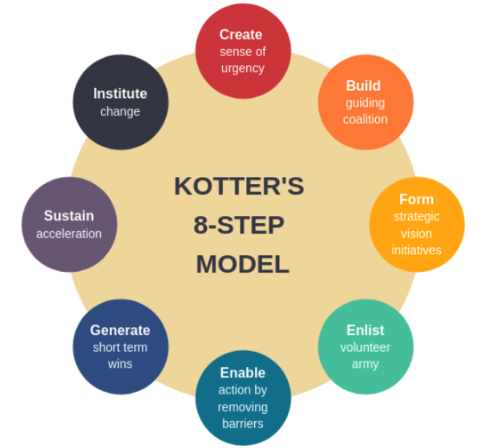
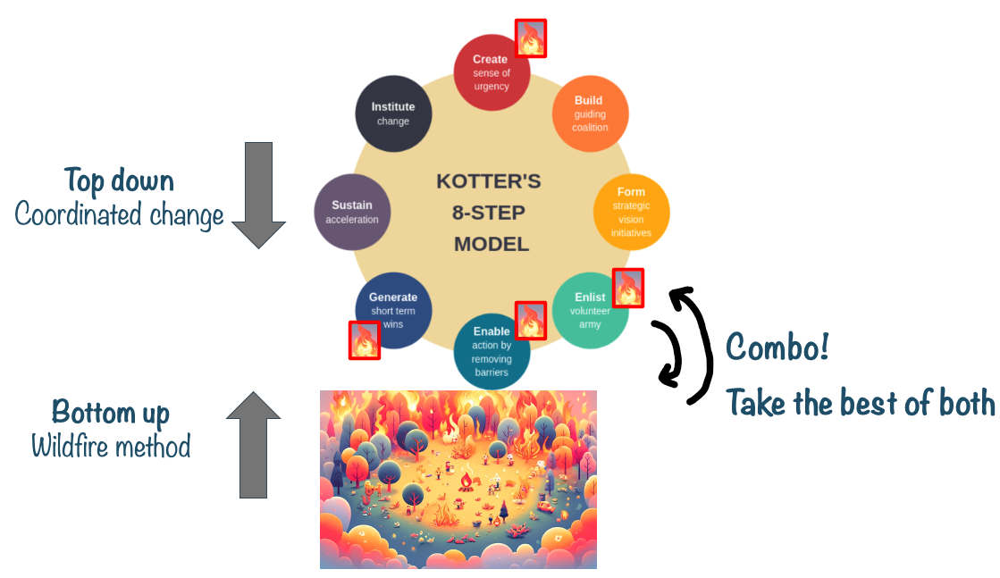

# Top down or Bottom up?

So how do you make the AI transformation happen? Top down or bottom up?

## Top down

One approach is to do a coordinated change driven from the top.

Kotter's 8-step model is a classic model for leading change in organizations.

- Create a sense of urgency
- Form a powerful guiding coalition
- Develop a vision and strategy
- Communicate the change vision
- Empower employees to act
- Create short-term wins
- Sustain acceleration
- Institute change

I won't go into detail, you can read about this online (or ask your friendly neighbourhood AI chat). But the Kotter model is mostly a top-down approach, with a few bottom-up elements.

## Bottom up

Another approach is to let change happen bottom up, without central control.

I like to call this the Wildfire method. Light fires here and there, blow some wind on it to help it spread, let sparks fly, and help smaller fires merge into larger ones.

This is basically uncontrolled change that happens when people get inspired, try stuff, find out what works, tell other teams about it, and then it spreads naturally. Someone in marketing starts using ChatGPT, the dev teams experiment with Cursor and Copilot, other teams notice and start asking questions, and before you know it every team has their own bag of AI tricks.

## Why not both?

So, which approach should you choose? Well, in the immortal words of the "Why Not Both?" meme kid - why not both?

I find that the best approach is a combination of top-down and bottom-up. Provide some guidance and leadership from the top, but then let the wildfire spread.

Yeah I know, that's very vague and fluffy, but don't worry, the rest of this book section is about how to do that in practice.

>  **Egbert's take**  
> Ah, playing with fire as a business strategy. What could possibly go wrong? I'm sure your company's insurance covers "death by metaphor."
