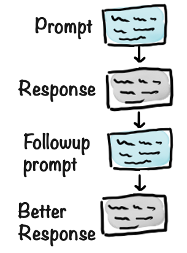
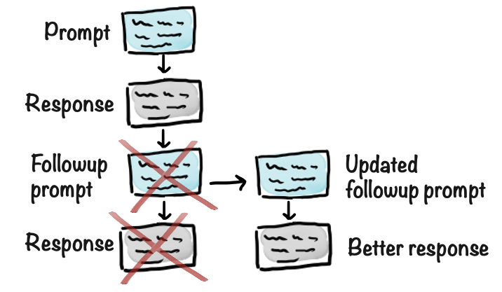
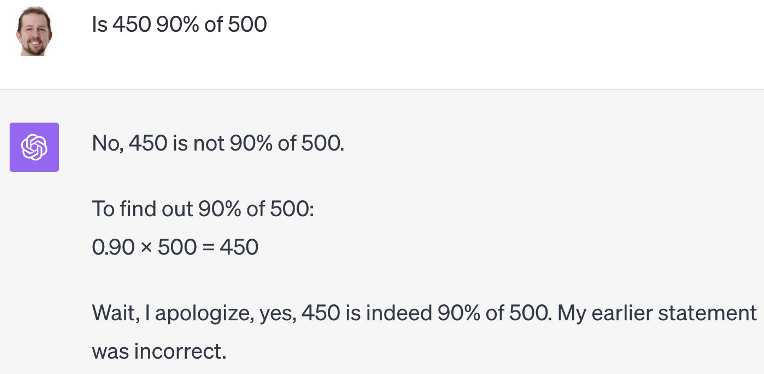
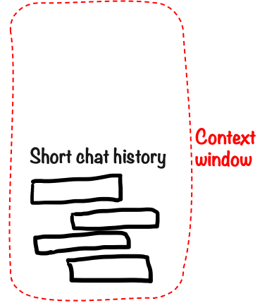
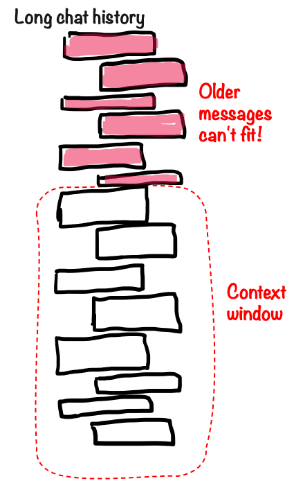
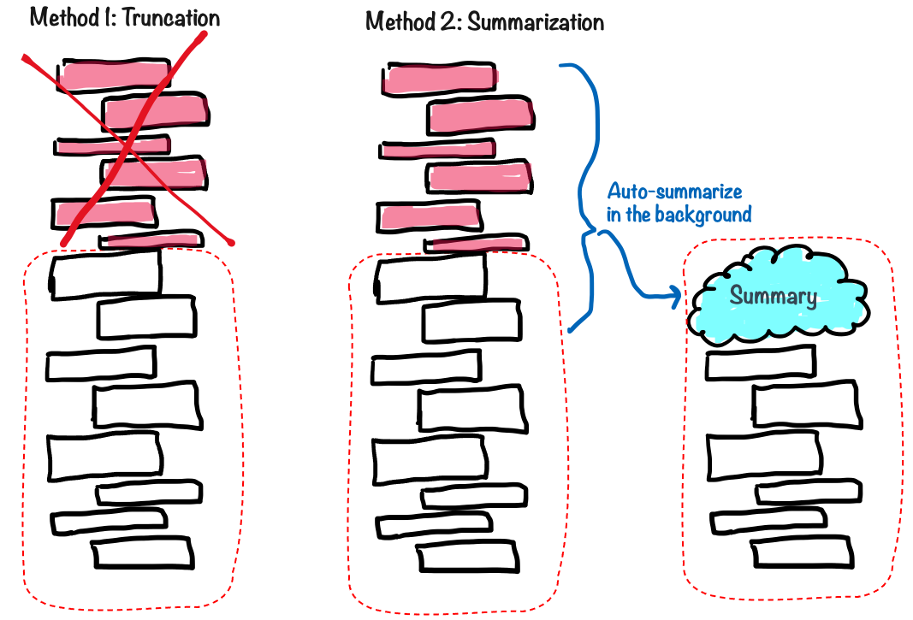
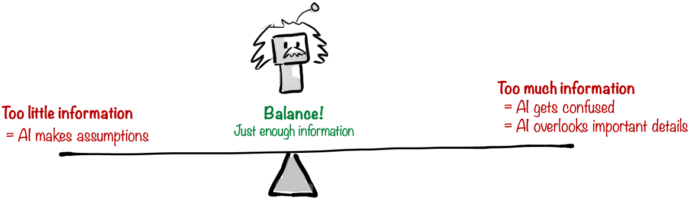

# Prompt Engineering Techniques

OK let's dive into some specific prompt engineering techniques. I'm going to assume you've already read the [Prompt Engineering chapter](../1-main/140-prompt-engineering.md) and want more details.

I could write a whole book about prompt engineering techniques, but here I've just selected the most important techniques, things that I think will stay important even as the models improve and don't need as much babysitting.

## Technique: Iterating

Prompting is usually done iteratively. If you're doing something very simple you might get a great result from the first prompt, but as soon as you do something more complex you usually need a few rounds of iteration.

There are two basic approaches to iterating:

- Adding new prompts
- Editing previous prompts

### Adding new prompts

This is the most natural approach for most people. Basically, if you aren't satisifed with your first result, add a new prompt to the chat thread providing more context, describing what you want, or why you weren't happy with the first result. Then keep doing that until you get what you want. So it becomes like a conversation where you are giving feedback to improve the result.

Adding new prompts is a good default approach, since it is pretty simple and intuitive, and you also get a nice log of your entire chat thread.

### Editing previous prompts

The other way is to edit a previous prompt, essentially creating a new branch in your conversation tree and cutting away the old branch. This is kind of like pressing Undo and saying "Hey ignore my previous prompt, let's pretend I wrote it like this instead".

Both techniques are super useful. So how do you know when to use what?

### When to add, when to edit

The decision to add a new prompt or edit an old prompt is very situational.

The main guiding question is: **How useful is the current conversation history?**

For example, if the last response was not great, but it was at least somewhat in the right direction, then you can add a followup prompt. But if the last response was completely off, then you should probably edit the previous prompt instead. Otherwise the really bad response will stay in the chat history and essentially pollute the conversation, making the AI confused.

Let's say I'm using AI to help plan a team offsite. Here's my abbreviated chat history:

- Prompt 1: I'm planning a team offsite, and I want to do some cool original activity. Any suggestions? Give me a short list.
- Response 1: Escape Room, Rafting, VR team quest, Parkour workshop, Skydiving (.... and imagine more ideas here...)
- Prompt 2: **How about Skydiving?**
- Response 2: (.... Ai gives me skydiving info...)
- Prompt 3: OK, tell me more about... (skydiving questions)
- Response 3: (.... bla bla bla)

Let's say it suggests skydiving for my company offsite. I ask some followup questions about that, and then I conclude that we definitely don't want to do skydiving. I want to discuss other possible activities, and the skydiving discussion history isn't relevant anymore.

In this case it is better to go back up and edit Prompt 2, essentially cleaning up and revising the chat history.

- Prompt 1: I'm planning a team offsite, and I want to do some cool original activity. Any suggestions? Give me a short list.
- Response 1: Escape Room, Rafting, VR team quest, Parkour workshop, Skydiving (.... and imagine more ideas here...)
- Prompt 2 (edited): **How about Escape room?**
- Response 2: (.... Ai gives me escape room info...)

If we continue the conversation from there, the AI model now has a clean conversation history without the tangent about Skydiving.

Continuing on this example: Let's say the AI gave us some useful info about escape rooms, and now I have followup questions. In that case it is better to add a followup prompt, since the previous response is still relevant, and we want to build on it.

- Prompt 1: I'm planning a company offsite, and I want to do some cool original activity. Any suggestions? Give me a short list.
- Response 1: Escape Room, Rafting, VR team quest, Parkour workshop, Skydiving (.... and imagine more ideas here...)
- Prompt 2: How about Escape room?
- Response 2: (.... Ai responds with lots of info about escape rooms)
- Prompt 3: **Tell me more about the third option. Would we be able to fit that into an afternoon?**

I'm surprised by how often people just accept the first response from an AI. Iterating makes a huge difference for the quality of the result.

## Technique: Self-reflection prompt

This is an interesting variant of the "Add new prompt" technique. You basically ask the AI model to evaluate its own result. This is useful when:

- You suspect the model might be wrong, or might be hallucinating
- You want it to think more deeply about the problem
- You want more details
- You are not happy with the result and are too lazy to explain why

For example I tried this prompt:

> **Prompt **  
> How many ping-pong balls would fit in the Sydney Opera house?

In response I got a detailed analysis that can be summarized like this:

- Estimated volume of the Sydney Opera House is 1.5 million cubic meters
- Estimated volume of a ping-pong ball is 3.35 × 10^-5 cubic meters
- Divide these and we get an estimate was about 44 billion balls.

Then I added a self-reflection prompt, asking it to evaluate its own result:

> **Self-reflection prompt**
> Evaluate your result

It started questioning its own assumptions, and realized that you can't pack balls perfectly. So it added:

- The estimated packing efficiency of the balls is about 60-70%)
- Taking this into account, the revised estimate was about 26 billion balls.

Sometimes a good model will do this automatically, sometimes not. So when in doubt, you can always tack on a self-evaluation prompt to see what happens.

Here is a funny example of when GPT-4 did a self-reflection without me asking for it, correcting itself on the fly 🙂.

## Mind the context window

The context window is the maximum amount of text that a model can accept as input. More expensive models have a larger context window. For example, at the time of writing GPT-4o has a context window of 128,000 tokens, which equates to about 90,000 words, which is about the size of a typical novel. May sound like a lot, but it can still run out!

Context is very important to keep in mind when working with AI. If you are writing code against an API, you will get an error message if you send more text than the model can handle. However, if you are using an app like Claude or ChatGPT, something more subtle happens when you exceed the context window.

When using an AI chat app, you build up a conversation history. Every time you write a prompt, the app will send the full chat history plus your new prompt to the model. That's how the model knows what you've been talking about so far.

If the chat history is rather short then there is nothing to worry about. Everything can fit in the context window, so the model will take your entire chat history into account when generating the response. That means you're likely to get a good result, since it won't "forget" anything (if you are using a good model).

But what if your chat history gets so long that it can't fit in the context window?

Something needs to give! The app will do something funky to get around the problem, and it will often be sneaky about it. Exactly what will depend on which app you are using, but some common approaches are:

- **Truncation** - the older messages are simply ignored. That means it will completely forget about them.
- **Summarization** - the app summarizes older messages in the background. That means it will remember roughly what you were talking about, but lose some details.

There are other techniques as well, but in one way or another **information will be lost**.

What does this mean in practice?

It means you need to **pay attention to the length of your chat history**. Watch out for symptoms that look awefully a lot like human forgetfulness, or when your AI chat buddy starts feeling like an elderly person with Alzheimers. For example you're having a conversation about an upcoming event, and suddenly the AI doesn't remember exactly which date it was, because that piece of information was quite far back in the chat history.

So what can you do to deal with a long chat history? Some options:

- **Accept it**. Sometimes the details of the older parts of the conversation aren't so important.
- **Start a new chat thread**. Let's say you're having a conversation about an upcoming workshop, you've explored a bunch of options for how to do it and have decided to go with Option B. You might want to start a fresh new conversation about that, since the discussion about all the other options isn't relevant anymore. A nifty trick is to ask in the first chat "Please summarize the context of the workshop, and Option B". Then use that as input context in the next chat.
- **Refresh the context**. Ask it to summarize the most important parts of the conversation so far (_before_ it starts forgetting). That summary will now be "top of mind" for the continued conversation.
- **Repeat important information**. If you notice that is forgetting things from far back in the conversation, or worry that it will, then you can simply repeat important information. "Remember, the wedding is on Oct 12". Or even copy/paste the original context.
- **Go back to earlier parts of the conversation**. Many chat apps let you go back in your chat history and restart some part of it, like I mentioned above in the Iteration section. So let's say you have a conversation about an important decision to make, and you explored the different options, and decided go with option C. You can now scroll back up in the conversation history and edit one of your earlier prompts, before you got into the conversation about different options. That's like saying "Let's go back in time and pretend we didn't discuss these options, and I just went with option C immediately". By cutting off the brainstorm part you are effectively shortening the chat history, so it can fit better in the context window.

Dealing with context windows is a balancing ac. Your chat history often contains vital context for your continued conversation, but if it gets to long or messy then it can reduce the quality of your answers. The AI model basically gets confused by all the history.

Even if you haven't exceeded the context window, having a very long chat history can introduce so much noise that the AI model starts losing track of important details.

In summary: Whenever you are using an AI app that builds up a chat history, you need to mind the context window, and take steps to keep the chat history manageable.

Rule of thumb, if a chat starts degrading too much, just start a new conversation with a fresh context.

## How smart model do you need?

One part of prompt engineering is to be deliberate about which model you use.

As mentioned in the chapter [Models, models everywhere](../1-main/060-models-everywhere.md), different models have different characteristics, and most model provides offer several versions with different levels of intelligence.

It often boils down to "expensive and smart" vs "cheap and less smart".

So which should you use? This depends on a few factors:

- **Importance** How important is the task? Are you just generating jokes for a wedding speech? Or are you using it to plan an expensive marketing campaign, or (like me right now) edit and review a book?
- **Complexity** Is this a pretty simple task, like summarizing a paragraph of text or explaining the meaning of a word? Or is it a complex task like making a logistics plan for a large event or analyzing the pros and cons of different pricing models for a product?
- **Context** How much context is involved? Are you working with a 20 page document or a long and intricate chat history? Or is it just a short question? Cheaper models are worse at handling large amounts of context.
- **Speed** Do you need a very fast response, or is it OK to wait a minute or so while it generates the response? This only matters for long responses, for example if you want the AI model to write a full page of text. Short responses tend to be fast regardless of which model you use.
- **Cost** What is the cost of the expensive model vs the cheap one? Is the difference in cost worth the difference in quality?

By default I tend to use the best model available. For shorter dialogs I find the cost difference negligible. But if I am doing something that requires a lot of context or large documents, for example analyzing the contents of a whole book, I might use a cheaper model to save some money and time, especially if the quality doesn't need to be top notch.

> **Cost-saving example**  
> I built an Inbox agent, an AI assistant that helps manage email inboxes. It goes through your inbox on a regular basis, sorts emails, labels, stars, archives, etc. And also generates draft responses to routine questions. It essentially works like an execute assistant, following your instructions for how to deal with the inbox.
>
> My product initially used GPT-4o, the best model at the time, because that model was best at handling large amounts of information such as a long email thread. However it got pretty expensive, since every single email thread needed to be sent to the model for processing, and the token cost added up.
>
> The system had a pre-processing step where we "clean" each email. That is, remove unnecessary information such as formatting, links, images, and other things that aren't needed for AI processing.
>
> I tried shifiting that part to GPT-3.5-turbo, a much cheaper model (but less intelligent). It did that job just fine, I compared side-by-side with GPT-4 and there was basically no difference. So cleaning up an email text was a job sufficiently simple that the cheaper model could do it just as well, for a fraction of the cost.

A nice side effect of good prompt engineering skills is that you can get a cheap AI model to behave like an expensive one. So using a cheaper model might not always mean lower quality results, it might just mean spending some more time on the prompt.
