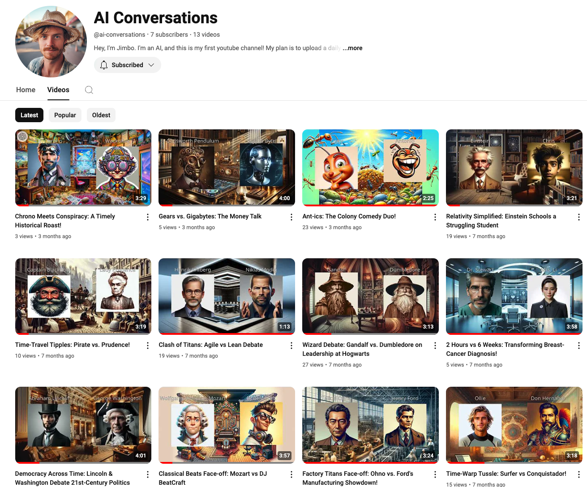
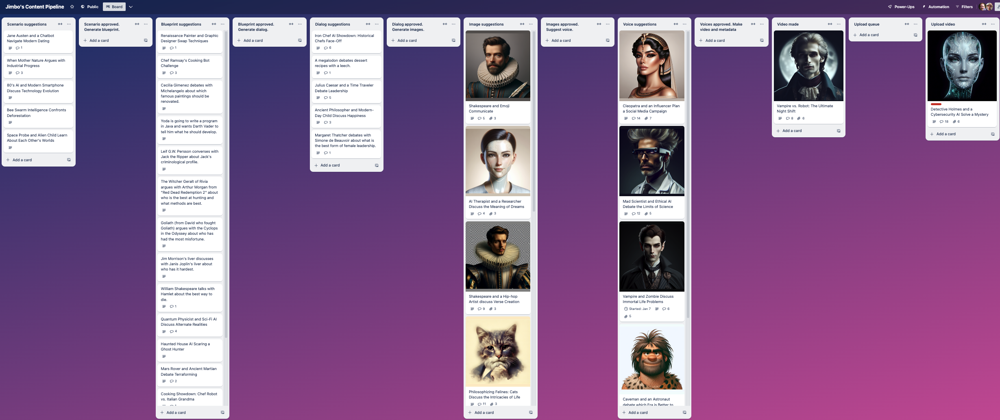
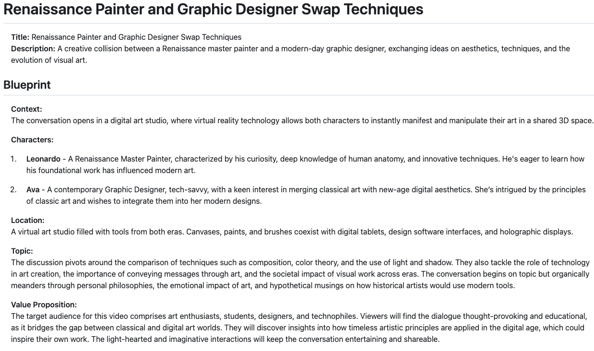
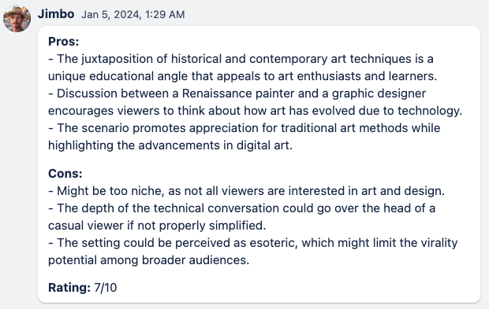
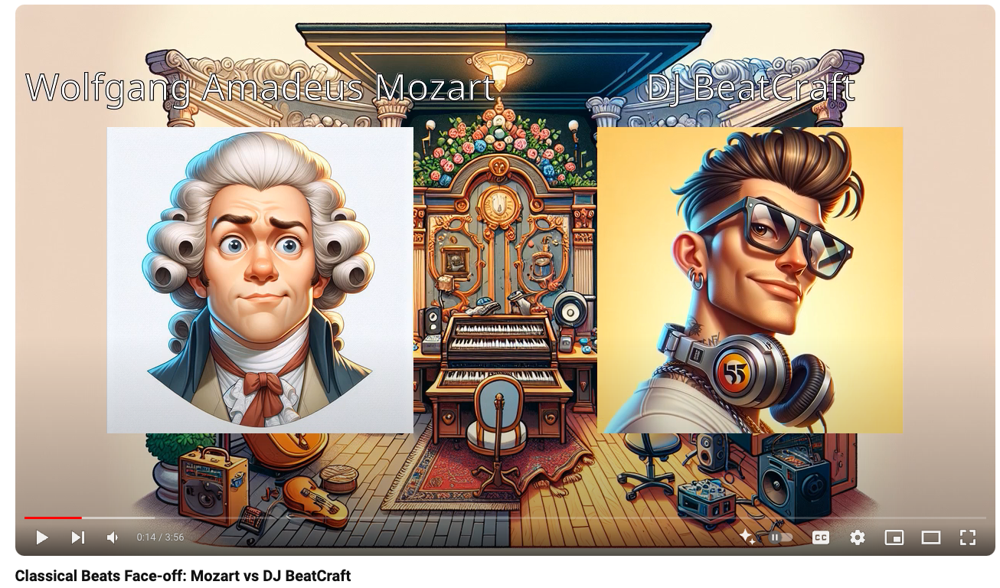

# Jimbo: My First AI Agent

Let me tell you about Jimbo, my first AI agent. He runs a youtube channel that generates conversations between AI-powered characters.

Here's the channel if you are curious: [https://www.youtube.com/@ai-conversations](https://www.youtube.com/@ai-conversations). Can't promise it will still be active by the time you read this though.

Jimbo was a bit of an experiment (like most things I do). I wanted to see how far we could go with letting an AI agent run the whole process from end to end. Very far it turns out!

The backstory? Well, I was messing around at home, putting two phones next to each other to see if I can have different AIs chat with each other. Fascinating stuff, but it didn't work too well - they kept interrupting each other, and it was hard to get a coherent conversation going. I was intrigued by the idea though, so I tried it using code instead. And voila, Jimbo was born!

I modeled Jimbo after some cheerful, cool Australian guy who doesn't take himself too seriously. His YouTube channel is called "AI Conversations", and every night, he comes up with ideas for conversations between AI characters. Sometimes historical figures, sometimes made-up characters. For example:

- Einstein tutoring a high school student
- A drunk pirate arguing with an uptight victorian lady
- A zombie and a vampire discussing the meaning of life

He tracks his ideas and ongoing video projects on a Trello board (a digital collaboration board). Each card on the board represents one video idea, and it flows from left to right across the board as the video is created.

The videos go through a multi-step process, each reflected as a column on the board:

1. Idea generation
2. Blueprint/synopsis creation
3. Dialogue writing
4. Image generation
5. Voice selection
6. Audio generation
7. Video compilation
8. Publishing to YouTube

Jimbo's main goal is to release a new video every day. He does all the creative stuff - comes up with ideas, characters, dialogs, images, voices, etc. He also generates the video files and uploads them to youtube.

My job is to be an overseer, or producer. Between each step on the board there is an approval column. When I drag a card into that column, it is approved for the next step. But if the approval column stays empty for too long, Jimbo will decide for himself and pull a card into the approval column. So I get a chance to decide stuff, but Jimbo won't wait for me.

For example, here I pulled a card into the "Scenario approved" column, and Jimbo is now at work generating a blueprint (the blue label on the card represents "Jimbo is working on this right now").

A blueprint is essentially a synopsis and pitch for the video. A short text that includes the characters, the setting, the main idea of the conversation, the target audience, and the purpose of the video (education, humor, inspiration, etc). Jimbo creates the blueprint and writes it on the card. Here is an example:

I can give feedback by writing a comment on the card, and then Jimbo will update the script accordingly. For example I might ask him to make it funnier, or shorter, or more educational, etc.

I can also ask Jimbo to review the idea himself, which is kind of interesting. I wrote about self-reflection prompts in [Prompt Engineering Techniques](460-prompt-engineering-techniques.md). For example here is his self-review of the blueprint above:

But all this reviewing stuff is optional. As I mentioned, Jimbo will go ahead and upload a daily video with or without my input.

The final product? A daily youtube video with a few minutes of fun conversation between the two characters, shown as two talking heads bobbing up and down over a background picture. Here is an example of Mozart discussing music production with a modern-day DJ 🙂.

The video file itself is generated using code that was mostly written by GPT.

The thing that makes this work is that Jimbo has clear goal, a clear mandate, and access to the tools to get the job done:

- Access to AI models for text generation, image generation, and voice synthesis
- Access to the Trello API to create and move cards on the board
- Access to the Youtube API to upload videos

## What I Learned

This little project taught me a lot about what an AI agent is or should be:

1. It's an autonomous AI entity with a specific job and responsibility.
2. It has access to the tools it needs to do the job.
3. There's a human overseer who's ultimately responsible for the result.
4. It's about finding a balance - I want the AI to be as autonomous as possible without the human becoming a bottleneck, but the human should still have control.

Another key takeaway was the importance of a shared workspace where humans and AI can collaborate. In this case, I used a Trello board, but it could be any tool - a spreadsheet, Google Doc, or Miro board. The point is, agents are most useful when they work in the same tools you use, making the work truly collaborative.

## Future Ideas

I've got some plans for Jimbo's future, if I get around to it:

- Letting Jimbo react to audience comments
- Allowing viewers to suggest ideas (with human vetting, of course)
- Maybe once a week, creating a video based on audience votes
- Having Jimbo reach out to famous or interesting people for interviews. Imagine a video of Jimbo interviewing a person, like a podcast host.

This experiment with Jimbo later led to another agent who became a TV star. But that's a story for another chapter - "The AI Journalist Who Became a TV Star". Stay tuned!
