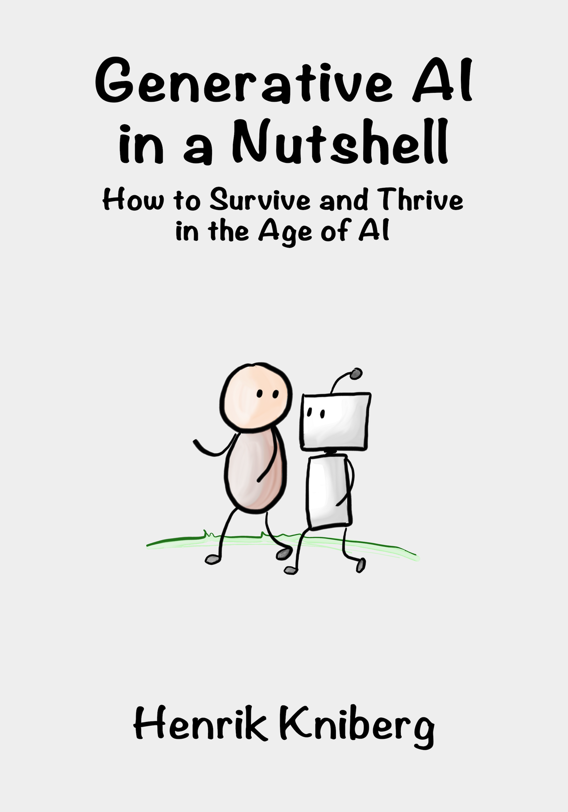

# Generative AI in a Nutshell - book source

This is the technical version of the source code for the book "Generative AI in a Nutshell - How to Survive and Thrive in the Age of AI". The structure is optimized for publishing on leanpub, so it is really only for internal use.

If you want to help improve the translations, go here:

[https://github.com/hkniberg/ainutshell-translations](https://github.com/hkniberg/ainutshell-translations)

