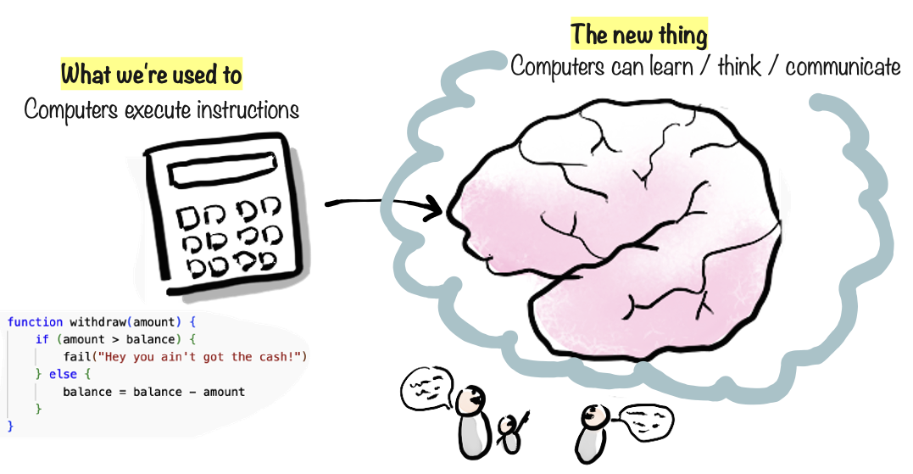

# Computers have gotten smarter

Ever since computers were invented they’ve really just been glorified calculators. Machines that execute the exact instructions given to them by a programmer.&#x20;

But something incredible is happening, something I never expected would happen in my lifetime. Computers have started gaining the ability to learn & think & communicate, in a similar way to us! They can do creative, intellectual work that previously only humans could do.

OK are they really _thinking_? Well, that's a philosophical question, since there is no widely accepted definition of "thinking" or "intelligence". But in practical terms - computers are increasingly able to do tasks that previously required human intelligence, creativity, and intuition.

We call this technology Generative AI, and you may have encountered it already through products like ChatGPT, Claude, Copilot, etc.

Basically, intelligence is now available as a service, like a giant brain floating in the sky, that anyone can talk to. It’s not perfect, but it is surprisingly capable, and it is improving at an exponential rate.

This is a big deal. It’s going to affect just about every person and company on this planet, positively or negatively.

This book is here to help you understand what Generative AI is all about, in practical terms, beyond the hype. The better you understand this technology, and how to make use of it, as a person, team, or company, the better equipped you will be to survive and thrive in the age of AI.
