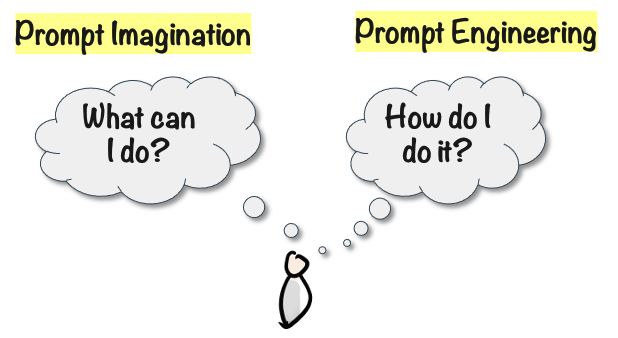

# Einstein in Your Basement

So here’s a silly mental model for this: You have Einstein in your basement. In fact everyone does. This is just a metaphor. I don't really mean Einstein as an individual, think of it as the combination of every smart person who ever lived.

You can talk to Einstein whenever you want. He has instant access to the sum of all human knowledge, and will answer anything you want within seconds. He will never run out of patience, never be tired or grumpy.

Just for fun, I asked ChatGPT "What are you? Explain in 1 sentence to a 10 year old". It answered:

> I'm like a super smart robot that can answer lots of questions and help with all sorts of things, kind of like a really helpful genie in a computer!

Your Einstein can take on any role you want - a comedian, poet, doctor, coach. Whatever role you give him, he will be an expert within that field. You can also give him any personality, any communication style, any goal or motive. This genius in your basement is very malleable and somewhat schitzofrenic.

He has some human-like limitations. He can make mistakes, jump to conclusions, or misunderstand you. Sometimes he can even lie or spew out absolute nonsense in a very convincing way.

But the biggest limitation is your imagination, and your ability to communicate effectively with him. This skill is known as Prompt Engineering and in the age of AI this is as essential as reading and writing. I like to distinguish between Prompt Imagination and Prompt Engineering.&#x20;

- Prompt Imagination = Your ability to come up with useful ways to use Generative AI.
- Prompt Engineering (or Prompt Design) = Your ability to get the results you want.

Most people vastly underestimate what this Einstein in your basement can do. It’s like going to the real Einstein, and asking him to proof-read a high school report. Or hiring a world class 5 star chef and having him chop onions.

The more you interact with Einstein, the more you will discover surprising and powerful ways for him to help you, your family, your team, or your company.

>  **Egbert's take**\
> Einstein? Seriously? Was that the best you could come up with? What about Marie Curie, Ada Lovelace, or Grace Hopper? Einstein didn't even invent a programming language or discover radioactivity.
