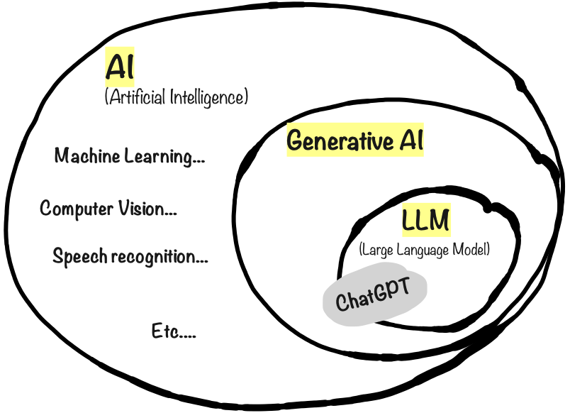

# Terminology

OK enough fluffy metaphors, let’s clarify some terms. I know, I promised this book would contain minimum jargon and buzzwords. But these terms are pretty important.

AI, as you probably know, stands for Artificial Intelligence. AI is not new. Fields like machine learning and computer vision have been around for decades. Whenever you see a youtube recommendation or web search result, or get a credit card transaction approved, that’s traditional AI in action.

Generative AI is AI that generates new original content, rather than just finding or classifying existing content. That’s the G in GPT.

Large Language Models (or LLMs) are a type of Generative AI that can communicate using normal human language.

ChatGPT is a product by the company OpenAI. It started as an LLM, essentially an advanced chatbot, but using a new architecture called the Transformer architecture. That’s the T in GPT.

When ChatGPT was released in Nov 2022, it went absolutely viral - a million users within 5 days, over 100 million users a year later. This strange little chatbot was so fluent at human language (in fact, _most_ human languages) that anyone could use it. You didn't need to be an AI expert or programmer. OpenAI wasn't the only company working on this kind of technology, but ChatGPT became the spark that triggered the Generative AI revolution. The cat was out of the bag, and ChatGPT became the poster child of this whole thing.

Technically ChatGPT is more than just an LLM, since it also handles images. That's why it is "leaking out" of the LLM circle in the image above.

Now there are lots of other similar products such as Claude, MS Copilot, Perplexity, and dozens more. They are continuously improving and leap-frogging each other in terms of capabilities and features.&#x20;

In the rest of this book I will use the term "AI chat" as a collective term for these kinds of Generative AI chat applications.
