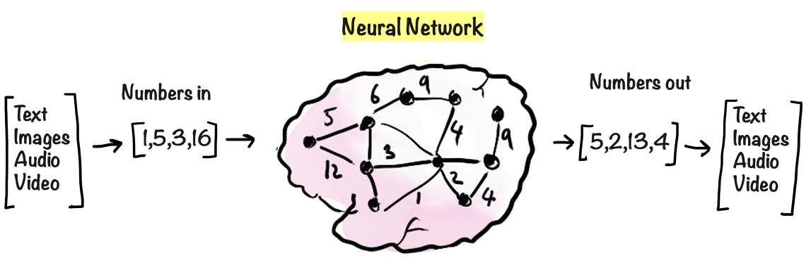
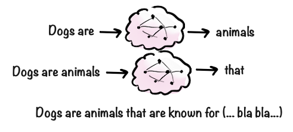

# How it works

So how does it actually work?&#x20;

An LLM (large language model) is an Artificial Neural Network. Basically a bunch of numbers, or parameters, connected to each other, similar to how our brain is a bunch of neurons, or brain cells, connected to each other.

Internally, Neural Networks only deal with numbers. You send in numbers, and depending on how the parameters are set, other numbers come out. But any kind content, such as text or images, can be represented as numbers. So Neural Networks can really be used for any kinds of media. For example, self-driving cars use neural networks to process visual input from cameras and other sensors, outputting control signals like "adjust steering 5 degrees right" or "apply 20% braking force".

LLMs are Neural Networks that are optimized for understanding and generating text. You may have heard the term "token" and "token limits". A token is a small chunk of text, typically a word or part of word. Internally, LLMs read and generate tokens. What you see is words and sentences.

Let’s say I write “Dogs are”. When I send that to an LLM, that gets converted to numbers, processed by the neural network, and then the resulting numbers are converted back into text. In this case the output is “animals”. So we get "Dogs are animals".

How did it decide on the word "animals?" It calculates probabilities for all possible next words based on input you gave it plus the data it was trained on (see next chapter for more info on training). It then selects a word, balancing probability with some randomness for creative diversity.&#x20;

So an LLM as basically a “guess the next word” machine. There's actually more going on than just statistical text prediction - there is some level of understanding and reasoning happening. But let's not go too deep here.

The interesting part is if we take the output and combine it with the input and send it through the model again, it will continue adding new words.

For example here's what I got when i wrote "Generate a short story about a flying puppy".

> Max was no ordinary puppy. While other dogs chased squirrels and dug holes in the backyard, Max spent his days gazing longingly at the sky. His owners thought it was cute how he'd sit for hours watching birds soar overhead, but they had no idea what was really going on in Max's fluffy little head. You see, Max had a secret - one that would turn the whole neighborhood upside down if anyone ever found out. This playful golden retriever pup could fly.

Then I wrote "Add a dark twist to the story", and the story continued:

> Max's ability to defy gravity was a source of wonder and joy, until the day everything changed. One crisp autumn evening, as Max soared high above the rooftops, he spotted something that made his little heart race with fear. In the shadows of an abandoned warehouse at the edge of town, he saw men in dark suits loading cages into unmarked vans. Inside those cages were puppies - dozens of them - whimpering and crying. Max realized with a chill that these weren't just any puppies; they all had an ethereal glow about them, just like he did when he took to the skies. Someone had discovered the secret of flying dogs, and they were hunting them down one by one.

This could basically go on forever, by adding more prompts.
