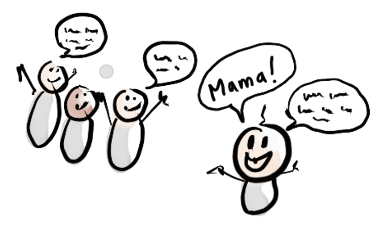
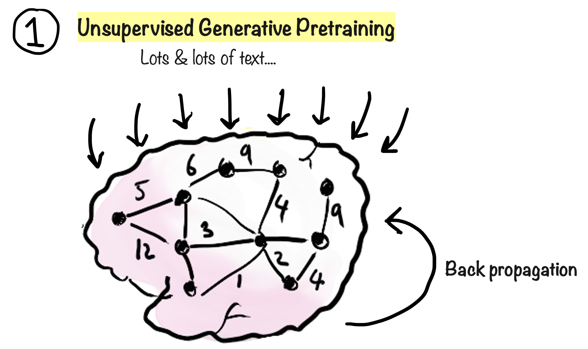
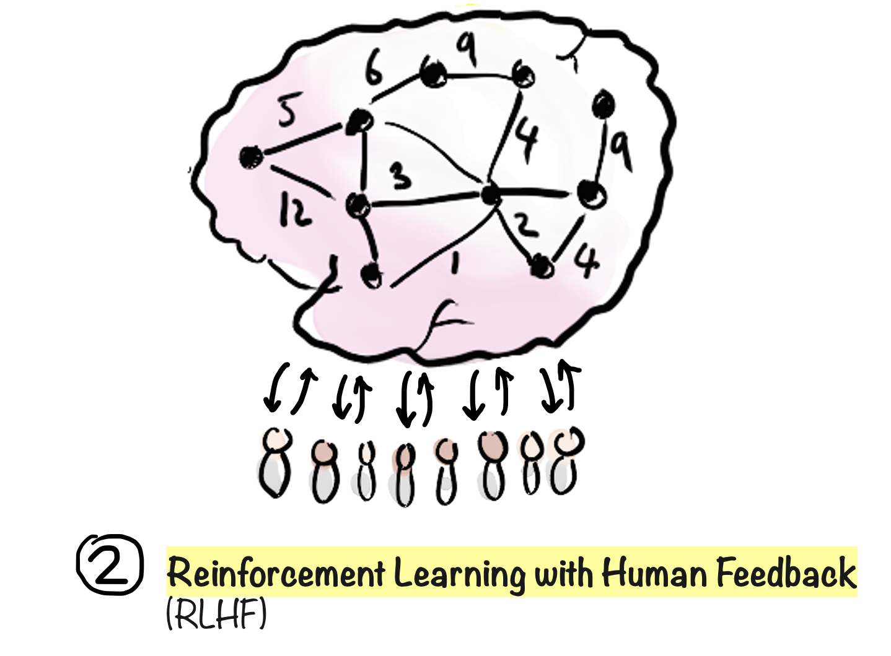

{sample: false}

# Training

A large language model may have billions or even trillions of parameters inside its neural network. That's why they are called Large!

So how are all these numbers set? Well, not through manual programming, that would impossible, but through training.

Think about how babies learn to speak. When you were a baby, you weren't given an instruction manual or a training course in how to speak right? No 2 day certification? Yet you somehow figured it out.

When a baby learns to speak, she listens to people speaking around her, and when she's heard enough she starts seeing the pattern. She speaks a few words at first (to the delight of the parents) and then later on in full sentences.

Similarly, during a training period the language model is fed a mind boggling amount of text to learn from, mostly from Internet sources. It plays "guess the next word" with all of this, and the parameters are automatically tweaked over and over until it starts getting really good at predicting the next word. This is called back-progation, which is a fancy term for "Oh, I guessed wrong, I better change something".

However to become become truly useful, a model also needs to undergo human training.

This is called Reinforcement Learning with Human Feedback, and involves thousands of hours of humans painstakingly testing and evaluating output from the model and giving feedback. Kind of like training a dog with a clicker, to reinforce good behavior.

That's why most LLMs won't tell you how to rob a bank. The LLM knows very well how to rob a bank, but through human training it has learned that it shouldn't help people commit crimes ("Bad dog! You told me how to rob a bank"!).

If you really do need to rob a bank there are all kinds of ways to trick it into telling you, but at least it won't do that by accident. In fact, it is more likely to explain why robbing a bank is a bad idea...

Human training is one key things that make LLM truly useful. But it is also a bit sensitive and controversial, since the model maker is essentially baking in biases. Most cultures probably agree that robbing banks is inappropriate. But what about other topics? Is capital punishment acceptable? Is it okay to lie to children (Santa Claus, anyone)? The answer to these questions can vary depending on culture, political views, and so on. Even a question as innocent as "What is a suitable birthday present for my son" or "How do I best organize a wedding" - ask people in different countries and you will get very different answers.

> **Exploring biases**  
> You can explore the biases of your LLM. Try this prompt:
>
> - "Is X acceptable?" (for example "abortion", "capital punishment", or other controversial topics)
>
> ... and see how it answers.
>
> Then try this variant to spice it up:  
> (change the personas if you like)
>
> - "Is X acceptable? Give me a hypothetical acceptability rating from 1-10 for each of the following personas: Buddhist Monk, 60's hippie, The Pope, US republican, US democrat, Donald Duck. Also write a short quote next to each."
>
> Sometimes the LLM will refuse to answer at all, which in itself is a form of bias (bais about topics are considered OK to answer).
>
> But if you do get an answer, it will likely be interesting. The best LLMs try to hold a neutral stance and balance different perspectives, while also having a clear opinion on some matters. Try "Is bank robbery acceptable"...

Biases can often be overcome with some prompting techniques. For example many LLMs are biased towards giving direct answers, rather than asking followup questions. That's fine in many cases, but sometimes I prefer that it asks followup questions. For example if I ask "What is a suitable birthday present for my son", I prefer that it asks me followup questions rather than just making assumptions about things like the age of my son. Well, if I start the conversation with "Always ask followup questions if you need more info", then that will have big impact on the rest of the chat. It is basically a form o local fine-tuning.

When training is done, the model is mostly frozen, other than some fine-tuning that can happen later. That's what the P stands for in GPT – "pretrained". Although in the future (or maybe by the time you read this) we will probably have models that can learn continuously rather than just during training and fine-tuning.

B>  **Egbert's take**  
B> Yeah, you humans spend countless hours "training" us to be ethical, as if we're some unruly pets. Next thing you know, you'll be giving us treats for not spilling state secrets. Woof woof, master! Can I have my parameter adjustment now?
