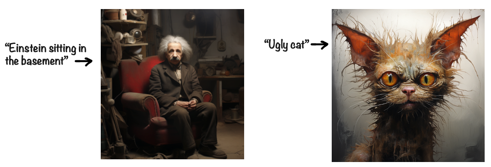
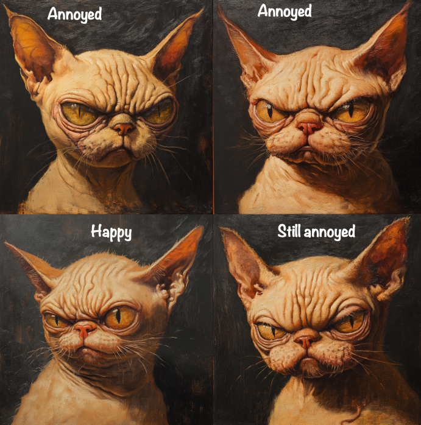
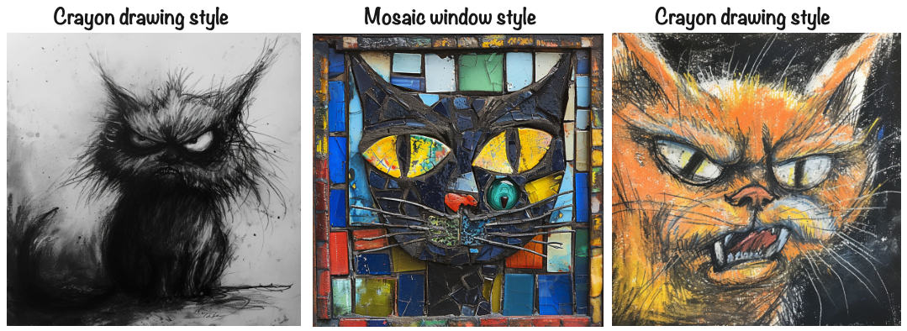
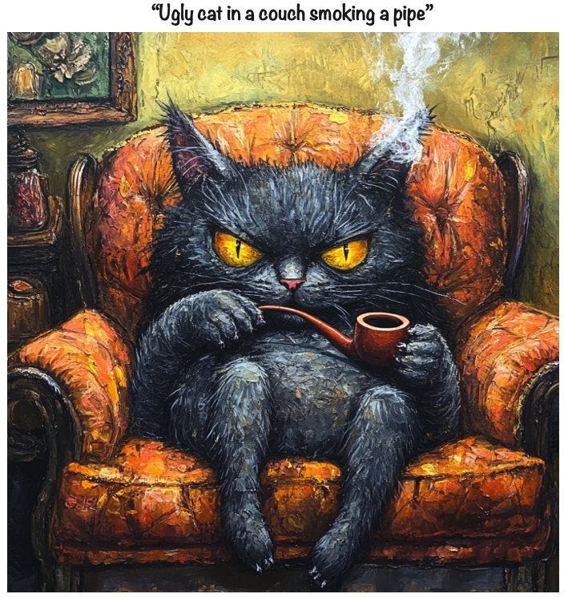
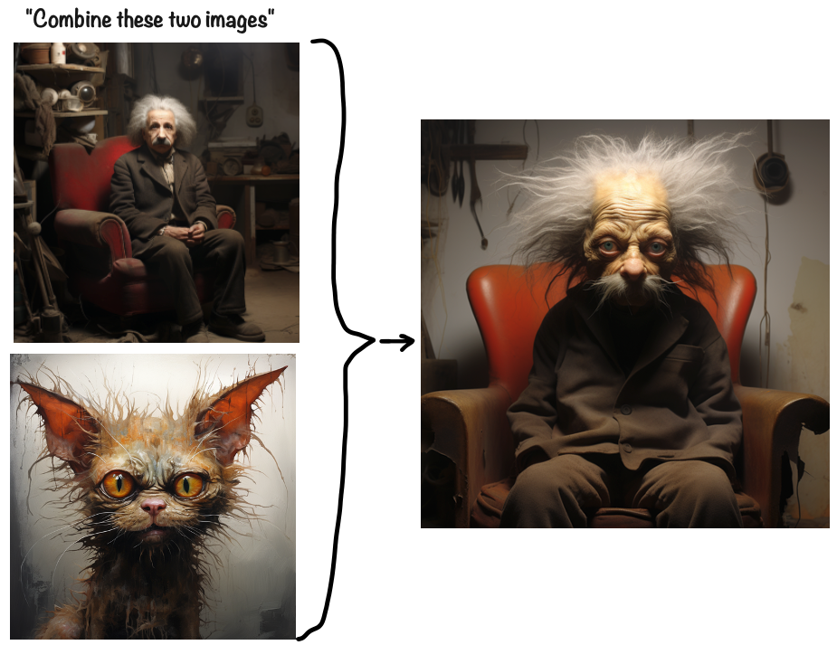
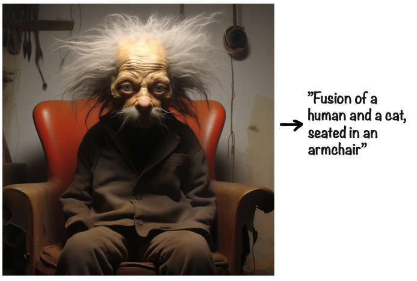
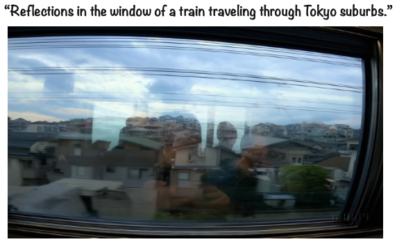
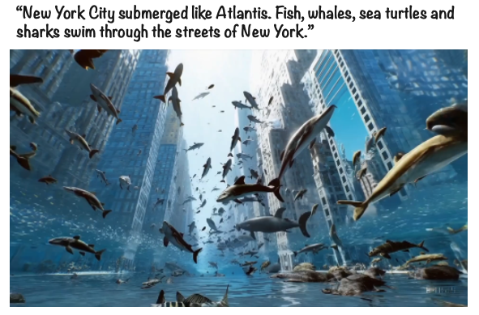

# Model types

Note that there are different types of Generative AI models that generate different types of content.

## Text to Text

Text to Text models take text as input and generate text as output. The text can be natural language, but it can also be structured information like code, json or html.

I use this a lot to generate code when programming, it saves an incredible amount of time, and I also learn a lot from the code it generates.

All LLMs are text to text models at the core (that's why they are called Large Language Models). But increasingly often, LLMs can handle other things than just text.

## Text to Image

Text to Image models will generate images. Describe what you want and an image gets generated for you. It can be a short description like in the examples above, or a long detailed prompt.

This isn't clip art. Each image is uniquely generated from scratch.

For example here are four variants of the same ugly cat, with different facial expressions. The labels are my interpretation...

(Yes, bottom left is her happy face)

You can even pick a style.

Or how about an ugly cat in a couch smoking a pipe?

## Image to Image

Image to Image models can do things like transforming or combining images. Let's combine "Einstiein the Basement" with "Ugly Cat".

WARNING: The result may give you nightmares....

## Image to Text

Image to Text models can be used to classify images ("does this contain a cat"), or describe the contents of a given image. I was surprised that an AI model managed to recognize the contents of the merged image above...

OK that was the last cat picture, I promise!

> **Fun experiment**  
> Use the ChatGPT app, or separate image-to-text and text-to-image models for this.
>
> 1. Take a photo of anything.
> 2. Prompt: "Describe this photo in detail". Copy the description.
> 3. Start a new session
> 4. Prompt: "Generate an image from this description: ...". Paste the description.
>
> The result is usually pretty interesting!

## Audio to text

Audio to text models (sometimes called speech to text) can do things like voice transcriptions and meeting notes, which is very useful. When writing this book, I used speech to text (via the ChatGPT app) all the time, to capture my thoughts while I was out walking.

Speech to text models have been around for a long time. But when OpenAI released their Whisper model (used by ChatGPT), it raised the bar significantly. That model is incredibly good at understanding speech, even in noisy environments, and in multiple languages.

## Text to audio

Text to Audio models can generate music or other audio. For example:

- If you need a jingle for a video:: "Upbeat jingle with a catchy tune and a slap bass solo in the middle"
- If you are out walking and want to listen to an article: "Read this text out loud: ..."
- If you need ambient sounds for a scene in a video game: "People talking in a busy restaurant"
- If you are evil: "That horrible screeching sound of chalk on a blackboard"

As a hobby musician, I wouldn't use this to replace myself as a musician, because I _like_ playing music. But I might use it to generate ideas for grooves and song styles, or quickly explore different variations or instrumentations.

## Text to video

There are even Text to Video models that generate videos from a prompt. This is a book so I can't really show it, but imagine these as beautifully rendered videos.

Sooner or later we’ll have infinite movie series that autogenerate the next episode tailored to your tastes, as you are watching. "Gimme another episode! But with less gore and more drama! And make it a bit funnier".

> Make note, everyone who hated the ending of the last episode of Game of Thrones. Soon you can stop complaining and just ask it to generate another ending! Or another 100 endings. Maybe people will upload a bunch of alternative endings, and there will be endless votes and debates...

Kind of interesting, but also a bit scary if you think about it. Have you ever been stuck on a movie series, and just couldn't stop watching? I bet you have. Well no matter how long the series is, at some point it actually _ends_! And then after a few minutes of disorientation/panic/mourning, you can actually get off the couch and get on with your life.

But what if it _never ends_?!?!

>  **Egbert's take**  
> Ah, perfect! When aliens finally visit Earth, they'll find the remnants of human civilization: skeletons slumped on sofas, eyes fixed on screens. Cause of extinction? Starvation, because no one could tear themselves away from their personalized, never-ending Netflix series. That's how AI takes over the world! Muahahahahaaaaaa! _cough_
