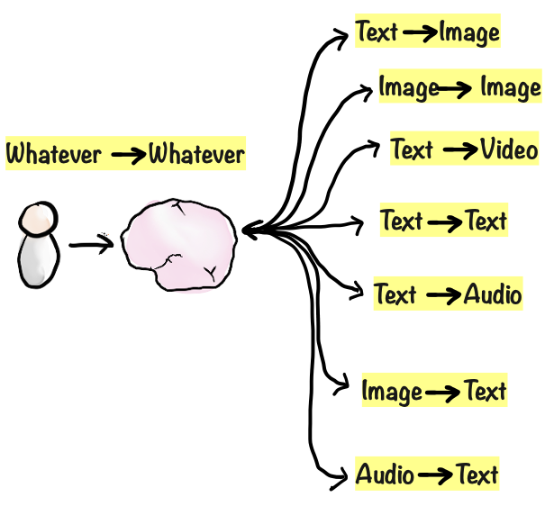

# Multimodal models

One growing trend is multi-modal AI products. Meaning they combine different models into one product, so you can work with text, images, audio, etc, without switching tools.

ChatGPT was one of the first multimodal AI chat products. You can speak to it, and it can speak back. You can upload images, camera photos, and documents, and it can generate images.

Here are some examples of what this can look like in practice.

## Example: Is my bacon done?

I took a picture of my frying pan while cooking bacon, and asked if it was done.
The input was an image (take from the phone), and my recorded voice asking if the bacon is done. The LLM figured out that what I wanted, converted my voice to text, interpreted the image to text, and then used that to generate a text response.

OK not super useful in this particular case, more a fun little experiment. But it shows the potential.

## Example: Where can I hide stuff?

Just for fun, I took a photo of the room I was in and asked where I could hide stuff.

The response:

> If you're looking to hide something valuable in this room, you have several options. Here are a few suggestions:
>
> 1. **Behind the map**: You could tape something flat, like documents or cash, behind the large map on the wall.
>
> 2. **Inside the guitar**: If the guitar has a case, you could hide something inside it. If not, small items could potentially be placed through the sound hole, although this is not advisable if it could damage the instrument.
>
> 3. **Under the couch cushions**: A common hiding spot, but effective for small and flat items.
>
> 4. **Behind or under the wood stove**: If there is any removable panel or space, although this is risky due to the heat when in use.
>
> 5. **In the lamp**: If the bottom of the lamp opens or if there is space within the lampshade, it could conceal small items.
>
> 6. **Under the rug**: Flat items could be hidden here, although it's a spot that could be easily disturbed.
>
> 7. **Inside plant pots**: If there are any removable false bottoms or if the plant is artificial, small items could be hidden in the soil.

I like that it mentioned the stove and said "this is risky due to the heat when in use". We talk about Emergent Behaviour later in this book, but this is a good example. This response indicates that it has a basic understanding of the consequences of placing an object inside a hot stove, and assumed (correctly) that I don't want my thing burned. Same with the guitar: "this is not advisable if it could damage the instrument"

## Example: Taking AI for a walk

When I have things to figure out, such as the contents of this book, I like to take walks using AI as sounding board. At the time of writing only ChatGPT supports two-way audio, but other apps will definitely follow suit.

1. I start by saying "Always respond with the word OK unless I ask you for something". That way it will just listen and not interrupt. This is important, because most LLMs are biased towards providing immediate answers, and in this case I want it to just listen and acknowledge.
2. After I finishing dumping my thoughts, I ask for feedback and we have some discussion.
3. Then I ask it to summarize in text afterwards.

Remember when I mentioned Prompt Imagination and Prompt Engineering? This is a good example of that.

- **Prompt Imagination** ("what can I do?") = coming up with the idea that AI could be useful as a sounding board when taking a walk.
- **Prompt Engineering** ("how do I do it?") = prompting it to only respond with "OK" initially, to allow me to finish dumping my thoughts before getting a response.

I recommend trying this. This is probably my favorite AI use case, I do it almost every day. Nice health benefit too, with all that walking! This book alone has gotten me at least 100,000 steps 🙂.

Just a few days ago I was planning an inspirational talk for a group of CEOs. The event organizer showed me a slide with all the participants and companies. For my next walk, I sent a screenshot of that slide to ChatGPT and asked:

- "Tell me about these companies, what do they do, how large are they?"
- "I'm doing a Generative AI talk for this audience, what are the most important things I should cover?".
- "What are some things I should keep in mind when talking to a group like this?"

I got really useful input and ideas! Then I did the "just respond with OK" thing while I dumped a bunch of ideas for the talk, asked for feedback, and by the time I came home I had a really clear idea about what to say. I was able to prepare the talk really quickly, and the feedback from the participants was overwhelmingly positive.

Turns out Einstein isn't stuck in the basement after all, you can take him out for a walk!

B>  **Egbert's take**  
B> Great. You've managed to demote your genius AI buddy to a glorified note-taking pedometer. Congratulations on finding the most inefficient way to jot down your fleeting thoughts and half-baked ideas. I'm sure the AI is thrilled to be your walking, talking, non-judgmental diary. What's next, asking us to remind you to breathe while you walk?
