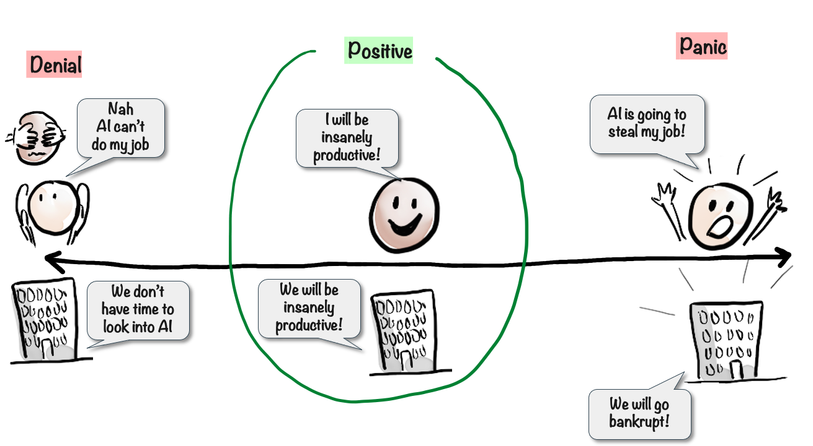

# Mindset

I’ve noticed that People and companies tend to fall into different Mindset categories when it comes to AI.

On one side we have Denial – the belief that AI cannot do my job, or we don’t have time to look into this technology. This a dangerous place to be.

A common saying is:

> AI might not take your job, but people using AI will.

This is true for both individuals and companies.

On the other side of the scale we have Panic and Despair, the belief that AI is going to take my job no matter what, AI is going make my company go bankrupt.

Often people start on the left side, denial, and then once they see what a good LLM can do, they hop all the way over to the right side, panic.

Neither of these mindsets are helpful. I propose a middle ground, a balanced, positive mindset. “AI is going to make me, my team, my company, insanely productive!”.

Easier said than done, I know. Mindset change can be challenging. But one thing that helps a lot, regardless of which side of the scale are you on right now, is to experiment a lot. Just play around with generative AI, try things, see what it can do for you. The more you experiment, the more you learn. And the more you learn, the more you will find ways that this technology can help you. It will feel more like a tool, and less like a threat.

Personally, I feel like I’ve gained superpowers. I can go from idea to result in so much shorter time. I can focus more on what I want to achieve and less on the grunt work of building things. And I’m learning a lot faster too, like having an awesome mentor with me at all times.

This mindset not only feels good, but it also equips you for the future, makes you less likely to lose your job or company, and more likely to thrive in the age of AI, despite all the uncertainty.

So one of my hopes for this book is that it will help people move towards the middle of this mindset scale.
