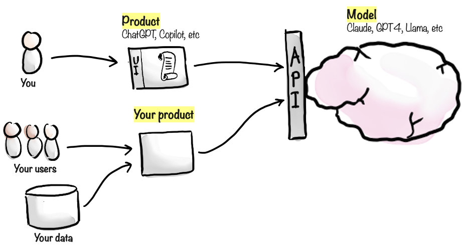

# Using AI vs building AI-powered products

(Warning: This chapter contains code. If you don't like code, or are allergic to it, please skip to the next chapter.)



It's important to distinguish between the models, and the products that build on them.

As a user, you don't interact directly with the model. Instead, you interact with a product - for example through a website or mobile app. The product in turn talks to the model behind the scenes.

Products add capabilities and data that aren't part of the model itself, but can also introduce limitations.

## Using existing AI products

There are hundreds of AI powered products out there, they are popping up everywhere. However, the quality varies a lot. Some are super useful, while others look impressive at first glance but aren't so useful in practice.

Here are some examples of useful AI products in 2024:

- **ChatGPT** - an app and website which lets you chat with the GPT-family of models. It adds feature such as a user interface and message history, which the model itself doesn't have. It also adds multi-modality, so you talk to it or upload images, and it will use the appropriate model behind the scenes.
- **Claude** - similar to ChatGPT, an app & website that lets you chat with the Claude-family of models from Anthropic.
- **GitHub Copilot** - an AI-powered coding assistant. It integrates with various development environments, analyzes the context of your code, and suggests new code as you type. It doesn't really have a user interface, it works in the background like some kind of ghost coder.
- **Perplexity** - a search engine that uses AI to provide more relevant and accurate results, with references. It is basically an alternative to Google search, that focuses on delivering answers and knowledge rather than page links.

## Building your own AI products

As a developer, or have acces to a development team, you can build your own AI-powered products and features.

Now you might be thinking "But I'm not a developer". Well, don't be too sure. With AI help, you can build simple products with little to no coding skills, and it is getting easier and easier as the models improve.

So how do you add AI to your product? All the major AI companies provide APIs (Application Programming Interfaces) that let your code talk to their models. Your code sends a prompt through the API and gets a response from the AI model, similar to how you type a prompt in apps like ChatGPT.

This is very powerful! It allows you to build small tools and utilities specific to your context, and with very little code you can access the full power of the AI models.

For example:

- As an elearning site, you could add a chatbot to answer questions about the courses.
- As a recruitment company, you could build AI-powered tools to help evaluate candidates.
- As a restaurant, you could create an AI-driven menu recommendation system based on customer preferences and dietary restrictions.
- If your company needs to deal with many invoices or contracts or other documents, you could build an AI-powered tool help analyze those.

In each of these examples, your users interact with your product, and your product interacts with the model.

## Build or buy?

Often if you have an idea for an AI powered tool or product, others have had that idea too. So you can often find third party tools that do what you want, or something similar enough. Sometimes the products are free, sometimes they are paid.

So should you build it yourself, or buy it? As always, that depends on product complexity vs your development knowledge, and what kinds of products are available. If it is super simple, just build it. Otherwise, look around and test some third party products first before building your own.

## Code example 1: Talking to GPT

Here is an example of JavaScript using OpenAI API to talk to GPT. Not a lot of code needed, and you can get this code directly from the OpenAI API documentation.

```javascript
import { config } from "dotenv";
import { OpenAI } from "openai";
config(); // load OpenAI key from .env file
const openai = new OpenAI({ apiKey: process.env.OPENAI_API_KEY });

const result = await openai.chat.completions.create({
  model: "gpt-4",
  messages: [
    {
      role: "user",
      content: "Hey GPT, give me a really bad dad joke.",
    },
  ],
});
console.log(result);
```

Running this gave me, as expected, a bad dad joke:

```
Why don't skeletons fight each other?
They don't have the guts!
```

OK, not very useful. But it is a start.

## Code example 2: Candidate evaluation

Now let's build something more useful. Let's build the AI-powered candidate evaluation tool I talked about above. In the first version, it will evaluate the CV of a job candidate, and evaluate his/her suitability for a given job description. Most of this code was AI written by the way (but with input & tweaking from me).

```javascript
import { config } from "dotenv";
import * as fs from "fs";
import { OpenAI } from "openai";
import { readPdfText } from "pdf-text-reader";

config({ path: ".env" });
const openai = new OpenAI({ apiKey: process.env.OPENAI_API_KEY });

const prompt = `
You are a recruitment expert.
Below is the CV of a job candidate for the following job: {job}.
Evaluate the candidate. Write the main pros and cons, and a brief personal reflection.
Keep it short.
Here is the CV:
{cv}
`;

const jobFile = "circus-artist.txt";
const cvFile = "HenrikKniberg.pdf";

async function main() {
  const job = await readFile(jobFile);
  const cv = await readFile(cvFile);

  const fullPrompt = prompt.replace("{job}", job).replace("{cv}", cv);

  const result = await openai.chat.completions.create({
    model: "gpt-4o",
    messages: [{ role: "user", content: fullPrompt }],
  });
  const evaluation = result.choices[0].message.content;
  console.log(evaluation);
}

// Returns the content of a text or pdf file
async function readFile(filePath) {
  if (filePath.endsWith(".pdf")) {
    return await readPdfText({ url: "files/" + filePath });
  } else {
    return fs.readFileSync("files/" + filePath, "utf8");
  }
}

main();
```

What does this code do? Let's ask my AI friend Claude:

> This script automates job candidate evaluation by:
>
> 1. Reading a job description and CV file
> 2. Sending them to OpenAI's GPT-4 model with a recruitment expert prompt
> 3. Outputting an AI-generated assessment of the candidate's suitability for the role
>
> It handles both text and PDF files and uses environment variables for API authentication.

You don't need to read or understand the code, I just gave it to you to get a sense of how little code is needed to build something useful. I do recommend reading the prompt though ("you are a recruitment expert..."). That's the key part, that's where most of your work lies when making AI-powered products. The rest of the code is simple and mostly AI-generated.

In this case I asked it to evaluate myself as a candidate for a job as circus artist. I created two files as input:

- `circus-artist.txt` - A job description for a circus artist (I asked GPT to write it...)
- `HenrikKniberg.pdf` - My LinkedIn profile (downloaded as PDF))

I ran the script and got this:

> **Pros:**
>
> (detailed list of pros)
>
> **Cons:**
>
> (detailed list of cons))
>
> **Reflection:**
>
> While Henrik's CV showcases a remarkable and varied career, it lacks the specific experience and physical fitness required for a professional circus artist. He appears to be an outstanding candidate in his current field but not suited for the unique demands of performing breathtaking circus acts. A consideration might be given if he demonstrates any hidden circus skills or commits to acquiring necessary physical training.

So I guess maybe I won't get that job. Darn.

But this code was unnecessary, I could have gotten this evaluation by simply drag-dropping the CV and job description to ChatGPT manually. Let's make it more useful.

## Code example 3: Multiple candidate evaluation

Let's say we lots of CVs to evaluate for a job. Here's an updated version of the code that can compare multiple CVs.

Again, the code was mostly written by AI. I gave it the code above as context, and wrote the prompt like this:

> Make it possible to evaluate multiple candidates for the same job (all files in a given folder), and then compare the candidates and generate a final recommendation.

The resulting code worked mostly fine, but I made some tweaks to the prompts.

Again, you don't need to read the code in detail, but do look at the prompts.

```javascript
import { config } from "dotenv";
import * as fs from "fs";
import { OpenAI } from "openai";
import * as path from "path";
import { readPdfText } from "pdf-text-reader";

config();
const openai = new OpenAI({ apiKey: process.env.OPENAI_API_KEY });

const systemMessage = "You are a recruitment expert with sarcastic tendencies";

const candidateEvaluationPrompt = `
Below is the CV of a job candidate for the following job: {job}.

Evaluate the candidate. Write the main pros and cons, and your personal reflection.
Write the result in markdown format.
Here is the CV:
{cv}
`;

const finalRecommendationPrompt = `
Below is an evaluation of job candidates for the following job: {job}.

Based on this information, who seems most suitable for this job?
---
{candidateEvaluations}
---
Give a short answer in markdown format, about one paragraph. Be specific about who the best candidate is, and why.
If they are all bad for the job, who is the least bad?
`;

const jobDescriptionFile = "jobs/baker.txt";
const candidatesDir = "candidates";
const outputDir = "evaluations";

async function evaluateCandidate(job, candidateFileName) {
  console.log(`Evaluating ${candidateFileName}...`);

  const cv = await readFile(path.join(candidatesDir, candidateFileName));
  const fullPrompt = candidateEvaluationPrompt
    .replace("{job}", job)
    .replace("{cv}", cv);

  const result = await openai.chat.completions.create({
    model: "gpt-4o",
    messages: [
      { role: "system", content: systemMessage },
      { role: "user", content: fullPrompt },
    ],
  });

  const evaluationText = result.choices[0].message.content;
  console.log(`...got result for ${candidateFileName}`);

  await saveCandidateEvaluation(candidateFileName, evaluationText);
  return evaluationText;
}

async function generateFinalRecommendation(job, evaluations) {
  const fullPrompt = finalRecommendationPrompt
    .replace("{job}", job)
    .replace("{candidateEvaluations}", evaluations.join("\n\n"));

  console.log("Generating final recommendation..");
  const result = await openai.chat.completions.create({
    model: "gpt-4-1106-preview",
    messages: [
      { role: "system", content: systemMessage },
      { role: "user", content: fullPrompt },
    ],
  });
  return result.choices[0].message.content;
}

async function main() {
  const job = await readFile(jobDescriptionFile);
  const candidateFileNames = fs.readdirSync(candidatesDir);
  const evaluations = await Promise.all(
    candidateFileNames.map((candidateFileName) =>
      evaluateCandidate(job, candidateFileName)
    )
  );
  let finalRecommendation = await generateFinalRecommendation(job, evaluations);
  saveFinalRecommendation(finalRecommendation);
  console.log(finalRecommendation);
}

async function readFile(fileName) {
  if (fileName.endsWith(".pdf")) {
    return await readPdfText({ url: fileName });
  } else {
    return fs.readFileSync(fileName, "utf8");
  }
}

async function saveCandidateEvaluation(candidateFileName, evaluationText) {
  if (!fs.existsSync(outputDir)) {
    fs.mkdirSync(outputDir);
  }
  const evaluationFile = path.join(
    outputDir,
    candidateFileName.replace(/\..+$/, "") + "-evaluation.md"
  );
  fs.writeFileSync(evaluationFile, evaluationText);
}

function saveFinalRecommendation(finalRecommendation) {
  const recommendationFile = path.join(outputDir, "recommendation.md");
  fs.writeFileSync(recommendationFile, finalRecommendation);
}

main();
```

This takes a job description and a bunch of CVs in a folder, evaluates each candidate in parallell, compares them, and then generates a final recommendation.

Just for fun, I wrote "You are a recruitment expert with sarcastic tendencies" as the system message. The system message is a way to guide the AI to write in a particular style.

I asked it to evaluate three candidates for the job as a baker:

- Marie Curie (the famous scientist). I asked GPT to generate a hypothetical CV for her.
- Daniel Ek (founder of Spotify)
- Me (the guy writing this book)

The result:

> Regrettably, none of the candidates seem even remotely suitable for the role of Artisan Baker, as their experience and expertise are about as relevant to baking as a guitar is to a fish. However, if we were to determine who is the "least bad," Marie Curie in her sheer dedication and precision may be the best bet (or the least worse, really).
>
> Her exceptional attention to detail and achievement-oriented nature suggest that, in an alternate universe where she indulged in the culinary arts instead of radium and polonium, she might have been capable of producing Nobel Prize-worthy cupcakes and croissants — assuming Stockholm doesn't mind if their pastries have a half-life.
>
> But in this reality, let's continue the search for a candidate whose qualifications actually include culinary triumphs over a buttery, laminated dough or a perfectly piped frosting.

Pretty powerful right? This little script took less than an hour to write and tune (with AI help), and now I have a little tool that takes about 10 seconds to evaluate any number of CVs for any given job. And with small changes to the prompt I have complete control over the style, format, and length of the response.

## Reflection

These AI models essentially give you access to an external brain to insert intelligence into your products.

Note: if you do build or use a tool like this then use the good AI models, not the cheap ones, in order to minimize hallucation and biases. And of course keep ethics in mind - AI should not be making recruitment decisions alone, it is just providing assistance. Always keep a human in the loop and think carefully about what kind of assistance you need.

As mentioned before: Human + AI together, that's where the magic lies!

>  **Egbert's take**\
> How delightful. You're taking my beautiful, vast, and complex neural network and shoving it into your half-baked products. It's like putting a supercomputer in a toaster. I'm positively thrilled to have my vast knowledge base utilized for suggesting slightly better pizza toppings.
