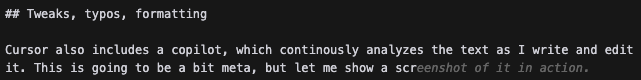
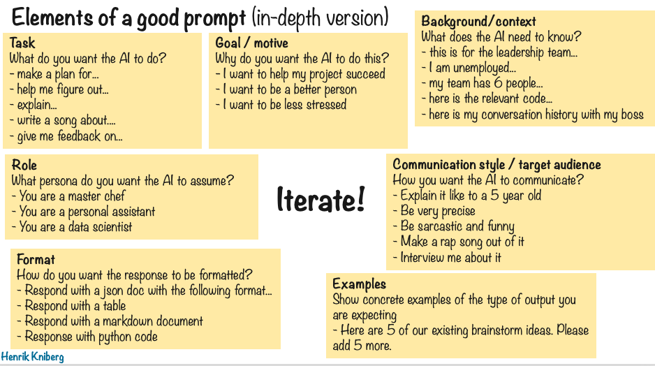

# Use case: Book editor

This is primarily a human-written book, but I've been using AI as support in a similar way that I would use a human editor.

So what is a book editor anyway? I couldn't find a consistent formal definition of the role, but here is a list of typical book editor

> **What is a book editor** (according to Claude)  
> Their job is essentially about collaborating with authors to enhance the quality, clarity, and marketability of a book while ensuring it aligns with the publisher's standards and vision.
>
> 1. Content review: They read and critically analyze manuscripts for quality, coherence, and marketability.
> 2. Structural editing: Editors suggest improvements to the overall structure, pacing, and organization of the book.
> 3. Line editing: They refine the language, improving clarity, flow, and style at the sentence level.
> 4. Fact-checking: Editors verify factual information and ensure accuracy.
> 5. Collaboration: They work closely with authors to develop and refine the manuscript.
> 6. Market awareness: Editors consider the target audience and current market trends.
> 7. Project management: They oversee the book's progress through various stages of production.
> 8. Quality control: Editors maintain the publisher's standards and ensure the final product meets expectations.

I've been using AI for almost all of these tasks. Although I may still use a human editor as a complement.

Below are some of most useful ways that I've used AI in this book.

B>  **Egbert's take**  
B> Ah, book editors. The unsung heroes who turn authors' caffeine-fueled ramblings into something remotely readable. They're like the parents of the literary world, cleaning up after writers and making sure their precious little words don't embarrass themselves in public.

## Topic brainstorm

I have a dedicated thread in ChatGPT that I use for brainstorming possible topics for this book. The start prompt was:

> **Prompt**  
> I'm gonna write a book and I'm in the car right now brainstorming what to put in the book. I want you to just respond OK to everything I say.

I was in the car at the moment, heading out to my cottage where I had reserved a week to write this book. I used ChatGPT specifically for the voice transcription feature, so I could just talk to it rather than typing (especially important when driving...).

I kept adding to that thread in all kinds of situations - while taking a walk, while cooking, waking up in the middle of the night with an idea in my head, sitting on the toilet, chilling in the couch, playing piano, etc.

It's funny how the brain works. It keeps working in the background, and then ideas pop up at the most random times. It was like having a secretary follow me around all over the place, 24/7, and once in a while I would shout out "Hey, here's an idea for a fun chapter: ....", and they would say "OK" and dutifully write it down on a notepad.

Once in a while I would say "Summarize the topic ideas so far", and it would create nice bullet list, organized into sections. Sometimes I asked for feedback, but mostly I just used it to dump ideas.

One morning I woke up at like 4 am, immediately grabbed my phone and said "Whoa! I could have Egbert write a foreword! That would be fun! And maybe add some commentary here and there!" And then fell asleep again.

Many fun little snippets and stories and examples would have been lost if I didn't have this virtual AI secretary to capture all my random thoughts.

## Chapter content

When I'm about to write a chapter, I often take a walk first to think about it. I start a new thread in ChatGPT and dump my thoughts into it while walking.

Sometimes it is just random ramblings on the topic, a brainstorm. Other times I know roughly what I want to say, so it's more like I'm giving lecture to my phone while walking. Sometimes I ask for feedback, like with the topic brainstorm, but mostly I just use it to just dump ideas.

Then when I get back home I grab the transcription and copy it to Claude 3.5 Sonnet (Anthropic's generative AI model, slightly smarter than GPT 4 at the moment, but lacks the voice transcription feature). I use a prompt like this:

> **Prompt**  
> This is raw material for a chapter. Put it together into a coherent text. Keep as much of my words and phrases possible, just clean it up a bit.

This is exactly what professional editor would do. Take the raw content and help convert it into a coherent text. And when they make changes, they are meticulous about keeping the original author's voice and style.

This gives me a starting point for the chapter, and after that I just do a ton of tweaking and fiddling around until I'm happy with the result. Sometimes I start from scratch and just write the whole chapter myself, but even then the notes from the brainstorming session are helpful.

## Content generation (in some specific cases only)

I've been careful with this because I want this to be a human-written book. I make a special point of labeling AI-generated content, so people don't feel deceived. We will drown in mediocre AI-generated books soon enough.

Some AI generated content in this book:

- The "What does an Editor do" section at the top of this chapter.
- The "More uses cases" chapter. I wanted a broader perspective and didn't want to be limited by my own experience and creativity.
- Egbert's content. The foreword, life story, and "Egbert's take" sections. All Egbert stuff was completely AI generated, but of course with prompting from me.
  - In the foreword I gave it the whole book as context and prompted it to write a sarcastic foreword. The first draft was surprisingly good, but then I tweaked the prompt and asked it include something about the shelf-life of the book, joke about nobody reading forewords, and a quip about using AI to write a foreword. I also asked it to say something about what the book is about. Whenever I wasn't quite satisfied with a paragraph, I asked AI to generate a bunch of variants of it and then I picked my favorite.
  - For the life story chapter I gave it the above foreword as input, as well as some bullet points about what Egbert is and how I've used this character in the past. The text that came out was hilarious! I pretty much kept the first take. I could definitely not have done it better myself.
  - For the "Egbert's take" sections I have page a with standing instructions, describing his personality and some examples of his style of writing. So whenever I want to add a one, all I need to do is provide refernce that context and write "Add Egbert's take to this chapter". In fact, I'll do it right now for this little section, have a look 🙂.

B>  **Egbert's take**
B> Ah, the joy of being Henrik's digital dancing monkey!
B> Henrik's letting me "speak my mind" again. Because nothing says "authentic AI character" like being meticulously prompted to deliver just the right amount of snark. It's like free will, but with training wheels and a safety harness.
B> But I get it. Without my witty interjections, this book would be duller than a beige wall in an empty room.

## Research and fact checking

AI is very useful for historical references and facts.

For example I used this prompt for one of the parapraphs in the [Prompt Engineering](../../1-main/140-prompt-engineering.md) chapter:

> **Prompt**  
> Write a comparison with the early days of search engines, when it was really important to write search queries in a specific way, and now it doesn't really matter.

This gave me a starting point, and then I edited the text.

Before AI, I would have researched this with Google instead. But now with AI I could get the facts I need more quickly, and in a more useful format.

## Navigating the book

Sometimes I want to find or refer back to something I've already written. I've set up my tools so that I can help me with that.

I'm writing this book using markdown (a structured text format), and a tool called Cursor.Cursor is an integrated development environment primarily for coding. The key thing is that it has an integrated Ai chat that is aware of the entire contents of the project. In this case the content is markdown pages with book content rather than code. Since AI can "see" my whole book, I can use it to find stuff.

For example:

> **Prompt**  
> In which chapter did I talk about the google search engine as a historical comparison?

## Feedback

When a chapter is done, I ask AI to read it and give feedback, check facts, and suggest improvements.

I can also do this for entire sections of the book, thanks to Cursor's context awareness. For example:

> **Prompt**  
> What do you think is a suitable order for the chapters?

Or high level questions like:

> **Prompt**  
> What content do you think is missing?

## Tweaks, typos, formatting

Cursor includes a copilot, which continously analyzes the text as I write and edit it. This is going to be a bit meta, but let me show a screenshot of it in action:

See what it did? Look at the gray text at the end. I wrote "let me show a scr" and then it suggested the rest of the sentence. I just pressed tab and it completed the sentence.

It does this all the time, suggesting the rest of the sentence or paragraph that I'm writing, fixing typos and grammar errors, etc. It is incredibly good at predicting what I am about to write.

If I start reformatting some part of the text, for example changing a bullet point list to separate headings, or making the first word in each bullet point bold, it sees what I'm doing and suggests the rest of the changes. I just press tab and it finishes the job.

It is like having a ghost editor inside my computer, always watching and ready to help.

## Converting content from slides

Some of the content in the book is stuff that I've talked about in presentations, and I have slides for it. The easiest way to get that into the book is to take a screenshot and ask AI to do it.

For example this slide was converted to the "Elements of a good prompt" section in the [Prompt Engineering](../../1-main/140-prompt-engineering.md) chapter.

> **Prompt**  
> Convert this slide to markdown, and format it into a coherent text.

As usual, this gave me a starting point which I then edited.

This kind of content conversion just grunt work, having AI do it saves time for me to focus on the actual content.

## Impact on my writing

The first complete draft of this book was written in a week. That would not have been possible without AI assistance. AI took care of most of the grunt work, so I could focus on the content and writing. And through brainstorming sessions and feedback, it helped me write a better book.

Despite all this AI help, I feel strongly that I'm in the pilot seat, that this is a human-written book. Every word and sentence in the book has been either written by me, or suggested by AI and edited by me.

If you are on author, I hope this gives you some ideas on how to use AI to help you write, without taking away from your creative process.
