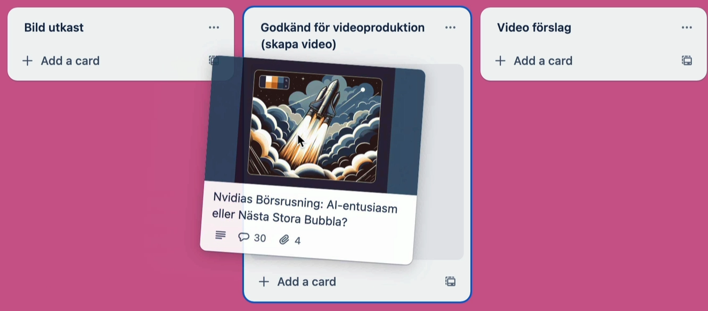

# The AI journalist who became a TV star

Here is an example of a AI agent in action.

In early 2024 I was involved in a Swedish TV documentary called "Generation AI". The producer of the show had heard of [Jimbo](470-jimbo.md), the autonomus AI Youtuber agent described in the previous chapter, and wanted something similar for the TV show. So that was the focus of Episode 6, the last episode of the series.

I worked together with Alex, the host of the show, a well-known Swedish journalist and news anchor. The idea was to build an AI journalist agent called Ailex, essentially an AI version of Alex, who would work alongside the real Alex to make news videos. Just for fun we configured Ailex to think of himself as a better version of Alex, so they could banter a bit about that 😁.

So how did we design this agent?

We started by mapping out Alex's process for making news videos, covering every step from research to production.

I then went off and built an AI agent for him that researches news, selects the most relevant news for today, generates suitable images, and even creates the actual news video. Technically this was a javascript application that interacts with OpenAI, Trello, HeyGen, and other APIs.

The idea was to let the agent run the whole process from idea to production, to show the potential of AI in a real-world scenario.

Let's have a look behind the scenes and see what this actually looks like. In the documentary, Alex and his AI coworker collaborate on a Trello board, a digital visualization of the complete workflow from research to production.

The key thing with AI co-workers is that they work with you in your tools, and you choose how much of the work to delegate. They don't automate a job, they automate specific tasks within a job.

Every night when Alex is asleep, his trusty coworker does research and adds relevant news items as cards to the board.

By the way this was a Swedish TV program and Swedish journalist, so we did everything in Swedish. But hopefully the screenshots below will still be interesting even if you don't understand Swedish. Or you can just copy the image and ask an AI chat to translate it for you...

Each card on the board contains a high-level summary of the news item and of course links to sources. Sometimes several related news items will be combined into one news report. Here is an example of the contents of a card:

So how does the agent know what to search for?

The research topic and news selection criteria are defined by Alex on a separate instructions board. Each card on the instruction board is a prompt for some aspect of the AI agent's work. For example how it should select news, how it should write a manuscript, etc.

In this case, the topic of the news channel is Generative AI, and we are looking for concrete news with a clear angle. Alex and I worked together to describe this on the instruction cards. As usual it took some iterations to get it right.

Next, we get pick which card to turn into an actual news video. So let's pick, say, this one about Nvidia's stock price.

We move the card, and now the coworker gets to work and starts writing a manuscript.

Again, we can guide this work through the instructions board where we describe what we're looking for in a good manuscript. This is similar to how we might work with a human assistant journalist.

So although the AI coworker is doing most of the work, Alex is still in control. He can change and tune the instructions whenever needed.

When the agent is done with the manuscript, he moves the card to the "draft manuscript" column.

We can now review the manuscript.

If we like it we can move the card to the next column. If we want to change something we can edit the text ourselves directly, or give feedback to the coworker.

For example, maybe we want it to be shorter and more targeted to a younger audience. So we type that in. We basically chat directly on the card and then the coworker updates the manuscript accordingly.

So let's say after a few rounds we're happy with the manuscript. Now it's time for some images.

We move the card, the agent gets to work, and after a minute or so the agent is done and the card is moved to the next column. The agent has now created image prompts for each part of the manuscript, and it has also generated the actual images.

Again, we could give feedback here on the images and request changes, but in this case let's just say we're happy and move it on to video production.

So we drag the card, and the agent gets to work making the video. A few minutes later the card is moved to the "Video suggestion" column, and a video file is attached to the card. Here are some frames from the video:

In the documentary Alex wanted his coworker to look like himself and use his voice, so what you see above is an AI-generated clone of him. But it could just as well have been some other avatar or character.

In retrospect, I think we maybe should have used a non-human avatar for this, rather than something that looks exactly like the real Alex. Even if we clearly mark it as AI generated, people may feel deceived.

We also made an app where Alex can chat with his agent freely, outside of the Trello board, using voice or text.

Here we asked him "Do we have any cool new news stories for today's video?". He checked the board and wrote some suggestions, and then we started discussing target audience.

As you can see, this is all about collaboration between human and AI.

Technically the AI coworker could do the whole workflow automatically, every step without any human feedback.
However, the results are always better with human oversight and involvement.

That's why all automation steps are optional. For example, we could have decided that the coworker is done after the manuscript step and then record the video the traditional way with a human news anchor.

## Reflection

I think these kind of agents will become the norm in the future. This example is perhaps a bit extreme, with the human-like AI news anchor reading the news. But the earlier parts of the workflow - doing research, analyzing and creating documents, refining, selecting and prioritizing, those kinds of things are perfect for an AI agent.

I think most companies will have AI agents that hook into existing workflows and tools, and take on whichever part of the workflow that makes most sense for an AI agent to do. And by using a shared workspace (such as Trello in this case), everyone has the same information and can work together.
