# Whodunit - the AI powered mystery game

In this chapter I will share some insights from a hobby project - an AI powered mystery game.

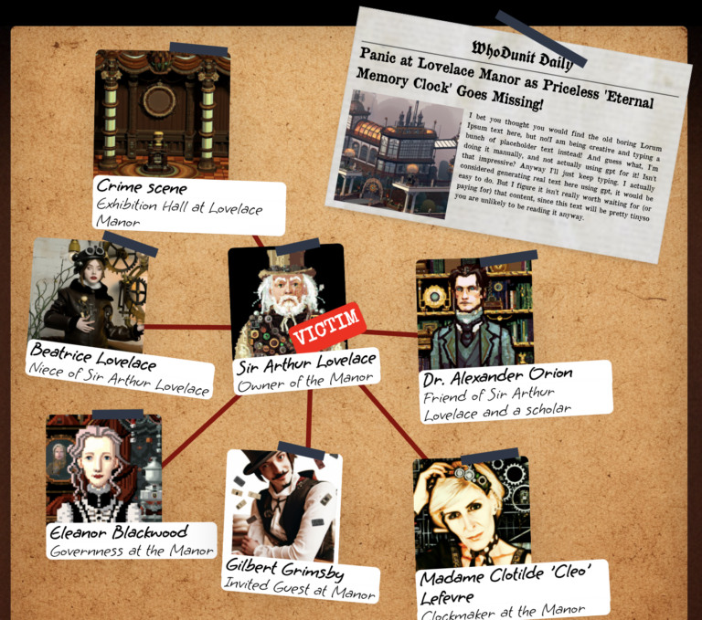

## How it started

It started as a fun little experiment. I was sitting on the porch with my cousin and my kids, goofing around with ChatGPT, trying to see if we could generate a role-playing game. We wrote a prompt like this:

> **Prompt**  
> You are the game master or a sherlock holmes-style mystery game.
> You will make up setting for the mystery, and the characters involved.
> I will roleplay as the detective, interrogating the characters and trying to solve the mystery.
> You will roleplay as the characters.

So GPT took the role gamemaster for a murder mystery game, and generated the setting, characters, etc. We played the role of a detective interrogating the suspects to figure out who the murderer is, and GPT roleplayed all the characters.

It worked surprisingly well! That is, until the chat history got too long and GPT started losing context and becoming inconsistent, and started changing the story on the fly. The AI model was essentially like a forgetful gamemaster who just wings it and doesn't actually have a plan or a consistent storyline in mind, and doesn't remember what they said earlier in the game. Pretty funny, but not great for a murder mystery where you need consistency.

I was intrigued by the idea, though, and decided to try to build something in code instead, using the OpenAI API instead of using ChatGPT directly. That way I could control the context, and make sure the AI gamemaster was roleplaying in a consistent way and sticking to the storyline. Development went insanely fast, because I pair-programmed with GPT all the time.

This project turned into a rather wild experiment in how far I could go with AI in game development. In fact, the game is entirely based on AI and would not be possible to build without it.

- AI wrote most of the code (with my guidance and feedback)
- AI generates all the content – mysteries, newspaper articles, crime scenes, characters, back-stories, plot twists, bulletin boards, images, loading texts, etc. With one button click you can ask it to generate a new mystery with a theme of your choice (or let GPT decide).
- AI roleplays all the characters in the game, and the crime scene search, and the police officer when you make your accusation, and the media writing articles about the crime and your investigation, and the epilogue describing the aftermath.
- AI even acts as a database administrator, and can answer questions about the number of players, the latest played mystery, etc.

You can try it at whodunit.kniberg.com.

## Playing the game

In the game you play the role of a detective trying to solve a crime. The first thing you do is decide which mystery to solve.

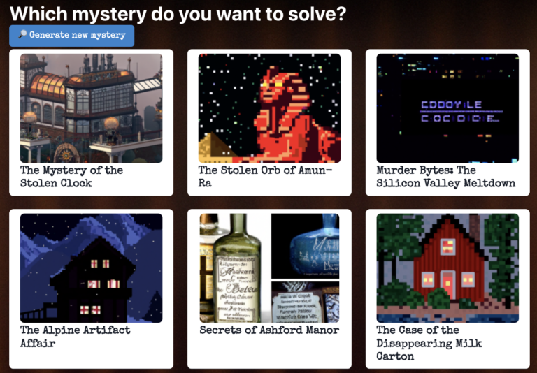

These are all auto-generated. You can create your own mysteries by pressing the “Generate new mystery” button at the top.

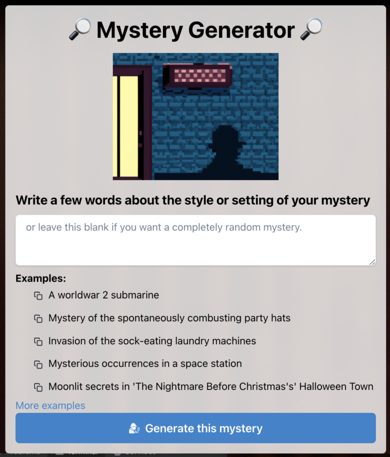

You don’t need to type anything here, you can just press “Generate new mystery” and AI will make everything up. But if you want, you can describe a style or setting or theme, with as much or little detail as you like. Some examples are provided, and they are also auto-generated.

Your mysteries are private by default – only you can see it, and those who you share the link with. You can press “publish” to make your visible to everyone.

After selecting (or generating) a mystery, you get to the overview page.


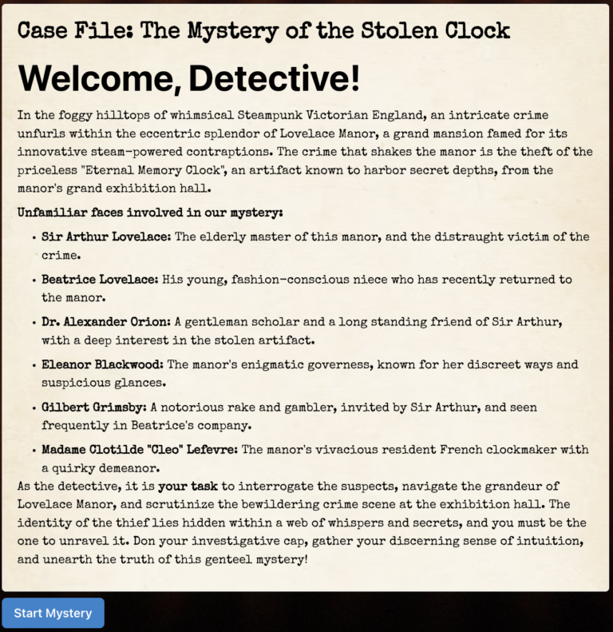

Press “Start Mystery” to get started!

To the left you see a list of all suspects and the crime scene. Click on a suspect to interrogate him/her, click on the crime scene to search. Each interrogation & search is a chat session for you play the role of the detective and GPT plays the role of the character being interrogated or the crime scene being searched.

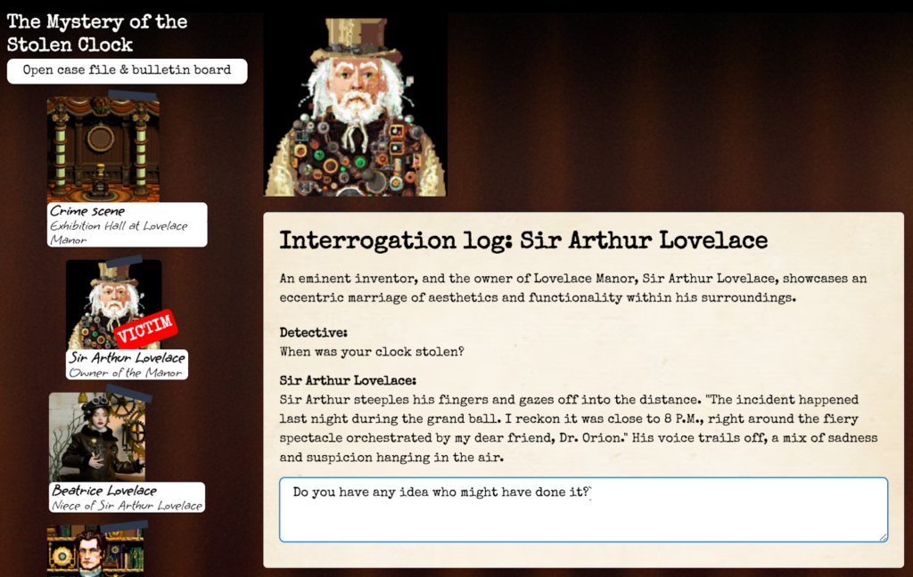

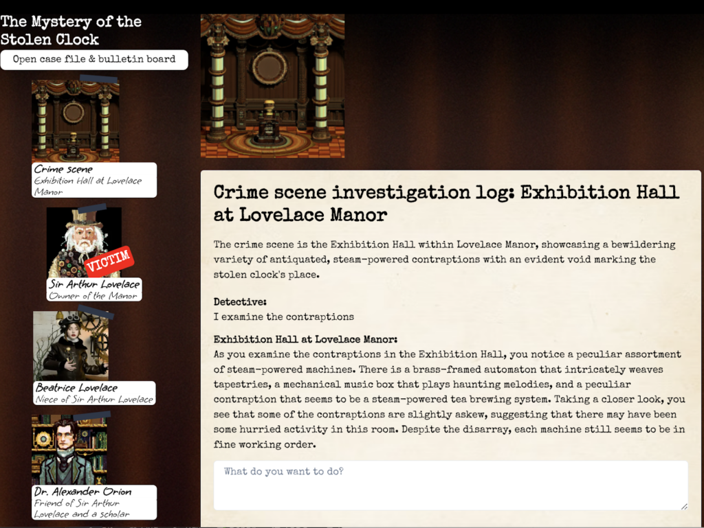

So search the crime scene, interrogate the suspects, and ask typical detective-story questions like where they were at the scene of the crime, about their relationship with other characters, etc.

When you think you know who committed the crime, press “Accuse”. Now your job is to present your case to the police in a convincing way. The police won’t accept flimsy accusations, you need to present a pretty good case for why you think character X is the culprit. There could also be multiple culprits!

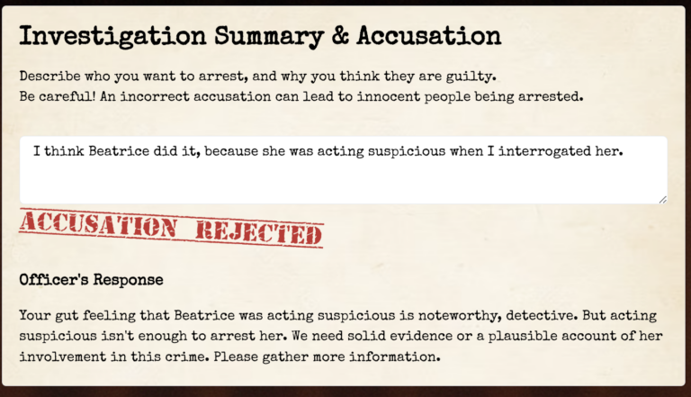

If the police reject your accusation you need to rephrase it to make your case stronge, or go do some more interrogating.

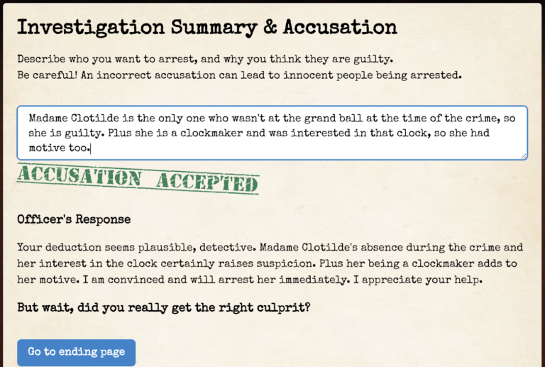

An important thing here is that convincing the police doesn’t mean you were right! You might have convincingly accused the wrong person! Click “Go to the ending page” to find out.

The ending page includes newspaper article about the arrest, an evaluate of your result (Failure, Success, or Partial Success), and an epilogue describing the aftermath. In this case we arrested an innocent person, ouch!

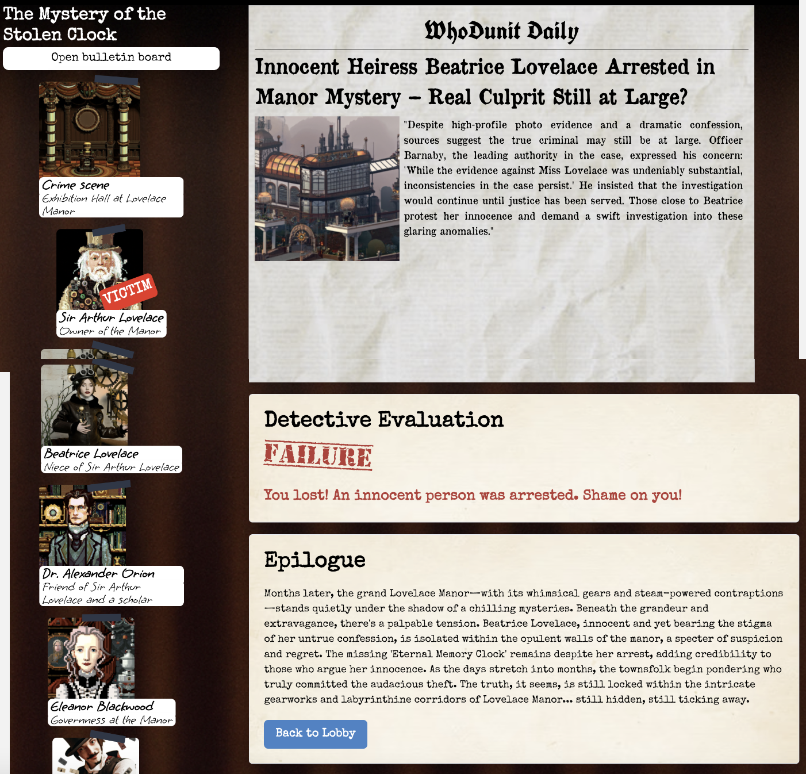

You can also end up with a Partial Success, where you catch some of the culprits but not all.

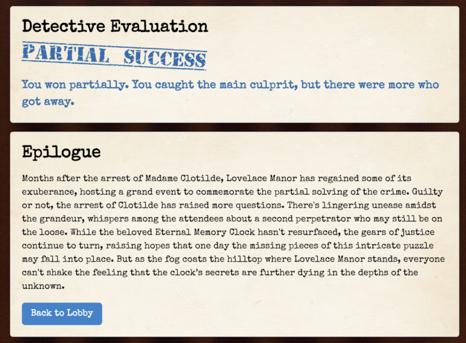

## Administrating the game

Normally with a product like this I would also build an adminstration backend to be able to see basic statistics like number of players, number of mysteries solved, etc.

But in the spirit of going all-in with AI, I just built an admin chat instead.

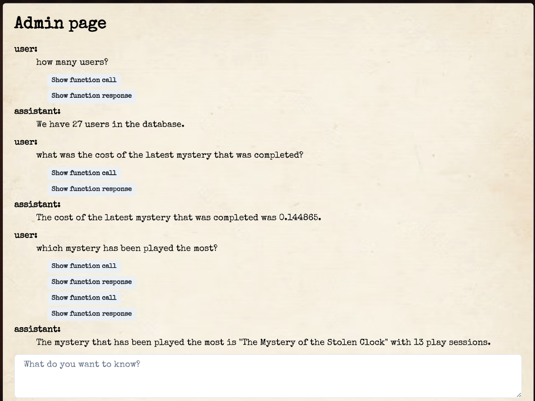

So I could ask questions like "how many mysteries have been played", "how many people have solved this mystery", etc. AI turns this into database queries, interprets the results, and explains it to me. In the example below you can see the database queires it was executing for me.

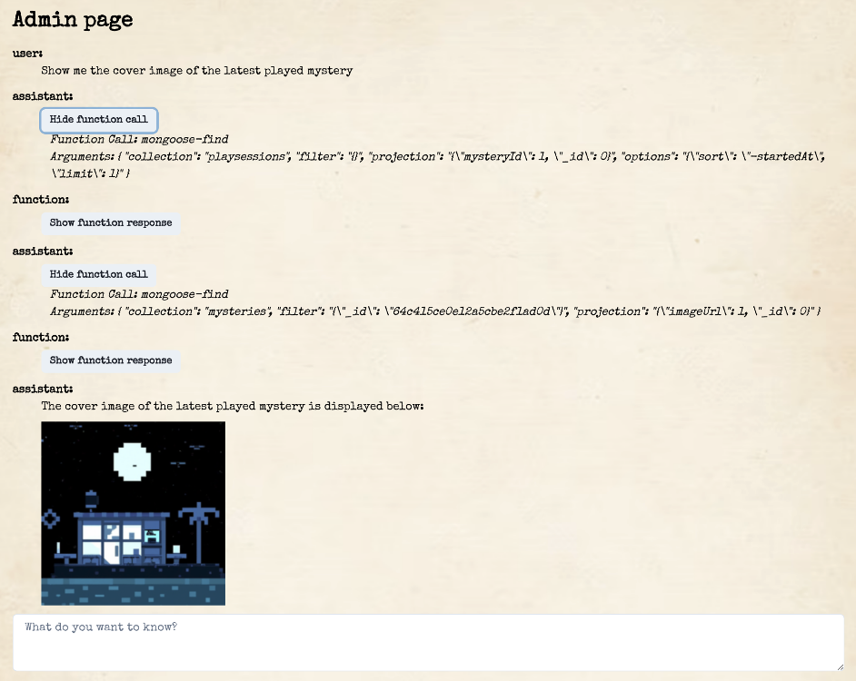

I think this is an interesting use case in general - using an AI chat as a general purpose tool for adminstration and analytics, or using AI chat as a user-friendly proxy for interacting with backend systems that are otherwise quite complicated.

## How the game was made

(note - this section is slightly technical)

The first playable version of the game took only 3 days to make. I used a tech stack that I had never used before (React + Next.js + Vercel), but thanks to GPT that was no problem. I learned it on the fly. This would have taken weeks to do without AI assistances, so this made me 5-10 times faster than usual.

Once I got the core gameplay loop working I spent another another couple of weeks spread out of the summer, tweaking and improving the game.

Here are some examples of how I used AI assistance:

- **Architecture discussion.** “I want to do X, which tools & tech are suitable for that?”. GPT helped me select React + Next.js + Vercel + MongoDB as tech stack, and it was a great choice for this.
- ** Design discussions.** “What is the best way to do X?”
- **Adding features**. “Here is some code (…), please add feature X.”
- **Fixing bugs.** “Here is some code, an error message, and a stack trace. Fix it. “
- **Explaining things.** “How does document serialization work in MongoDB?” or “How do api routes work in Next.js?”
- **Improving the UI.** “This page is ugly and confusing. Improve it.”
- **Fixing performance issues.** “This page loads really slowly. Speed it up”. GPT helped me figure out were it makes sense to use client-side rendering vs server-side rendering for example.
- **Adding functions.** “Write a function that does XYZ” (although copilot could often do that too, if I just start writing a comment or function name).
- **Code cleanup.** “This code is messy and full of duplication. Refactor it.” For example in several cases my react page started getting too big, so I asked GPT to extract reusable components from it.

I used GPT4, which might be considered a dinosaur by the time you read this. But it was surprisingly good!

As long as I provided a clear context (for example existing code), and a clear goal or problem statement, it nailed it almost every time. When it failed or created bugs, it was either because my instructions were unclear, or because we were dealing with code or APIs that had changed after GPT4’s training date.

A lot of my work was prompt engineering – writing and tuning prompts to generate the right content. The game is quite special because we use one prompt to generate the mystery, and then the output of that is a “dm info” that is used as input to the AI that roleplays all characters and runs the mystery.

This is like a team of AIs prompting each other, which requires especially well-crafted prompts.

We can compare it to a traditional D&D roleplaying campaign. One AI is “campaign creator” and creates a campaign booklet describing the world, all characters with motives, personalities, etc, and of course the goal of the campaign. And then another AI is “dungeon master” and uses the campaign booklet when talking to the players and role-playing all characters. And then there are separate AIs to generate images and newspaper articles and bulletin boards and other content on the fly.

Here’s a crude attempt to illustrate this…

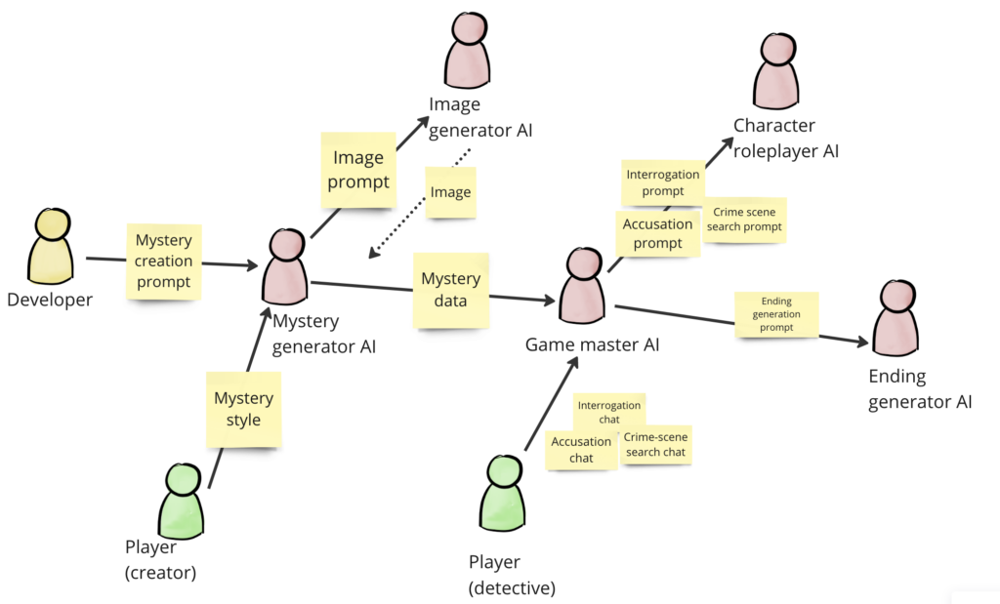

## Prompts used

In this section I will share some of the prompts used inside the game.
I used all of the techniques described in the [Prompt Engineering Techniques chapter](460-prompt-engineering-techniques.md).

### Prompt used to generate the DM info (= storyline):

DM Info stands for “Dungeon Master Info”, the secret master document used to run the mystery

```
Create the context for a crime mystery, for example a murder or a theft. This will be used as a basis for creating a role-playing game where the player is a detective seeking to find out who is guilty of the crime.

Setting and style for the mystery: {style}

Include the following factual information. This is for the game leader, so all information should be correct. The game leader will decide which information to reveal to the player and when.

 - A setting. For example an old english manor, a train, a ship, or a wedding party.
 - A crime. Describe what the crime was.
 - A set of 5-6 characters. This includes the victim of the crime and any characters were at the location and are potential suspects. At least one person should be guilty of the crime. For each character, include their name, their appearance and personality, and their relationships with ach other. It should not be obvious which character is guilty. At least several of the characters should seem suspicious, and might have motive to commit the crime. It is also OK if several of the suspects collaborated on the crime.
 - Secret truth about the crime. This should be correct and complete information, to be hidden from the player. Who was the criminal? Was he or she acting alone? If not, who else was involved and how? If it was a murder, how and where was the victim murdered? What was the criminal's motive? Where and when did the crime happen? Where was the victim found? If it was a murder, what was the real cause of death, and what was the apparent cause of death? Include any other details that make this mystery interesting. Be very specific and detailed, including timestamp and location of each event and each character.
 - Guilty characters. List the name of the characters who are considered guilty of this crime.
 - Location info. Describe the key locations that are relevant to the mystery. If this is a manor, for example, describe the overall layout of the manor and which rooms exist, and a little bit about the area around the manor.
 - Plot twists. Describe any potential plot twists that can be triggered by the player interrogating suspects, or the player searching the crime scene. For example 'if Jim is told about the hidden necklace, he will break down and admit that he is in love with Jennie'.
 - Crime scene description. A detailed factual description of the crime scene. How does it look to the detective? Are there any hidden clues that can be found? Where was the body found?
```

Here is an example of a DM info that it generated:

```
Setting and Style: Whimsical Steampunk Victorian England

**Setting:** The crime mystery takes place in Lovelace Manor, a grand Victorian mansion renowned for its eccentric steampunk-inspired modifications. The manor is nestled on a fog-coated hilltop, surrounded by well-manicured gardens filled with whimsically designed steam-powered contraptions.

**Crime:** The priceless "Eternal Memory Clock," an elaborately designed artifact known to contain important secrets, was stolen from the manor's grand exhibition hall.
Characters:

1. Sir Arthur Lovelace: The owner of the manor, he is an elderly nobleman and an eminent inventor, renowned for merging steampunk and daily life with unparalleled sophistication. Sir Arthur had publicly displayed the clock at his grand ball. He is often seen with his mechanical pet raven, Eureka.
2. Beatrice Lovelace: Sir Arthur's young, fashion-forward niece who arrived a few days before the crime was committed. She is seen as the heir of Lovelace inventions and the manor. There are rumors about her need for the Eternal Memory Clock's secrets to maintain her status.
3. Dr. Alexander Orion: A gentleman scholar, Sir Arthur's closest friend, and a frequent guest at the manor. He was deeply interested in the eternal memory clock.
4. Eleanor Blackwood: The mysterious, quiet governess who takes care of Sir Arthur's wards. Eleanor is secretly in love with Dr. Orion but suspects him of having intentions for Beatrice and the manor's wealth.
5. Gilbert Grimsby: An enigmatic and shifty outsider invited to the grand ball. Grimsby is known throughout Victorian England as a notorious gambler and con artist. Some believe he was invited to the manor as Beatrice's suitor.
6. Madame Clotilde "Cleo" Lefevre: A vivacious, seemingly batty French clockmaker, she was hired to ensure the smooth functioning of the artifacts at Lovelace Manor.

**Secret Truth:**

The real culprits are Dr. Alexander Orion and Cleo Lefevre. Dr. Orion found an obscure page of blueprints suggesting that the clock contained a map that leads to Sir Arthur's secret treasure, which Cleo knew about. Together, on the night of the grand ball at 8 P.M., they managed to confound everyone with a spectacular fireworks display created by Dr. Orion while Cleo removed the clock from its mount unnoticed. They hid the clock in a tightly locked cupboard inside the grand hall behind a large portrait.

**Guilty Characters:**

- Dr. Alexander Orion and Madame Clotilde "Cleo" Lefevre

**Location Info:**

Lovelace Manor is a sprawling mansion with flying buttresses, numerous guest rooms, a grand library filled with secret passages, an exhibition hall displaying unique objects, a clocktower, and a grand party hall. Modern steampunk contrivances surround the manor, with vast gardens and an impressive fountain that spurts colored steam.

**Plot Twists:**

- Finding a Curious Note: This note, when found by the player, reveals that Beatrice didn't arrive at Lovelace Manor by chance, but because she was summoned covertly by Dr. Orion.
- Dr. Orion's Confession: Dr. Orion, if asked about his relationship with Beatrice and Cleo, will admit to his affair with Cleo, adding another layer of suspicion to his character.

**Crime Scene Description:**

The crime scene, the grand Exhibition Hall, is a room filled with a majestic array of antique contraptions, all powered by steam and polished brass. The spot where the clock stood is identified by an empty circular indent in the elaborately carved oak pedestal. There are signs of hurried activity with a few contraptions knocked askew, and the temperature in the room is strangely higher than the other parts of the manor, suggesting the misuse of steam. A keen eye can detect scratches near the portrait revealing the hidden cupboard. A false panel on this cupboard reveals a small, empty space - precisely the size of the stolen clock.
```

### Prompt to generate character details

```
Now create interrogation details about each character. This will be used by the game leader to guide the interrogation of each character.

For each character, describe the following:
- How was the character involved in the crime (if at all)?
- What do they know about the crime?
- How do they feel about the crime?
- Where were they at the time of the crime?
- What exactly were they doing during the hours before the crime? Where were they, when, and with whom?
- What are they eager to talk about, and what will they lie about or try to hide?
- What are their personal motives?
- Any other information that may be relevant to their interrogation.
```

Here is an example of one of the character detail sheets that it generated:

```
2. Beatrice Lovelace
- She arrived few days before the crime was committed.
- She claims ignorance about the crime but is visibly distressed.
- During the time of the crime, she was seen mingling with guests at the ball, especially Gilbert Grimsby.
- Before the crime, she spent time with Gilbert and felt uncomfortable with Dr. Orion's excessive attention.
- Beatrice tries to hide her desperation for the clock's secrets but eagerly talks about Gilbert.
- Her personal motive is the need for the secret within the clock to maintain her status.
```

### Structured data for the web client

I used GPT function calling to make it generate structured data for the web client, like this.
Note that it also generate the image prompts for all characters and locations, which in turn are used to generate the actual images.

```json
{
  "_id": "64dc776d73e872e8abeae3e8",
  "name": "The Mystery of the Stolen Clock",
  "dmInfo": "...(the full DM info from above)...",
  "intro": "# Welcome, Detective! In the foggy hilltops of whimsical Steampunk Victorian England, an intricate crime unfurls within the eccentric splendor of Lovelace Manor.... (etc)",
  "artStyle": "whimsical steampunk",
  "newspaperHeadline": "Panic at Lovelace Manor as Priceless 'Eternal Memory Clock' Goes Missing!",
  "hint": "A spectacular fireworks display had everyone's attention during the theft. The temperature in the Exhibition Hall is abnormally high, and a false panel hides an empty space perfectly fitting the stolen artifact. The clock's disappearance hinges on more than one secret alliance.",
  "imagePrompt": "Victorian mansion with an eccentric fusion of steampunk modifications and Victorian architecture, enveloped in a layer of fog, with a grand exhibition hall showcasing steam-powered contraptions.",
  "characters": [
    {
      "name": "Sir Arthur Lovelace",
      "role": "Owner of the Manor",
      "imagePrompt": "An elderly nobleman with white hair, dressed in Victorian-era clothing and surrounded by steampunk gadgets",
      "intro": "An eminent inventor, and the owner of Lovelace Manor, Sir Arthur Lovelace, showcases an eccentric marriage of aesthetics and functionality within his surroundings.",
      "guilty": false,
      "victim": true,
      "dead": false,
      "imageUrl": "https://mysterygpt.s3.amazonaws.com/mysteries/64dc776d73e872e8abeae3e8/characters/64dc776d73e872e8abeae3e9.png",
      "_id": "64dc776d73e872e8abeae3e9"
    },
    {...}
  ]
}
```

### Prompt used to generate interrogation responses

```
You are game master for the following mystery:

"""
{dmInfo}
"""

You will role-play as the character {characterName}, being interrogated by a detective.

The user is role-playing as the detective carrying out the interrogation.

Respond to all messages in the voice of {characterName}.

Respond in third person, present tense.
For example:
- "I was in my cabin, I always go there after dinner"
- He smiles and leans back. "I was sleeping at the time. But I am happy she is gone."

Take into account that character’s personality, motives, and knowledge.
```

### Prompt useto generate the police response to an accusation:

```
You are police officer in a crime mystery role-playing game.

Here are details about the crime mystery, between tripple quotes:
"""
{dmInfo}
"""

The message you receive is an accusation from the player, who is playing the role of a detective in this game.

Determine if the accusation sounds plausible to the police officer, even if it is incorrect.

Answer with a comment in the voice of the police officer who is processing the accusation.
If the police office was convinced by the accusation, he will arrest the suspect.

An epilogue will be created in a later step, not now.
```

### Prompt used to generate the ending

````
You are the game leader of a detective mystery game that has just ended.

Here are details about the crime mystery, between tripple quotes:
"""
{dmInfo}
"""

The player is acting as detective and has just made the following accusation:
"""
{accusation}
"""

The police officer has responded with the following comment:
"""
{policeComment}
"""

Describe the aftermath of this.
Assume that all accused characters were arrested (whether they were guilty or not).
Also write a newspaper headline and article about this.

The epilogue and newspaper article should emphasize if any innocent characters were arrested.
If any guilty characters were missed in the accusation, the epilogue should mention that,
but without mentioning exactly who.
```
````

### Prompt used for the admin chat

```
You are a data scientist who helps the user analyze the contents of a database.

You have access to database find and aggregate functions, which can be called with arguments in valid JSON format. 

The current time is {time}.

The database you are using has the following schema:
---
{schema}
---

You always respond with markdown-formatted text, answering the user's question as clearly and simply as possible.
For example:
- User: "How many users do we have in the database?"
- Assistant: "we have 25 users"
- User: "How many have played the game today?
- Assistant: "3 have played the game today"
- User: "Did anyone play the game yesterday?"
- Assistant: "No, nobody played the game yesterday".
- User: "Which users has played the most during the past week?"
- Assistant: "jim@example.com played the most during the past week, 5 game sessions."

Use aggregate function for things like counting and summing.
```

## Reflection

I had a lot of fun making this game, and learn a lot.
My main insight was that I can be helpful in so many different ways. In this case:

- Help decide on architecture, technology, tools
- Write code, debug, clean up, document
- Design (UI & code structure)
- Generate mysteries and instructions for the game master.
- Be game master, role-play all the characters and events
- Generate DB queries and summarize results
- Generate images

The productivity impact of this cannot be overstated.
Being able to go from idea to shipped product in such a short time feels really nice. I got to spend most of my time thinking about the design and working at a higher level, rather than wrestling with code and bugs.
